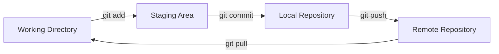

# Lesson 02.2: Git Basics

**Duration**: 60 minutes | **Difficulty**: Beginner

---

## Learning Objectives

By the end of this lesson, you will be able to:
- Initialize a Git repository
- Stage and commit changes
- View history and differences
- Push and pull from remotes
- Use Git confidently in daily work

---

## The Git Workflow



---

## Creating a Repository

### Initialize New Repository

```bash
# Create project directory
mkdir my-project
cd my-project

# Initialize Git
git init

# Output:
# Initialized empty Git repository in /path/to/my-project/.git/
```

### Clone Existing Repository

```bash
# Clone from GitHub
git clone https://github.com/username/repo.git

# Clone to specific folder
git clone https://github.com/username/repo.git my-folder
```

---

## The Basic Workflow

### 1. Check Status

Always start by checking status:

```bash
git status
```

**Output examples**:

```bash
# Clean working directory
On branch main
nothing to commit, working tree clean

# With changes
On branch main
Changes not staged for commit:
  modified:   src/index.ts

Untracked files:
  src/new-file.ts
```

### 2. Stage Changes

Add files to the staging area:

```bash
# Stage specific file
git add src/index.ts

# Stage all changes in directory
git add src/

# Stage everything
git add .

# Stage interactively (select what to add)
git add -p
```

### 3. Commit Changes

Save staged changes to history:

```bash
# Commit with message
git commit -m "Add user authentication feature"

# Commit with detailed message (opens editor)
git commit
```

**Good commit messages**:
```bash
# Good ✅
git commit -m "Add JWT token validation to auth middleware"
git commit -m "Fix null pointer exception in payment processing"
git commit -m "Refactor user service to use repository pattern"

# Bad ❌
git commit -m "fix"
git commit -m "stuff"
git commit -m "WIP"
```

### 4. Push to Remote

Share your commits:

```bash
# Push to origin (default remote)
git push

# Push specific branch
git push origin main

# Push and set upstream (first push of new branch)
git push -u origin feature/my-feature
```

### 5. Pull from Remote

Get others' changes:

```bash
# Pull from default remote
git pull

# Pull from specific remote/branch
git pull origin main
```

---

## Viewing History

### Log Commands

```bash
# Basic log
git log

# Compact one-line format
git log --oneline

# With graph visualization
git log --oneline --graph

# Last 5 commits
git log -5

# Commits by author
git log --author="John"

# Commits affecting specific file
git log -- path/to/file.ts
```

### Example Output

```bash
$ git log --oneline -5
a1b2c3d (HEAD -> main) Add payment processing
d4e5f6g Fix authentication bug
g7h8i9j Implement user login
j1k2l3m Add project structure
m4n5o6p Initial commit
```

---

## Viewing Differences

### Diff Commands

```bash
# Changes not yet staged
git diff

# Changes staged for commit
git diff --staged

# Changes between commits
git diff a1b2c3d d4e5f6g

# Changes in specific file
git diff src/index.ts
```

### Example Output

```diff
$ git diff src/index.ts
diff --git a/src/index.ts b/src/index.ts
--- a/src/index.ts
+++ b/src/index.ts
@@ -10,7 +10,7 @@ function authenticate(user: User) {
-  return false;
+  return validateToken(user.token);
 }
```

---

## Undoing Changes

### Discard Working Changes

```bash
# Discard changes to specific file
git checkout -- src/index.ts

# Discard all changes (careful!)
git checkout -- .

# Modern alternative
git restore src/index.ts
```

### Unstage Files

```bash
# Unstage specific file
git reset HEAD src/index.ts

# Unstage everything
git reset HEAD

# Modern alternative
git restore --staged src/index.ts
```

### Undo Last Commit

```bash
# Undo commit, keep changes staged
git reset --soft HEAD~1

# Undo commit, keep changes unstaged
git reset HEAD~1

# Undo commit AND discard changes (careful!)
git reset --hard HEAD~1
```

---

## Working with Remotes

### View Remotes

```bash
git remote -v
# origin  https://github.com/user/repo.git (fetch)
# origin  https://github.com/user/repo.git (push)
```

### Add Remote

```bash
git remote add origin https://github.com/user/repo.git
```

### Change Remote URL

```bash
git remote set-url origin https://github.com/user/new-repo.git
```

---

## Practice Exercise: Complete Workflow

Let's practice the entire workflow:

```bash
# 1. Create project
mkdir git-practice
cd git-practice
git init

# 2. Create first file
echo "# My Project" > README.md

# 3. Check status
git status
# Shows: Untracked files: README.md

# 4. Stage the file
git add README.md

# 5. Check status again
git status
# Shows: Changes to be committed: new file: README.md

# 6. Commit
git commit -m "Initial commit with README"

# 7. View history
git log --oneline
# Shows: a1b2c3d Initial commit with README

# 8. Make a change
echo "## Features" >> README.md

# 9. See the difference
git diff
# Shows the added line

# 10. Stage and commit
git add README.md
git commit -m "Add features section to README"

# 11. View history
git log --oneline
# Shows both commits
```

---

## Git with SpecWeave

When using SpecWeave, Git tracks your specs automatically:

```bash
# Initialize SpecWeave
specweave init .

# See what SpecWeave created
git status
# Shows: new file: .specweave/config.json

# Commit SpecWeave setup
git add .specweave/
git commit -m "Initialize SpecWeave"

# Later, after creating an increment
/sw:increment "User authentication"

# Git shows new specs
git status
# Shows: new file: .specweave/increments/0001-user-auth/spec.md
# Shows: new file: .specweave/increments/0001-user-auth/plan.md
# Shows: new file: .specweave/increments/0001-user-auth/tasks.md

# Commit your specs
git add .specweave/
git commit -m "feat: Add user authentication spec"
```

---

## Common Mistakes & Fixes

### Mistake 1: Committed to Wrong Branch

```bash
# Undo commit, keep changes
git reset --soft HEAD~1

# Switch to correct branch
git checkout correct-branch

# Recommit
git add .
git commit -m "Your message"
```

### Mistake 2: Need to Change Last Commit Message

```bash
git commit --amend -m "New message"
```

### Mistake 3: Forgot to Add a File to Last Commit

```bash
git add forgotten-file.ts
git commit --amend --no-edit
```

### Mistake 4: Pushed Sensitive Data

```bash
# Remove from history (destructive!)
git filter-branch --force --index-filter \
  "git rm --cached --ignore-unmatch path/to/secret.txt" \
  --prune-empty --tag-name-filter cat -- --all

# Force push (requires coordination with team)
git push --force
```

---

## Quick Reference Card

```
SETUP
  git init                Initialize repository
  git clone <url>         Clone repository

DAILY WORKFLOW
  git status              Check current state
  git add <file>          Stage file
  git add .               Stage all
  git commit -m "msg"     Commit staged changes
  git push                Push to remote
  git pull                Pull from remote

HISTORY
  git log                 View commits
  git log --oneline       Compact view
  git diff                View changes

UNDO
  git checkout -- <file>  Discard changes
  git reset HEAD <file>   Unstage file
  git reset --soft HEAD~1 Undo last commit
```

---

## Key Takeaways

1. **git status is your friend** — check it constantly
2. **Stage intentionally** — only add what you mean to commit
3. **Write good commit messages** — your future self will thank you
4. **Commit often** — small commits are easier to understand
5. **Push regularly** — don't lose work to hardware failure

---

## Next Lesson

Now let's learn branching — the feature that makes Git truly powerful.

→ [Continue to Lesson 02.3: Branching](./03-branching)
