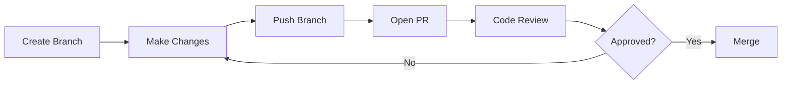

# Lesson 02.4: Collaboration

**Duration**: 45 minutes | **Difficulty**: Beginner

---

## Learning Objectives

By the end of this lesson, you will:
- Understand remote repositories
- Know how to work with GitHub/GitLab
- Create and review Pull Requests
- Follow collaboration best practices
- Understand how SpecWeave enhances team collaboration

---

## Remote Repositories

### What is a Remote?

A remote is a copy of your repository hosted elsewhere (GitHub, GitLab, Bitbucket):

```
┌─────────────────┐         ┌─────────────────┐
│  Your Computer  │◄───────►│  GitHub/GitLab  │
│  (Local Repo)   │  push   │  (Remote Repo)  │
│                 │  pull   │                 │
└─────────────────┘         └─────────────────┘
                                    ▲
                                    │ clone/pull/push
                                    ▼
                            ┌─────────────────┐
                            │ Teammate's PC   │
                            │  (Local Repo)   │
                            └─────────────────┘
```

### Working with Remotes

```bash
# Clone a repository
git clone https://github.com/org/project.git

# View remotes
git remote -v

# Add a remote
git remote add origin https://github.com/org/project.git

# Fetch changes (download, don't merge)
git fetch origin

# Pull changes (fetch + merge)
git pull origin main

# Push changes
git push origin main
```

---

## The Pull Request Workflow

Pull Requests (PRs) are how teams collaborate:



### Step 1: Create Branch and Work

```bash
# Start fresh
git checkout main
git pull origin main

# Create feature branch
git checkout -b feature/add-search

# Do your work
# ... make changes ...
git add .
git commit -m "Add search functionality"
```

### Step 2: Push to Remote

```bash
# Push branch (first time)
git push -u origin feature/add-search

# Subsequent pushes
git push
```

### Step 3: Create Pull Request

On GitHub:
1. Navigate to repository
2. Click "Pull requests" → "New pull request"
3. Select your branch
4. Add title and description
5. Request reviewers
6. Click "Create pull request"

### Step 4: Code Review

Reviewers will:
- Read your code changes
- Leave comments and suggestions
- Request changes if needed
- Approve when ready

### Step 5: Address Feedback

```bash
# Make requested changes
# ... edit files ...
git add .
git commit -m "Address review feedback"
git push
```

### Step 6: Merge

After approval:
- Click "Merge pull request" on GitHub
- Or merge locally:

```bash
git checkout main
git pull
git merge feature/add-search
git push
```

---

## Writing Good Pull Requests

### PR Title

```bash
# Good ✅
feat: Add user search functionality
fix: Resolve payment calculation error
docs: Update API documentation
refactor: Simplify authentication logic

# Bad ❌
Update stuff
fix
WIP
```

### PR Description Template

```markdown
## Summary
Brief description of what this PR does.

## Changes
- Added search component
- Implemented search API endpoint
- Added unit tests for search

## Testing
- [ ] Unit tests pass
- [ ] Manual testing completed
- [ ] E2E tests updated

## Screenshots (if UI changes)
[Add screenshots here]

## Related Issues
Closes #123
```

### SpecWeave-Enhanced PR

With SpecWeave, your PRs include specifications:

```markdown
## Summary
Implements user authentication feature.

## SpecWeave Increment
- **Increment**: 0001-user-authentication
- **spec.md**: User stories and acceptance criteria
- **plan.md**: Architecture decisions (ADR-001: JWT tokens)
- **tasks.md**: Implementation breakdown

## Changes
- [x] T-001: Add AuthService
- [x] T-002: Implement JWT validation
- [x] T-003: Add login endpoint
- [x] T-004: Add logout endpoint
- [x] T-005: Add unit tests

## Quality Gates
- [x] All tasks complete (5/5)
- [x] Test coverage: 92%
- [x] `/specweave:validate` passed
- [x] `/specweave:qa` passed

## Related
- Increment: `.specweave/increments/0001-user-authentication/`
- ADR: `.specweave/docs/internal/adr/0001-jwt-tokens.md`
```

---

## Code Review Best Practices

### As a Reviewer

**DO**:
- Read the whole PR before commenting
- Ask questions instead of making demands
- Provide context for suggestions
- Acknowledge good work
- Be timely (review within 24 hours)

**DON'T**:
- Be harsh or dismissive
- Nitpick on style (use linters instead)
- Block on personal preferences
- Leave PRs hanging for days

### Example Comments

```markdown
# Good ✅
"Could you add a check for null here?
The API might return undefined when..."

"Nice refactor! This is much cleaner."

"I'm not sure I understand this logic.
Could you explain or add a comment?"

# Bad ❌
"Wrong."
"This is bad."
"Why would you do it this way?"
```

### As a PR Author

**DO**:
- Keep PRs small (under 400 lines ideal)
- Self-review before requesting
- Respond to all comments
- Thank reviewers for feedback

**DON'T**:
- Take feedback personally
- Argue in comments (discuss in person/call)
- Leave comments unresolved
- Create massive PRs

---

## Collaboration Commands

### Staying Up to Date

```bash
# Update your branch with latest main
git checkout main
git pull
git checkout feature/my-feature
git merge main
# Or rebase (cleaner history)
git rebase main
```

### When Someone Else is Working on Same File

```bash
# Fetch their changes
git fetch origin

# See what they've done
git diff origin/feature/their-branch

# If you need their changes
git merge origin/feature/their-branch
```

### Resolving Collaboration Conflicts

```bash
# Your branch is behind
git pull --rebase origin main

# If conflicts occur
# 1. Resolve conflicts in files
# 2. Stage resolved files
git add .
# 3. Continue rebase
git rebase --continue
```

---

## SpecWeave Team Collaboration

SpecWeave enhances team collaboration:

### 1. Spec Review Before Code

```bash
# Create increment with specs
/specweave:increment "Payment processing"

# Commit just the specs
git add .specweave/increments/0001-payment/
git commit -m "feat(spec): Add payment processing specification"
git push -u origin feature/0001-payment

# Create PR for spec review FIRST
# Team reviews requirements before implementation
```

### 2. Architecture Decision Records

```markdown
# ADR-001: Payment Gateway Selection

## Status
Proposed → **Accepted**

## Context
We need to process payments...

## Decision
Use Stripe because...

## Consequences
- Good: Industry standard
- Bad: 2.9% + 30¢ per transaction
```

ADRs in PRs mean **decisions are reviewed** before implementation.

### 3. Task Traceability

Every task links to acceptance criteria:

```markdown
### T-003: Implement payment validation
**User Story**: US-001
**Satisfies ACs**: AC-US1-02, AC-US1-03
**Status**: [x] completed

#### Test Plan (BDD)
- Given a valid card number
- When the user submits payment
- Then the payment is processed successfully
```

Reviewers can trace **code → task → user story → acceptance criteria**.

### 4. Quality Gate Automation

```yaml
# GitHub Actions workflow
- name: Validate SpecWeave
  run: specweave validate 0001

- name: Run Quality Assessment
  run: specweave qa 0001 --gate
```

PRs are **automatically validated** against specs.

---

## Enterprise Collaboration Patterns

### Protected Branches

```
main (protected)
├── Requires PR to merge
├── Requires 2+ approvals
├── Requires CI to pass
└── Requires spec validation (SpecWeave)
```

### CODEOWNERS

```
# .github/CODEOWNERS
* @team-lead
/src/payments/ @payments-team
/.specweave/ @architects @pm
```

### Required Reviews by Area

| Change | Required Reviewers |
|--------|-------------------|
| Code | 1 developer |
| Architecture (ADRs) | Tech lead + Architect |
| Specs | PM + Tech lead |
| Security | Security team |
| Infrastructure | DevOps team |

---

## Practice Exercise

```bash
# 1. Fork a practice repository (or use your own)

# 2. Clone it
git clone https://github.com/YOUR-USERNAME/repo.git
cd repo

# 3. Create a branch
git checkout -b feature/practice-collab

# 4. Make changes
echo "## Collaboration Practice" >> README.md
git add .
git commit -m "docs: Add collaboration section"

# 5. Push
git push -u origin feature/practice-collab

# 6. Create PR on GitHub
# - Write good title and description
# - Request review (if you have teammates)

# 7. If you have a teammate, review each other's PRs
```

---

## Key Takeaways

1. **Remotes enable collaboration** — share work with the team
2. **Pull Requests are the collaboration hub** — discussion, review, approval
3. **Write good PRs** — clear title, description, small changes
4. **Be a good reviewer** — constructive, timely, thorough
5. **SpecWeave enhances collaboration** — review specs before code

---

## Module 02 Complete!

Congratulations! You've mastered Git version control:
- ✅ Why Git matters
- ✅ Basic Git workflow
- ✅ Branching strategies
- ✅ Team collaboration

---

## Next Module

Ready to learn about software engineering principles and roles?

→ [Continue to Module 03: Engineering Principles](../03-engineering-principles/)
