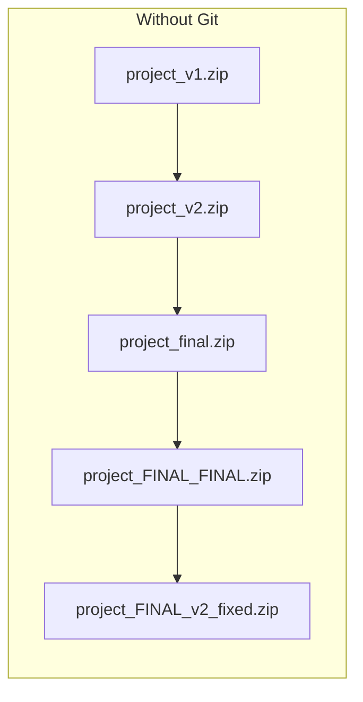
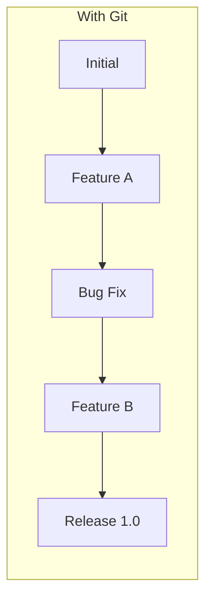

# Module 02: Version Control with Git

**Duration**: 3-4 hours | **Difficulty**: Beginner

Git is the most important tool you'll learn. Every company, every project, every developer uses it.

---

## What You'll Learn

- Why version control is essential
- Git core concepts and workflow
- Branching strategies
- Collaboration patterns
- How Git integrates with SpecWeave

---

## Why Git Matters



**Sound familiar?** Git solves this chaos.



Every change tracked. Every version recoverable. Every collaborator synchronized.

---

## Module Lessons

| Lesson | Topic | Duration |
|--------|-------|----------|
| [02.1 Why Git?](./01-why-git) | The problem Git solves | 30 min |
| [02.2 Git Basics](./02-git-basics) | Core commands | 60 min |
| [02.3 Branching](./03-branching) | Feature branches & merging | 45 min |
| [02.4 Collaboration](./04-collaboration) | Working with teams | 45 min |

---

## The SpecWeave Connection

SpecWeave stores all specifications in Git:

```
.specweave/
├── increments/
│   └── 0001-user-auth/
│       ├── spec.md      ← Version controlled
│       ├── plan.md      ← Version controlled
│       └── tasks.md     ← Version controlled
└── docs/
    └── internal/
        └── adr/         ← Version controlled ADRs
```

**Benefits**:
- **Full history** of every spec change
- **Diff view** shows what changed
- **Blame** shows who decided what
- **Revert** if something goes wrong
- **Branch** for experimental approaches

---

## Git in Enterprise

At Fortune 500 companies, Git is used for:

| Use Case | Example |
|----------|---------|
| **Code** | Application source code |
| **Infrastructure** | Terraform, Kubernetes configs |
| **Documentation** | Technical docs, runbooks |
| **Specifications** | Requirements, ADRs (via SpecWeave) |
| **Configuration** | App configs, feature flags |

**Everything in Git = Everything tracked = Everything auditable**

---

## Prerequisites

- Lesson 01.2 completed (Git installed)
- Terminal basics from Lesson 01.3

---

## Let's Begin

Ready to master the most important tool in your toolkit?

→ [Start Lesson 02.1: Why Git?](./01-why-git)
