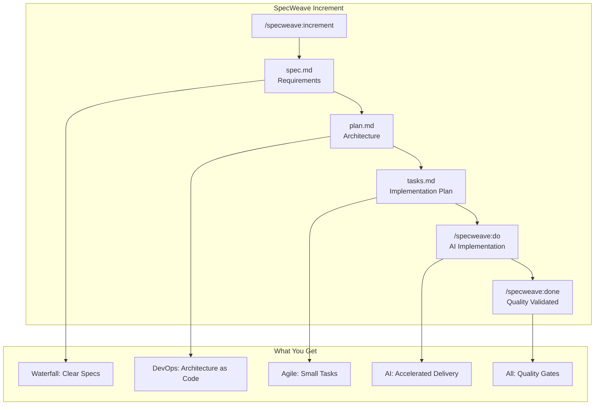

# Lesson 03.1: Development Methodologies

**Duration**: 45 minutes | **Difficulty**: Beginner

---

## Learning Objectives

By the end of this lesson, you will understand:
- The major development methodologies
- When to use each approach
- How modern teams combine approaches
- How SpecWeave fits into the methodology landscape

---

## The Evolution of Methodologies

### The Challenge

Building software is inherently complex:
- Requirements change
- Technology evolves
- Teams grow and change
- Deadlines shift
- Bugs are discovered

Different methodologies offer different answers to these challenges.

---

## Waterfall (1970s-1990s)

### The Model

```
Requirements ──► Design ──► Implementation ──► Testing ──► Deployment
     │              │              │              │              │
     └──────────────┴──────────────┴──────────────┴──────────────┘
                        (Linear, one-way flow)
```

### How It Works

1. **Requirements**: Document everything upfront (months)
2. **Design**: Complete architecture before coding
3. **Implementation**: Build to the design
4. **Testing**: Find bugs after building
5. **Deployment**: Ship when complete

### Pros
- Clear milestones
- Extensive documentation
- Works for well-understood domains (bridges, buildings)

### Cons
- Can't handle changing requirements
- Users don't see product until end
- Bugs found late (expensive to fix)
- **80% of software projects failed**

### When to Use
- Regulatory environments (medical devices, aviation)
- Fixed contracts with unchanging requirements
- Very small, well-understood projects

---

## Agile (2001-Present)

### The Agile Manifesto

```
Individuals and interactions    over    Processes and tools
Working software                over    Comprehensive documentation
Customer collaboration          over    Contract negotiation
Responding to change            over    Following a plan
```

### The Model

```
┌─────────────────────────────────────────┐
│   Plan → Build → Test → Review → Ship   │
│     ↑                               │   │
│     └───────────────────────────────┘   │
│         (Repeat every 1-2 weeks)        │
└─────────────────────────────────────────┘
```

### Common Agile Frameworks

**Scrum**:
- 2-week sprints
- Daily standups
- Sprint planning/review
- Product Owner + Scrum Master + Team

**Kanban**:
- Continuous flow (no sprints)
- WIP limits
- Visual board
- Pull-based work

### Pros
- Adapts to change
- Delivers value early and often
- User feedback incorporated continuously
- Catches bugs early

### Cons
- Requires discipline
- Can lack documentation
- "Agile theater" — doing ceremonies without understanding
- Technical debt accumulation

### When to Use
- Most software projects
- When requirements may change
- When user feedback is valuable

---

## DevOps (2010s-Present)

### The Philosophy

DevOps bridges development and operations:

```
Traditional:
Dev Team ──builds──► Code ──throws over wall──► Ops Team ──deploys

DevOps:
Dev + Ops = Single Team
Build → Test → Deploy → Monitor → Improve (Continuous)
```

### Key Practices

| Practice | Description |
|----------|-------------|
| **CI** | Continuous Integration — merge code frequently |
| **CD** | Continuous Delivery — always deployable |
| **IaC** | Infrastructure as Code — infrastructure in Git |
| **Monitoring** | Observability — know what's happening |
| **Automation** | Automate everything possible |

### The DevOps Loop

```
     ┌─────► Plan ─────► Code ─────► Build ─────┐
     │                                          │
Operate                                      Test
     │                                          │
     └──── Monitor ◄──── Deploy ◄──── Release ◄─┘
```

### Pros
- Faster delivery (hours instead of months)
- Better reliability
- Faster recovery from failures
- Shared responsibility

### Cons
- Requires cultural change
- Infrastructure investment
- Skills across the stack needed

---

## AI-Native Development (2020s)

### The Revolution

AI changes everything:

```
Traditional:
Human thinks → Human writes code → Human writes tests → Human writes docs

AI-Native:
Human directs → AI generates → Human reviews → AI iterates
```

### The Problem with Current AI Tools

```
Chat with AI → Get code → Chat disappears → Context lost → Repeat
```

**No specs. No architecture. No history.**

### The SpecWeave Solution

```
Describe feature → AI creates spec.md → AI creates plan.md → AI creates tasks.md
       │                    │                   │                    │
       └────────────────────┴───────────────────┴────────────────────┘
                    (All captured permanently in Git)
```

**Spec-Driven Development** = Agile + DevOps + AI + Documentation

---

## Comparing Methodologies

| Aspect | Waterfall | Agile | DevOps | AI-Native (SpecWeave) |
|--------|-----------|-------|--------|----------------------|
| **Planning** | All upfront | Each sprint | Continuous | AI-assisted |
| **Documentation** | Heavy | Minimal | As code | Auto-generated |
| **Delivery** | End | Each sprint | Continuous | Per increment |
| **Change** | Difficult | Embraced | Expected | Natural |
| **Feedback** | Late | Sprint end | Real-time | Continuous |
| **Architecture** | Big design | Emergent | Evolving | AI + human review |

---

## The Modern Hybrid Approach

Most successful teams combine:

### From Waterfall
- Clear requirements (captured in spec.md)
- Architecture design (captured in plan.md)
- Documentation (auto-synced living docs)

### From Agile
- Small increments
- Regular delivery
- Adaptation to change
- User feedback

### From DevOps
- Continuous integration
- Automated testing
- Infrastructure as code
- Monitoring and observability

### From AI-Native
- AI-assisted planning
- AI-assisted implementation
- Automated documentation
- Preserved context

---

## SpecWeave: The Best of All Worlds

### How SpecWeave Combines Methodologies



### Increment = Mini-Waterfall in Agile Cycles

Each increment is a complete mini-project:
1. **Specify** (spec.md) — What are we building?
2. **Design** (plan.md) — How will we build it?
3. **Plan** (tasks.md) — What are the steps?
4. **Build** (/specweave:do) — Implement with AI
5. **Validate** (/specweave:done) — Quality gates pass

But increments are **small** (days, not months) and **frequent** (Agile cycles).

---

## Practice Exercise

### Reflection Questions

1. **Your Experience**: What methodology does your current/past team use?

2. **The Gap**: What documentation is usually missing?

3. **SpecWeave Fit**: How would auto-generated specs help?

### Mini Exercise

Think of a feature you've built. Map it to:
- What would be in spec.md? (user stories, ACs)
- What would be in plan.md? (architecture decisions)
- What would be in tasks.md? (implementation steps)

---

## Key Takeaways

1. **Methodologies evolved** to solve real problems
2. **No methodology is perfect** — each has trade-offs
3. **Modern teams combine approaches** — take the best of each
4. **AI changes the game** — but principles remain
5. **SpecWeave synthesizes everything** — specs + agility + AI

---

## Next Lesson

Now let's understand the roles on a software team.

→ [Continue to Lesson 03.2: Roles](./02-roles)
