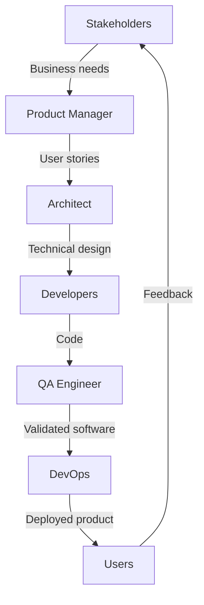
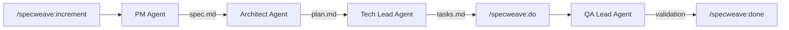

# Lesson 03.2: Engineering Roles

**Duration**: 45 minutes | **Difficulty**: Beginner

---

## Learning Objectives

By the end of this lesson, you will understand:
- The key roles on a software team
- What each role is responsible for
- How roles collaborate
- How SpecWeave agents mirror these roles

---

## Why Roles Matter

### The Problem with "Everyone Does Everything"

```
Small Team Reality:
- Developer A: "I'll handle the database"
- Developer B: "I'll do the frontend"
- Developer C: "Who's doing testing?"
- Everyone: "..."
- Result: No tests, bugs in production
```

### Clear Roles = Clear Accountability

```
Defined Roles:
- PM: Defines WHAT we build
- Architect: Defines HOW we build
- Developers: BUILD it
- QA: VALIDATES it works
- Result: Everyone knows their responsibility
```

---

## Core Engineering Roles

### Product Manager (PM)

**Primary Question**: "What should we build and why?"

**Responsibilities**:
- Gather requirements from stakeholders
- Define user stories and acceptance criteria
- Prioritize features
- Represent the customer's voice
- Make trade-off decisions

**Artifacts Created**:
- Product roadmap
- User stories
- Acceptance criteria
- Feature specifications

**In SpecWeave**: The PM Agent creates `spec.md` with user stories and acceptance criteria.

```markdown
## User Stories (from spec.md)

### US-001: User Login
**As a** registered user
**I want to** log in with my credentials
**So that** I can access my account

#### Acceptance Criteria
- [ ] **AC-US1-01**: User can enter email and password
- [ ] **AC-US1-02**: Invalid credentials show error message
- [ ] **AC-US1-03**: Successful login redirects to dashboard
```

---

### Software Architect

**Primary Question**: "How should we build this?"

**Responsibilities**:
- Design system architecture
- Make technology decisions
- Define coding standards
- Review technical approaches
- Balance trade-offs (performance vs. cost vs. complexity)

**Artifacts Created**:
- Architecture diagrams
- Architecture Decision Records (ADRs)
- Technical specifications
- API designs

**In SpecWeave**: The Architect Agent creates `plan.md` with architecture decisions.

```markdown
## Architecture Decision (from plan.md)

### ADR-001: Authentication Strategy

**Status**: Accepted

**Context**:
We need to authenticate users across web and mobile apps.

**Decision**:
Use JWT tokens with refresh token rotation.

**Consequences**:
- Good: Stateless, scales horizontally
- Good: Works across platforms
- Bad: Token revocation requires additional infrastructure
```

---

### Software Developer (Engineer)

**Primary Question**: "How do I implement this feature?"

**Responsibilities**:
- Write clean, maintainable code
- Implement features according to specs
- Write unit tests
- Participate in code reviews
- Debug and fix issues

**Artifacts Created**:
- Source code
- Unit tests
- Code documentation
- Pull requests

**In SpecWeave**: The Tech Lead Agent creates `tasks.md` with implementation steps.

```markdown
## Implementation Task (from tasks.md)

### T-003: Implement JWT validation middleware
**User Story**: US-001
**Satisfies ACs**: AC-US1-01, AC-US1-03
**Status**: [ ] pending

#### Implementation Notes
- Use `jsonwebtoken` library
- Validate token signature and expiration
- Extract user ID from token payload

#### Test Plan (BDD)
- Given a valid JWT token
- When the request hits the middleware
- Then the user ID is attached to the request
```

---

### QA Engineer (Quality Assurance)

**Primary Question**: "Does this work correctly?"

**Responsibilities**:
- Create test plans
- Execute manual tests
- Write automated tests
- Report bugs with reproduction steps
- Validate bug fixes
- Ensure quality standards are met

**Artifacts Created**:
- Test plans
- Test cases
- Bug reports
- Test automation scripts

**In SpecWeave**: The QA Lead Agent validates quality gates and coverage.

```markdown
## Quality Gate Report

### Test Coverage
- Unit Tests: 85% ✓
- Integration Tests: 72% ✓
- E2E Tests: 60% ⚠️ (target: 70%)

### Acceptance Criteria Coverage
- AC-US1-01: ✓ Covered by T-001
- AC-US1-02: ✓ Covered by T-002
- AC-US1-03: ✓ Covered by T-003

### Recommendation
E2E coverage below target. Add tests for login flow before release.
```

---

### DevOps Engineer

**Primary Question**: "How do we deploy and operate this?"

**Responsibilities**:
- Set up CI/CD pipelines
- Manage infrastructure
- Monitor system health
- Handle deployments
- Ensure reliability and uptime

**Artifacts Created**:
- CI/CD configurations
- Infrastructure as Code
- Deployment scripts
- Monitoring dashboards

---

### Tech Lead / Team Lead

**Primary Question**: "Is the team executing effectively?"

**Responsibilities**:
- Guide technical decisions
- Mentor team members
- Remove blockers
- Coordinate with other teams
- Balance technical debt vs. features

**Artifacts Created**:
- Technical guidelines
- Sprint plans
- Architecture reviews
- Mentorship feedback

---

## Role Collaboration

### The Requirements Flow



### Communication Patterns

| From | To | What |
|------|-----|------|
| PM | Architect | Requirements, priorities |
| Architect | Developers | Design, standards |
| Developers | QA | Features ready for testing |
| QA | Developers | Bugs, test results |
| DevOps | Everyone | Deployment status, incidents |

---

## SpecWeave Agents Mirror Real Roles

### The AI Team

SpecWeave provides AI agents that mirror these roles:

| Human Role | SpecWeave Agent | Output |
|------------|-----------------|--------|
| Product Manager | PM Agent | spec.md |
| Architect | Architect Agent | plan.md |
| Tech Lead | Tech Lead Agent | tasks.md |
| QA Engineer | QA Lead Agent | Quality reports |

### How They Work Together



### The Paradigm Shift

**Traditional AI Coding**:
```
You: "Write a login function"
AI: [Generates code]
You: "Now add tests"
AI: [Generates tests]
You: "Where's the documentation?"
AI: "What documentation?"
```

**SpecWeave Approach**:
```
You: "/specweave:increment User authentication"
PM Agent: Creates spec.md with user stories, ACs
Architect Agent: Creates plan.md with ADRs
Tech Lead Agent: Creates tasks.md with test plans
You: "/specweave:do"
[Code generated with full context]
QA Agent: Validates all ACs covered
```

---

## Small Teams vs. Enterprise

### Solo Developer

One person wears all hats:
- You ARE the PM (decide what to build)
- You ARE the architect (decide how)
- You ARE the developer (write code)
- You ARE the QA (test it)
- You ARE the DevOps (deploy it)

**SpecWeave helps**: AI agents handle the roles you don't have time for.

### Small Team (3-5 people)

Roles are shared:
- 1 PM/Product Owner (maybe part-time)
- 2-3 Developers (one as Tech Lead)
- 1 QA (often shared with development)

**SpecWeave helps**: Structured specs mean less miscommunication.

### Enterprise Team (10+ people)

Dedicated specialists:
- Full-time PM
- Dedicated Architect
- Multiple developers by specialty (frontend, backend, mobile)
- QA team with automation engineers
- DevOps team
- Security specialists

**SpecWeave helps**: ADRs and specs create institutional knowledge.

---

## Practice Exercise

### Reflection Questions

1. **Your Current Role**: What roles do you currently fill? Which ones do you wish you had help with?

2. **Role Gaps**: Think of a project that failed or struggled. What role was missing or under-resourced?

3. **SpecWeave Application**: Which SpecWeave agent would help you most right now?

### Mini Exercise

For a feature you're building (or want to build):
1. Write one user story (PM role)
2. List one architecture decision (Architect role)
3. Break it into 3 tasks (Tech Lead role)
4. Define how you'd test the first task (QA role)

---

## Key Takeaways

1. **Roles create accountability** — everyone knows who's responsible
2. **Each role produces artifacts** — specs, designs, code, tests
3. **Collaboration is essential** — roles must communicate
4. **SpecWeave agents mirror roles** — AI assistance for each function
5. **Scale appropriately** — solo devs need different support than enterprise teams

---

## Next Lesson

Now let's understand why documentation matters and how SpecWeave automates it.

→ [Continue to Lesson 03.3: Documentation](./03-documentation)
