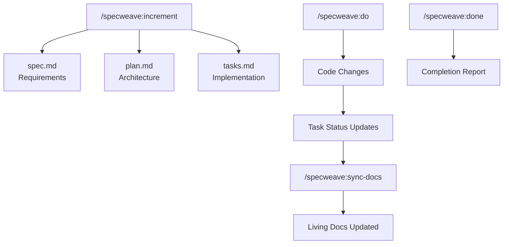

# Lesson 03.3: Documentation

**Duration**: 30 minutes | **Difficulty**: Beginner

---

## Learning Objectives

By the end of this lesson, you will understand:
- Why documentation is critical
- Types of documentation
- Documentation best practices
- How SpecWeave solves the documentation problem

---

## The Documentation Problem

### The Reality

```
Day 1:   "We'll document this later"
Day 30:  "I remember how this works"
Day 90:  "Why did we build it this way?"
Day 180: "Who wrote this? Oh, they left the company"
Day 365: "Let's rewrite everything"
```

### The Cost of No Documentation

| Problem | Impact |
|---------|--------|
| Onboarding new developers | Weeks instead of days |
| Understanding old code | Hours of archaeology |
| Making changes | Fear of breaking things |
| Knowledge loss | When people leave |
| Compliance/audits | Failed audits, legal issues |

---

## Types of Documentation

### 1. Requirements Documentation

**What**: What the software should do

**Examples**:
- User stories
- Acceptance criteria
- Feature specifications
- Business rules

**In SpecWeave**: `spec.md`

```markdown
## User Stories

### US-001: User Registration
**As a** new user
**I want to** create an account
**So that** I can access the platform

#### Acceptance Criteria
- [ ] **AC-US1-01**: User can enter email, password, name
- [ ] **AC-US1-02**: Password must be 8+ characters
- [ ] **AC-US1-03**: Confirmation email is sent
```

---

### 2. Architecture Documentation

**What**: How the software is designed

**Examples**:
- System diagrams
- Architecture Decision Records (ADRs)
- API specifications
- Data models

**In SpecWeave**: `plan.md` and ADRs

```markdown
## Architecture Decision Record

### ADR-001: Database Selection

**Status**: Accepted
**Date**: 2024-01-15

**Context**:
We need a database for user data and transactions.

**Options Considered**:
1. PostgreSQL - Relational, ACID compliant
2. MongoDB - Document store, flexible schema
3. DynamoDB - Managed, auto-scaling

**Decision**:
PostgreSQL for transactional data integrity.

**Consequences**:
- Requires schema migrations
- Excellent for complex queries
- Team has existing expertise
```

---

### 3. Code Documentation

**What**: How the code works

**Examples**:
- Code comments
- API documentation
- README files
- JSDoc/TypeDoc

**Best Practices**:

```typescript
// ❌ Bad: Describes WHAT (obvious from code)
// Increment counter by 1
counter++;

// ✅ Good: Describes WHY (not obvious)
// Offset by 1 because array indices are 0-based but display is 1-based
counter++;
```

```typescript
/**
 * Validates user authentication token.
 *
 * @param token - JWT token from request header
 * @returns Decoded user payload if valid
 * @throws {AuthError} If token is expired or invalid
 *
 * @example
 * const user = await validateToken(req.headers.authorization);
 * console.log(user.id); // '123'
 */
async function validateToken(token: string): Promise<UserPayload> {
  // Implementation
}
```

---

### 4. Operational Documentation

**What**: How to run and maintain the software

**Examples**:
- Deployment guides
- Runbooks
- Incident response procedures
- Monitoring guides

```markdown
## Deployment Runbook

### Prerequisites
- AWS CLI configured
- Docker installed
- Access to production VPC

### Steps
1. Build Docker image: `docker build -t app:v1.2.3 .`
2. Push to ECR: `docker push $ECR_URI/app:v1.2.3`
3. Update ECS service: `aws ecs update-service --cluster prod --service app`
4. Monitor CloudWatch for errors

### Rollback
If errors exceed 1%:
1. `aws ecs update-service --cluster prod --service app --task-definition app:previous`
```

---

### 5. User Documentation

**What**: How to use the software

**Examples**:
- User guides
- Tutorials
- API reference
- FAQ

---

## Documentation Anti-Patterns

### 1. "We'll Document Later"

**Problem**: Later never comes

**Solution**: Document as you go. SpecWeave generates docs automatically.

### 2. Documentation Rot

**Problem**: Docs become outdated

```markdown
# User API (Last updated: 2022)

POST /api/users
- email: string
- password: string

# ACTUAL API (Current):
POST /api/v2/users
- email: string
- password: string
- name: string (REQUIRED!)  ← Not in docs!
```

**Solution**: Living documentation that syncs with code.

### 3. Documentation Silos

**Problem**: Docs scattered across tools

```
- Requirements: Confluence
- Architecture: Miro
- API docs: Swagger
- Code docs: README
- Tasks: Jira
- Result: Nobody knows where anything is
```

**Solution**: Single source of truth (SpecWeave: `.specweave/` folder)

### 4. Over-Documentation

**Problem**: So much docs that nobody reads them

**Solution**: Document decisions and rationale, not obvious things.

---

## The SpecWeave Solution

### Living Documentation

SpecWeave creates documentation that:
1. **Stays in Git** — version controlled with code
2. **Auto-generates** — created during planning
3. **Links together** — tasks trace to user stories
4. **Syncs** — updates propagate automatically

### Documentation Flow



### Traceability

Every piece of code traces back to requirements:

```
Code Change
    ↓
Task T-003: "Implement JWT validation"
    ↓
User Story US-001: "User Login"
    ↓
Acceptance Criteria AC-US1-03: "Successful login redirects"
    ↓
Business Need: "Users must authenticate to access data"
```

### Auto-Generated Artifacts

| Traditional | SpecWeave |
|------------|-----------|
| Write requirements doc (2 hours) | `/specweave:increment` (5 minutes) |
| Create architecture diagram (1 hour) | `plan.md` auto-generated |
| Write task breakdown (1 hour) | `tasks.md` auto-generated |
| Update docs after changes (never) | `/specweave:sync-docs` |
| Generate completion report (30 min) | `/specweave:done` |

---

## Documentation Best Practices

### 1. Document Decisions, Not Just Facts

```markdown
# ❌ Bad: Just facts
We use PostgreSQL.

# ✅ Good: Decision with context
## ADR-001: Database Selection

**Context**: Need ACID compliance for financial transactions.
**Decision**: PostgreSQL over MongoDB.
**Rationale**: Transaction integrity more important than schema flexibility.
**Trade-off**: Requires migrations, but team has PostgreSQL expertise.
```

### 2. Keep Docs Close to Code

```
# ❌ Bad: Docs in separate system
Code: GitHub
Docs: Confluence (always out of sync)

# ✅ Good: Docs in repo
/project
  /src
  /docs
  /.specweave
    /increments
    /docs
```

### 3. Use Templates

Consistent structure makes docs easier to write and read:

```markdown
## User Story Template

### US-XXX: [Title]
**As a** [user type]
**I want to** [action]
**So that** [benefit]

#### Acceptance Criteria
- [ ] **AC-USXXX-01**: [Criterion]
```

### 4. Review Docs Like Code

```yaml
# Pull Request checklist
- [ ] Code compiles
- [ ] Tests pass
- [ ] spec.md updated if requirements changed
- [ ] plan.md updated if architecture changed
- [ ] README updated if setup changed
```

---

## Practice Exercise

### Mini Documentation Task

Pick a small feature you've built. Create:

1. **User Story** (requirements)
```markdown
### US-001: [Your Feature]
**As a** [user type]
**I want to** [action]
**So that** [benefit]
```

2. **Architecture Decision** (design)
```markdown
### ADR-001: [Decision Title]
**Context**: [Why this decision was needed]
**Decision**: [What you decided]
**Rationale**: [Why this option]
```

3. **Code Comment** (implementation)
```typescript
/**
 * [What this function does]
 * @param [param] - [description]
 * @returns [what it returns]
 */
```

---

## Key Takeaways

1. **Documentation prevents knowledge loss** — teams change, docs persist
2. **Different types serve different needs** — requirements, architecture, code, operations
3. **Outdated docs are worse than no docs** — they mislead
4. **SpecWeave automates documentation** — generated, not written manually
5. **Living docs stay in sync** — because they're generated from source of truth

---

## Part 1 Complete!

Congratulations! You've completed the Foundations:

- ✅ Module 01: What is software engineering
- ✅ Module 02: Version control with Git
- ✅ Module 03: Engineering principles

---

## Next Part

Ready to build your first application with SpecWeave?

→ [Continue to Part 2: Your First Application](../../part-2-first-application/)
