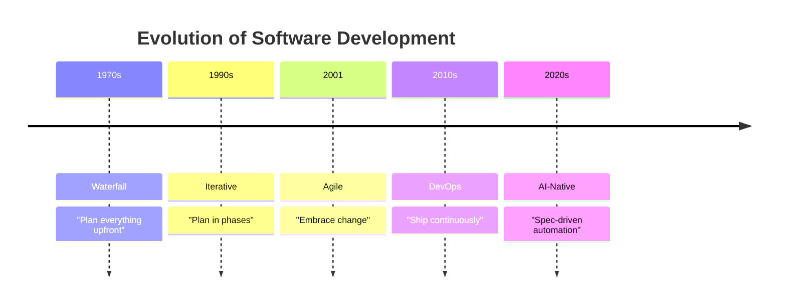

# Module 03: Engineering Principles

**Duration**: 2-3 hours | **Difficulty**: Beginner

This module covers the fundamental principles that separate amateur coding from professional software engineering.

---

## What You'll Learn

- Development methodologies (Waterfall → Agile → DevOps)
- Engineering roles and responsibilities
- Documentation standards and practices
- How SpecWeave automates best practices

---

## The Evolution of Software Development



SpecWeave represents the **AI-Native evolution** — combining the rigor of specifications with the speed of AI.

---

## Module Lessons

| Lesson | Topic | Duration |
|--------|-------|----------|
| [03.1 Methodologies](./01-methodologies) | How teams build software | 45 min |
| [03.2 Roles](./02-roles) | Who does what | 45 min |
| [03.3 Documentation](./03-documentation) | Why docs matter | 30 min |

---

## The SpecWeave Difference

Traditional development relies on:
- Manual documentation (often outdated)
- Meetings to discuss requirements
- Tribal knowledge about architecture
- Hope that decisions are remembered

**SpecWeave automates this**:

| Traditional | SpecWeave |
|------------|-----------|
| Requirements meeting | `spec.md` auto-generated |
| Architecture whiteboard | `plan.md` with ADRs |
| Task estimation meeting | `tasks.md` with test plans |
| Doc updates (never happen) | Living docs auto-sync |

---

## Why Principles Matter

**Without principles**:
```
Day 1: Start coding immediately
Day 30: Nobody knows what it does
Day 90: Rewrite from scratch
Day 180: Rewrite again
```

**With principles**:
```
Day 1: Define requirements → spec.md
Day 2: Design architecture → plan.md
Day 3-30: Implement → tasks.md
Day 90: Maintain with full context
Day 180: Evolve confidently
```

---

## Let's Begin

Ready to learn the principles that Fortune 500 companies follow?

→ [Start Lesson 03.1: Methodologies](./01-methodologies)
