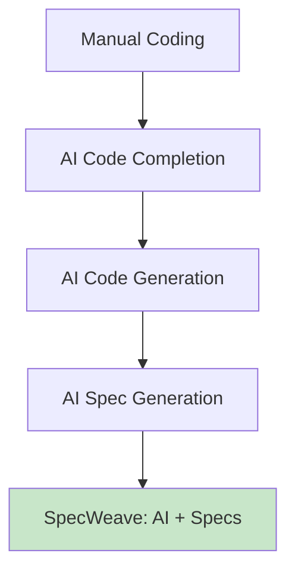

# Part 13: AI-Native Development

**Duration**: 8-10 hours | **Difficulty**: Advanced

AI is transforming software development. This part teaches you to leverage AI effectively while maintaining quality and control.

---

## What You'll Learn

- AI-assisted coding best practices
- Prompt engineering for development
- AI limitations and pitfalls
- The spec-driven AI advantage

---

## Part 13 Modules

| Module | Topic | Duration |
|--------|-------|----------|
| [Module 42: AI Coding Tools](./42-ai-tools/) | GitHub Copilot, Claude, GPT | 2-3 hours |
| [Module 43: Prompt Engineering](./43-prompt-engineering/) | Effective AI prompts | 3-4 hours |
| [Module 44: SpecWeave AI Workflow](./44-specweave-ai/) | Spec-driven AI development | 3-4 hours |

---

## The AI Development Evolution

---

## Why Specs + AI > Just AI

| AI Only | SpecWeave + AI |
|---------|----------------|
| Context lost each session | Context preserved in specs |
| No requirements | Requirements in spec.md |
| No architecture docs | ADRs in plan.md |
| No traceability | Full AC → Task → Code tracing |
| Quality varies | Quality gates enforce standards |

---

## Prerequisites

Before starting:
- ✅ Completed Parts 1-12
- ✅ SpecWeave proficiency
- ✅ AI tool familiarity

---

## Let's Begin

→ [Start Module 42: AI Coding Tools](./42-ai-tools/)
