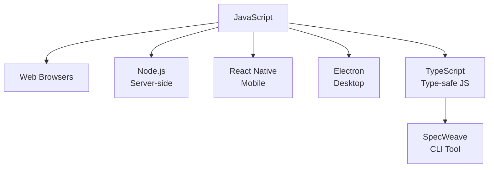

# Module 04: JavaScript Basics

**Duration**: 3-4 hours | **Difficulty**: Beginner

JavaScript is the most widely-used programming language in the world. This module teaches you the fundamentals you need to start building real applications.

---

## What You'll Learn

- Variables, data types, and operators
- Functions and control flow
- Arrays and objects
- Modern JavaScript (ES6+) features
- How JavaScript relates to TypeScript (used by SpecWeave)

---

## Why JavaScript?



JavaScript runs everywhere:
- **Browsers**: Interactive websites
- **Servers**: Node.js backend applications
- **Mobile**: React Native apps
- **Desktop**: Electron applications
- **SpecWeave**: Written in TypeScript (typed JavaScript)

---

## Module Lessons

| Lesson | Topic | Duration |
|--------|-------|----------|
| [04.1 Variables & Types](./01-variables-types) | Data fundamentals | 45 min |
| [04.2 Functions](./02-functions) | Reusable code blocks | 45 min |
| [04.3 Arrays & Objects](./03-arrays-objects) | Data structures | 60 min |

---

## Prerequisites

Before starting this module:
- ✅ Completed Part 1 (Foundations)
- ✅ Node.js installed (from Module 01)
- ✅ VS Code or editor ready

---

## How to Practice

Each lesson includes:
1. **Concepts** — What you need to know
2. **Examples** — Code you can run
3. **Exercises** — Practice problems
4. **SpecWeave Connection** — How this relates to real development

### Running JavaScript

```bash
# Create a file
echo 'console.log("Hello, JavaScript!")' > hello.js

# Run with Node.js
node hello.js
# Output: Hello, JavaScript!
```

---

## Let's Begin

Ready to learn the language that powers the modern web?

→ [Start Lesson 04.1: Variables & Types](./01-variables-types)
