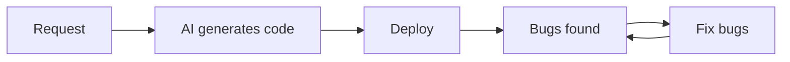
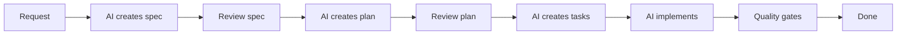
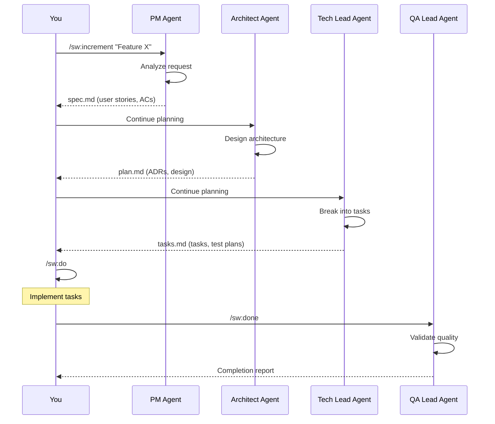

# Lesson 06.1: What is SpecWeave?

**Duration**: 45 minutes | **Difficulty**: Beginner

---

## Learning Objectives

By the end of this lesson, you will understand:
- What SpecWeave is and what problem it solves
- The difference between "AI coding" and "spec-driven development"
- The core principles of SpecWeave
- How it fits into modern development workflows

---

## The Problem with AI-Assisted Coding

### The Chat-and-Forget Pattern

```
Day 1, Chat Session 1:
  You: "Write a user authentication system"
  AI: [Generates 500 lines of code]
  You: "Looks good, thanks!"

Day 5, Chat Session 47:
  You: "Why does login fail for users with special characters?"
  AI: "I don't have context about your authentication system."
  You: "But you wrote it!"
  AI: "Each conversation starts fresh. What's in your code?"
```

**The AI doesn't remember. Context is lost.**

### The Undocumented Feature Problem

```
Month 1: You build a feature with AI
Month 3: New developer joins
Month 3: "What does this code do?"
Month 3: "Why was it built this way?"
Month 3: "What are the edge cases?"
Month 3: *crickets*
```

**No specs. No ADRs. No traceability.**

### The "It Works" Trap

```
PM: "Is the feature done?"
Dev: "It works!"
PM: "Does it meet the requirements?"
Dev: "What requirements?"
PM: "The ones from the meeting."
Dev: "Which meeting?"
PM: "..."
```

**No acceptance criteria. No quality gates. No definition of done.**

---

## What is SpecWeave?

SpecWeave is a **spec-driven development framework** that transforms how you work with AI.

### The Core Idea

```
Traditional:  Human thinks → AI writes code → Done (sort of)

SpecWeave:    Human describes → AI creates specs → AI creates plan
              → AI creates tasks → Human approves → AI implements
              → Quality validated → Done (properly!)
```

### The Key Insight

**The problem isn't AI writing code. It's AI writing code without context, requirements, or accountability.**

SpecWeave solves this by generating:
1. **spec.md** — Requirements (user stories, acceptance criteria)
2. **plan.md** — Architecture (decisions, technical design)
3. **tasks.md** — Implementation (task breakdown, test plans)

All **before** code is written.

---

## The SpecWeave Difference

### Without SpecWeave



Problems:
- No requirements to validate against
- No understanding of "done"
- No documentation for future
- Endless bug-fix cycles

### With SpecWeave



Benefits:
- Requirements documented and approved
- Architecture decisions recorded
- Implementation traceable to requirements
- Quality gates ensure completeness
- Documentation stays in sync

---

## Core Principles

### 1. Specs Before Code

```
❌ Wrong: "Write me a login function"
✓ Right: "Create an increment for user authentication"
```

The increment process creates:
- User stories defining WHAT
- Acceptance criteria defining WHEN DONE
- Architecture decisions defining HOW
- Tasks defining STEPS

### 2. Traceability

Every line of code traces back:

```
Code: validatePassword()
  ↓
Task: T-003 "Implement password validation"
  ↓
Acceptance Criteria: AC-US1-02 "Password must be 8+ characters"
  ↓
User Story: US-001 "User Registration"
  ↓
Business Need: "Users must be able to create accounts"
```

### 3. Living Documentation

Traditional docs:
```
Write docs → Forget docs → Docs rot → Delete docs → "We don't have docs"
```

SpecWeave docs:
```
Generate docs → Update with code → Always current → Always useful
```

### 4. Quality Gates

Before marking an increment complete:
- [ ] All tasks completed
- [ ] All acceptance criteria satisfied
- [ ] Tests exist for each task
- [ ] Code coverage meets threshold
- [ ] No security vulnerabilities

### 5. Preserved Context

Every increment is stored in `.specweave/increments/`:

```
.specweave/
└── increments/
    └── 0001-user-authentication/
        ├── spec.md       # What we built
        ├── plan.md       # How we built it
        ├── tasks.md      # Steps we took
        └── metadata.json # Status, dates, stats
```

Six months later: "Why does authentication work this way?"
Answer: Read `.specweave/increments/0001-user-authentication/plan.md`

---

## The AI Agents

SpecWeave uses specialized AI agents that mirror professional roles:

| Agent | Human Role | Output |
|-------|-----------|--------|
| **PM Agent** | Product Manager | spec.md |
| **Architect Agent** | Software Architect | plan.md |
| **Tech Lead Agent** | Technical Lead | tasks.md |
| **QA Lead Agent** | QA Engineer | Quality reports |

### How They Work



---

## Real Example

Let's see how this plays out for our task tracker:

### Traditional Approach

```
You: "Build a task tracker CLI with add, list, complete, delete"
AI: [500 lines of code]

6 months later:
- Why JSON instead of SQLite? Unknown.
- What validation exists? Read the code.
- What edge cases are handled? Hope for the best.
```

### SpecWeave Approach

```
You: /sw:increment "Task Tracker CLI with add, list, complete, delete"

PM Agent creates spec.md:
- US-001: Add Task
- US-002: List Tasks
- US-003: Complete Task
- US-004: Delete Task
- AC-US1-01 through AC-US4-03 (15 acceptance criteria)

Architect Agent creates plan.md:
- ADR-001: JSON for storage (simple, no dependencies)
- Component design: CLI, TaskManager, Storage
- Error handling strategy

Tech Lead Agent creates tasks.md:
- T-001 through T-012 (12 implementation tasks)
- BDD test scenarios for each task

You: /sw:do
[Code generated with full context]

You: /sw:done 0001
QA validates:
✓ 12/12 tasks complete
✓ 15/15 ACs satisfied
✓ 85% test coverage
✓ All quality gates passed
```

**Same feature. But now documented, traceable, and professional.**

---

## Who Benefits?

### Solo Developers

- **Before**: "I'll remember what this does"
- **After**: You won't have to remember — it's documented

### Teams

- **Before**: Tribal knowledge, onboarding takes weeks
- **After**: Read the specs, understand immediately

### Enterprises

- **Before**: Compliance audits reveal undocumented systems
- **After**: Every decision traceable, every requirement documented

---

## Common Questions

### "Is this just generating documentation?"

No. It's **generating specifications first**, then implementing to those specifications. Documentation is a byproduct of the process, not an afterthought.

### "Does this slow down development?"

For small scripts? Maybe slightly. For anything that matters? It speeds up:
- Less time debugging unclear requirements
- Less time explaining code to others
- Less time fixing bugs caught by quality gates
- Less time onboarding new developers

### "Can I still just write code?"

Yes. SpecWeave is additive. You can still write code directly. But for features that matter, using the increment workflow ensures quality and documentation.

### "What if requirements change?"

Update the spec. SpecWeave tracks which tasks satisfy which acceptance criteria. When ACs change, you know exactly what code is affected.

---

## Key Takeaways

1. **SpecWeave is spec-driven development** — specifications before code
2. **Context is preserved** — no more lost conversations
3. **AI agents mirror real roles** — PM, Architect, Tech Lead, QA
4. **Quality gates ensure completeness** — not just "it works"
5. **Documentation stays current** — generated with the code

---

## Next Lesson

Now let's learn the core workflow — the three commands that power SpecWeave.

→ [Continue to Lesson 06.2: Core Workflow](./02-core-workflow)
