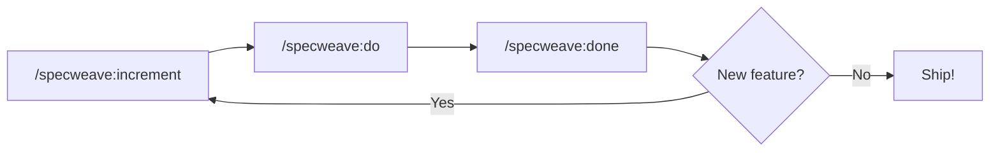
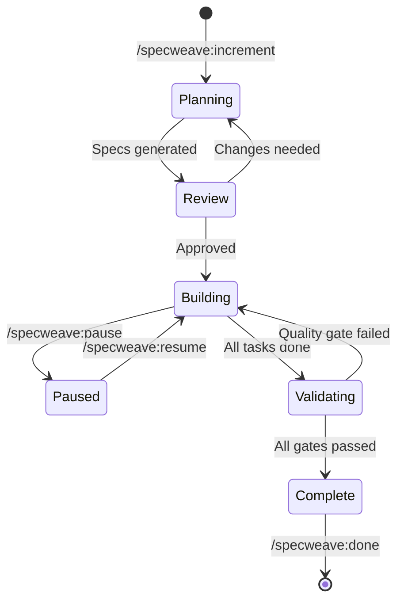

# Lesson 06.2: Core Workflow

**Duration**: 60 minutes | **Difficulty**: Beginner

---

## Learning Objectives

By the end of this lesson, you will understand:
- The three core phases of SpecWeave development
- When and how to use each command
- The complete increment lifecycle
- Supporting commands for workflow management

---

## The Three Phases

SpecWeave development follows a simple cycle:



| Phase | Command | Purpose |
|-------|---------|---------|
| **Plan** | `/specweave:increment` | Create specifications |
| **Build** | `/specweave:do` | Implement tasks |
| **Validate** | `/specweave:done` | Verify quality |

---

## Phase 1: Plan (`/specweave:increment`)

This is where the magic starts. A single description becomes complete specifications.

### How It Works

```bash
/specweave:increment "User authentication with email/password login"
```

The AI agents create:

1. **spec.md** — PM Agent
   - Feature scope definition
   - User stories (As a... I want... So that...)
   - Acceptance criteria (testable conditions)

2. **plan.md** — Architect Agent
   - Architecture Decision Records (ADRs)
   - Component design
   - Technology choices
   - Risk assessment

3. **tasks.md** — Tech Lead Agent
   - Task breakdown
   - Dependencies
   - BDD test scenarios
   - Estimated complexity

### Example Output

```
/specweave:increment "Task tracker CLI with add, list, complete, delete"

Creating increment 0001-task-tracker-cli...

📋 PM Agent creating spec.md...
   ✓ Feature scope defined
   ✓ 4 user stories created
   ✓ 12 acceptance criteria defined

🏗️ Architect Agent creating plan.md...
   ✓ 2 architecture decisions recorded
   ✓ Component design complete
   ✓ Error handling strategy defined

📝 Tech Lead Agent creating tasks.md...
   ✓ 10 tasks created
   ✓ Dependencies mapped
   ✓ BDD scenarios written

Increment 0001-task-tracker-cli ready!

Review specs at:
  .specweave/increments/0001-task-tracker-cli/spec.md
  .specweave/increments/0001-task-tracker-cli/plan.md
  .specweave/increments/0001-task-tracker-cli/tasks.md
```

### Key Principles

1. **One increment = One feature** — Don't pack too much into one increment
2. **Review before proceeding** — Read the specs, suggest changes
3. **Smaller is better** — More increments with fewer tasks each

---

## Phase 2: Build (`/specweave:do`)

With specifications approved, implementation begins.

### How It Works

```bash
/specweave:do
```

SpecWeave:
1. Loads the active increment
2. Identifies pending tasks
3. Implements each task sequentially
4. Updates task status
5. Syncs with specs

### During Implementation

```
/specweave:do

Loading increment 0001-task-tracker-cli...

📋 Task Progress: 0/10 complete

Working on T-001: Set up project structure
  ✓ Created package.json
  ✓ Created src/ directory
  ✓ Initialized storage module
  → T-001 complete

Working on T-002: Implement task data model
  ✓ Created Task interface
  ✓ Added validation functions
  → T-002 complete

Working on T-003: Implement add task function
  ...

📊 Progress: 3/10 tasks complete
```

### Key Principles

1. **Tasks are atomic** — Each task is a single unit of work
2. **Tests accompany code** — BDD scenarios become tests
3. **Progress is tracked** — Status updates in real-time
4. **Context is maintained** — AI knows the full spec

### Pausing and Resuming

Life happens. You can pause and resume:

```bash
# Pause current work
/specweave:pause 0001

# Resume later
/specweave:resume 0001

# Check status
/specweave:status
```

---

## Phase 3: Validate (`/specweave:done`)

Before marking complete, quality gates must pass.

### How It Works

```bash
/specweave:done 0001
```

SpecWeave validates:

1. **Task Completion**
   - [ ] All tasks marked complete
   - [ ] No pending tasks remain

2. **Acceptance Criteria**
   - [ ] Each AC has a corresponding task
   - [ ] All ACs satisfied by tests

3. **Test Coverage**
   - [ ] Unit tests exist
   - [ ] Coverage meets threshold (default: 70%)

4. **Code Quality**
   - [ ] No critical linting errors
   - [ ] No security vulnerabilities

### Example Output

```
/specweave:done 0001

Validating increment 0001-task-tracker-cli...

📋 Task Completion
   ✓ 10/10 tasks complete

✅ Acceptance Criteria
   ✓ AC-US1-01: Task can be added (T-003)
   ✓ AC-US1-02: Task ID is auto-generated (T-003)
   ✓ AC-US2-01: All tasks can be listed (T-004)
   ... (12/12 satisfied)

🧪 Test Coverage
   ✓ Unit tests: 85%
   ✓ Integration tests: 72%
   ✓ Meets threshold (70%)

🔒 Code Quality
   ✓ No linting errors
   ✓ No security vulnerabilities

═══════════════════════════════════════════════
  Increment 0001-task-tracker-cli COMPLETE
═══════════════════════════════════════════════

📄 Completion report:
   .specweave/increments/0001-task-tracker-cli/completion-report.md
```

### If Validation Fails

```
/specweave:done 0001

Validating increment 0001-task-tracker-cli...

📋 Task Completion
   ⚠️ 8/10 tasks complete
   Pending: T-009, T-010

❌ Cannot mark complete. Fix issues:
   - Complete pending tasks: T-009, T-010
```

---

## Supporting Commands

### `/specweave:status`

View current state:

```bash
/specweave:status

SpecWeave Status
════════════════════

Active Increment: 0001-task-tracker-cli
  Status: in_progress
  Tasks: 6/10 complete (60%)
  ACs: 8/12 satisfied (67%)

WIP Limit: 1 (current: 1)
```

### `/specweave:progress`

Detailed progress view:

```bash
/specweave:progress 0001

Increment: 0001-task-tracker-cli
═══════════════════════════════

User Stories & Tasks:
─────────────────────
US-001: Add Task
  [x] T-001: Project setup
  [x] T-002: Task data model
  [x] T-003: Add task function
  [ ] T-004: Add task tests

US-002: List Tasks
  [x] T-005: List function
  [ ] T-006: List tests
```

### `/specweave:validate`

Run validation without completing:

```bash
/specweave:validate 0001

Validation Results:
  Tasks: 6/10 complete
  ACs: 8/12 satisfied
  Coverage: 72%
  Issues: 2 pending tasks
```

### `/specweave:sync-docs`

Sync living documentation:

```bash
/specweave:sync-docs

Syncing documentation...
  ✓ Updated API reference
  ✓ Updated feature docs
  ✓ Updated changelog
```

---

## The Complete Lifecycle



### State Transitions

| From | To | Trigger |
|------|-----|---------|
| None | Planning | `/specweave:increment` |
| Planning | Review | Specs generated |
| Review | Building | Specs approved |
| Building | Paused | `/specweave:pause` |
| Paused | Building | `/specweave:resume` |
| Building | Validating | `/specweave:done` |
| Validating | Complete | All gates pass |

---

## Best Practices

### 1. Small Increments

```bash
# ❌ Too big
/specweave:increment "Complete e-commerce platform"

# ✓ Right size
/specweave:increment "User registration with email verification"
/specweave:increment "Product catalog display"
/specweave:increment "Shopping cart functionality"
```

### 2. Review Specs Before Building

```bash
/specweave:increment "Feature X"

# STOP! Review before proceeding:
cat .specweave/increments/0001-feature-x/spec.md
cat .specweave/increments/0001-feature-x/plan.md
cat .specweave/increments/0001-feature-x/tasks.md

# Make adjustments if needed, then:
/specweave:do
```

### 3. Complete Before Starting New

```bash
# ❌ Don't jump between increments
/specweave:increment "Feature A"
/specweave:do  # Partially done
/specweave:increment "Feature B"  # Starting new!

# ✓ Complete one at a time
/specweave:increment "Feature A"
/specweave:do
/specweave:done 0001
/specweave:increment "Feature B"
```

### 4. Use Status Commands

```bash
# Regular check-ins
/specweave:status        # Quick status
/specweave:progress 0001 # Detailed progress
/specweave:validate 0001 # Pre-validate
```

---

## Key Takeaways

1. **Three phases: Plan → Build → Validate** — never skip
2. **`/specweave:increment` creates specifications** — the foundation
3. **`/specweave:do` implements with context** — not just code generation
4. **`/specweave:done` validates quality** — gates ensure completeness
5. **Supporting commands help manage** — status, progress, validate

---

## Next Lesson

Now let's create your first real increment and see this workflow in action.

→ [Continue to Lesson 06.3: Your First Increment](./03-first-increment)
