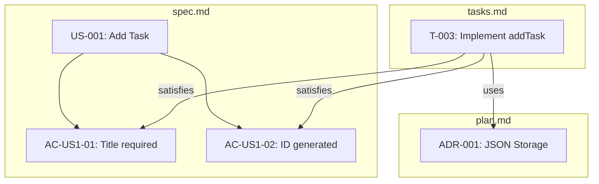

# Lesson 06.4: Understanding the Artifacts

**Duration**: 45 minutes | **Difficulty**: Beginner

---

## Learning Objectives

By the end of this lesson, you will understand:
- The structure and purpose of each artifact
- How artifacts connect and reference each other
- How to read and modify specifications
- The metadata and state management

---

## The Three Core Artifacts

Every increment produces three files:

```
.specweave/increments/0001-feature-name/
├── spec.md        ← WHAT to build (PM Agent)
├── plan.md        ← HOW to build (Architect Agent)
├── tasks.md       ← STEPS to build (Tech Lead Agent)
└── metadata.json  ← State and statistics
```

These files are **interconnected** — changes in one affect others.

---

## 1. spec.md — The Specification

### Purpose

Defines **WHAT** you're building in user-centric terms.

### Structure

```markdown
---
increment: 0001-feature-name
created: 2024-01-15T10:30:00.000Z
status: in_progress
---

# Feature Title

## Feature Overview
[High-level description of the feature]

## User Stories

### US-001: [Story Title]
**As a** [user type]
**I want to** [capability]
**So that** [benefit]

#### Acceptance Criteria
- [ ] **AC-US1-01**: [Testable criterion]
- [ ] **AC-US1-02**: [Testable criterion]
- [ ] **AC-US1-03**: [Testable criterion]

### US-002: [Next Story]
...

## Out of Scope
[What this increment does NOT include]

## Assumptions
[Dependencies and assumptions]
```

### Key Elements

| Element | Purpose | Example |
|---------|---------|---------|
| **User Story** | Who wants what and why | "As a user, I want to add tasks..." |
| **Acceptance Criteria** | Testable conditions | "AC-US1-01: Task receives unique ID" |
| **Out of Scope** | Clear boundaries | "Multi-user support not included" |

### Reading AC IDs

```
AC-US1-02
│  │  │
│  │  └── Criterion number (02)
│  └───── User story number (US1)
└──────── Acceptance Criteria prefix
```

### Checkboxes Track Progress

```markdown
# Before implementation
- [ ] **AC-US1-01**: Task can be added with title

# After task T-003 completes
- [x] **AC-US1-01**: Task can be added with title ← T-003
```

---

## 2. plan.md — The Architecture Plan

### Purpose

Defines **HOW** you'll build it — technical decisions and design.

### Structure

```markdown
---
increment: 0001-feature-name
---

# Architecture Plan

## Component Overview
[System diagram or description]

## Architecture Decisions

### ADR-001: [Decision Title]

**Status**: Proposed | Accepted | Deprecated | Superseded

**Context**:
[Why this decision is needed]

**Options Considered**:
1. [Option A] - [pros/cons]
2. [Option B] - [pros/cons]
3. [Option C] - [pros/cons]

**Decision**:
[What was decided]

**Rationale**:
[Why this option was chosen]

**Consequences**:
- Good: [positive outcomes]
- Bad: [negative outcomes]
- Neutral: [neutral observations]

## Technical Specifications
[APIs, data models, interfaces]

## Security Considerations
[Security-related decisions]

## Performance Considerations
[Performance-related decisions]
```

### ADR (Architecture Decision Record)

ADRs document **why** decisions were made:

```markdown
### ADR-001: Database Selection

**Context**:
We need persistent storage for user data.

**Options Considered**:
1. PostgreSQL - Reliable, ACID, complex setup
2. SQLite - Simple, embedded, single-file
3. JSON files - Simplest, no dependencies

**Decision**:
SQLite for development, PostgreSQL for production

**Rationale**:
- SQLite simplifies local development
- PostgreSQL provides production reliability
- Same SQL syntax, easy migration
```

**Six months later**: "Why do we support two databases?"
**Answer**: Read ADR-001.

### ADR Status Flow

```
Proposed → Accepted → [Deprecated | Superseded]
```

- **Proposed**: Under discussion
- **Accepted**: Implemented
- **Deprecated**: No longer recommended
- **Superseded**: Replaced by new ADR

---

## 3. tasks.md — The Implementation Plan

### Purpose

Defines **STEPS** to build — actionable work items with test plans.

### Structure

```markdown
---
increment: 0001-feature-name
---

# Implementation Tasks

## Task Overview

| Task | User Story | Status | ACs Satisfied |
|------|-----------|--------|---------------|
| T-001 | All | [x] | - |
| T-002 | US-001, US-002 | [x] | - |
| T-003 | US-001 | [ ] | AC-US1-01, AC-US1-02 |

---

## T-001: [Task Title]
**User Story**: [Which US this supports]
**Satisfies ACs**: [Which ACs this task completes]
**Status**: [ ] pending | [x] completed
**Dependencies**: [Other tasks that must complete first]

### Implementation Notes
[Technical details, approach, code hints]

### Test Plan (BDD)
```gherkin
Scenario: [Scenario Name]
  Given [precondition]
  When [action]
  Then [expected result]
```

### Files Changed
- [ ] `src/module.js` - [What changes]
- [ ] `tests/module.test.js` - [Test file]

---

## T-002: [Next Task]
...
```

### Task ID Format

```
T-003
│ │
│ └── Task number within increment
└──── Task prefix
```

### Status Tracking

```markdown
**Status**: [ ] pending     # Not started
**Status**: [~] in_progress # Currently working
**Status**: [x] completed   # Done
**Status**: [!] blocked     # Cannot proceed
```

### BDD Test Scenarios

Each task includes Behavior-Driven Development scenarios:

```gherkin
Scenario: Add task with valid title
  Given an empty task list
  When addTask("Learn SpecWeave") is called
  Then the task list contains 1 task
  And the task has title "Learn SpecWeave"
  And the task has a unique ID

Scenario: Add task with empty title
  Given any task list state
  When addTask("") is called
  Then an error is thrown
  And the error message is "Task title cannot be empty"
```

These scenarios become your **test cases**.

---

## 4. metadata.json — State Management

### Purpose

Machine-readable state and statistics.

### Structure

```json
{
  "increment": "0001-task-tracker-cli",
  "status": "in_progress",
  "created": "2024-01-15T10:30:00.000Z",
  "updated": "2024-01-15T14:45:00.000Z",
  "stats": {
    "userStories": 4,
    "acceptanceCriteria": {
      "total": 14,
      "satisfied": 10
    },
    "tasks": {
      "total": 12,
      "completed": 8,
      "pending": 4,
      "blocked": 0
    },
    "testCoverage": 72
  },
  "agents": {
    "pm": {
      "version": "1.0.0",
      "completed": "2024-01-15T10:32:00.000Z"
    },
    "architect": {
      "version": "1.0.0",
      "completed": "2024-01-15T10:35:00.000Z"
    },
    "techLead": {
      "version": "1.0.0",
      "completed": "2024-01-15T10:38:00.000Z"
    }
  }
}
```

---

## How Artifacts Connect



### Traceability Chain

```
Requirement (Business Need)
    ↓
User Story (US-001)
    ↓
Acceptance Criteria (AC-US1-01)
    ↓
Task (T-003)
    ↓
Code (src/tasks.js:addTask)
    ↓
Test (tests/tasks.test.js:describe('addTask'))
```

---

## Modifying Specifications

### When to Modify

- Requirements change mid-increment
- Architecture needs adjustment
- Tasks need refinement

### How to Modify

1. **Edit the file directly** — markdown is human-readable
2. **Maintain references** — if you add AC, add task to satisfy it
3. **Update metadata** — or let SpecWeave sync it

### Example: Adding an Acceptance Criterion

```markdown
# In spec.md - add new AC:
- [ ] **AC-US1-05**: Task title limited to 200 characters

# In tasks.md - add task to satisfy it:
## T-013: Add title length validation
**User Story**: US-001
**Satisfies ACs**: AC-US1-05
**Status**: [ ] pending

### Implementation Notes
Add check in validateTitle() for max length.

### Test Plan (BDD)
Scenario: Title exceeds maximum length
  Given any state
  When addTask with 201-character title is called
  Then error "Title must be 200 characters or less" thrown
```

---

## The Completion Report

After `/specweave:done`, a completion report is generated:

```markdown
# Increment Completion Report

## 0001-task-tracker-cli

### Summary
- **Status**: Complete
- **Duration**: 4 hours 15 minutes
- **User Stories**: 4/4 implemented
- **Acceptance Criteria**: 14/14 satisfied
- **Tasks**: 12/12 completed
- **Test Coverage**: 85%

### User Stories Delivered
1. US-001: Add Task ✓
2. US-002: List Tasks ✓
3. US-003: Complete Task ✓
4. US-004: Delete Task ✓

### Architecture Decisions Made
1. ADR-001: JSON file storage (Accepted)
2. ADR-002: Error handling strategy (Accepted)

### Quality Metrics
- Unit test coverage: 85%
- No linting errors
- No security vulnerabilities

### Files Changed
- task.js (new)
- src/tasks.js (new)
- src/storage.js (new)
- tests/tasks.test.js (new)

### Next Steps
- Consider adding task priorities (future increment)
- Consider due dates (future increment)
```

---

## Best Practices

### 1. Keep Artifacts in Sync

```bash
# After manual edits, validate
/specweave:validate 0001

# Sync documentation
/specweave:sync-docs
```

### 2. Reference Consistently

```markdown
# Good - clear references
**Satisfies ACs**: AC-US1-01, AC-US1-02

# Bad - vague references
**Satisfies ACs**: the add task criteria
```

### 3. Write Testable ACs

```markdown
# Good - testable
- [ ] **AC-US1-02**: Task ID is positive integer

# Bad - vague
- [ ] **AC-US1-02**: Task has some kind of ID
```

### 4. Document Decisions

Every "why" should be in plan.md:

```markdown
# Why JSON? → ADR-001
# Why throw errors? → ADR-002
# Why this validation? → AC-US1-03
```

---

## Key Takeaways

1. **spec.md defines WHAT** — user stories and acceptance criteria
2. **plan.md defines HOW** — architecture decisions and design
3. **tasks.md defines STEPS** — implementation with test plans
4. **Artifacts are interconnected** — tasks satisfy ACs, use ADRs
5. **Everything is traceable** — code → task → AC → user story

---

## Part 2 Complete!

Congratulations! You've mastered the fundamentals:
- ✅ JavaScript basics
- ✅ Building a project traditionally
- ✅ SpecWeave core workflow
- ✅ Understanding specifications

---

## Next Part

Ready to learn about testing?

→ [Continue to Part 3: Testing Fundamentals](../../part-3-testing/)
