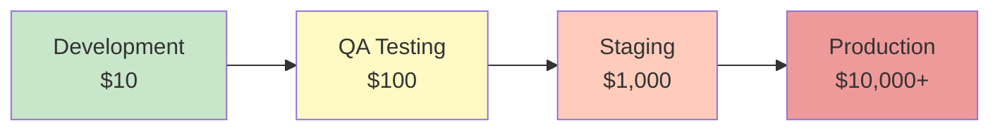

# Lesson 07.1: Why Testing Matters

**Duration**: 30 minutes | **Difficulty**: Beginner

---

## Learning Objectives

By the end of this lesson, you will understand:
- The real cost of software bugs
- Why testing is a professional requirement
- The five key benefits of testing
- How testing enables confident development

---

## The Cost of Bugs

Software bugs don't have equal costs. **When** you catch a bug matters dramatically:



### Real-World Cost Examples

| Stage | Cost | Example |
|-------|------|---------|
| **Development** | $10 | Developer catches bug in unit test (5 min fix) |
| **QA Testing** | $100 | QA finds bug, writes report, developer debugs, retests (2 hours) |
| **Staging** | $1,000 | Bug blocks release, emergency fix, deployment cycle (1 day) |
| **Production** | $10,000+ | Data corruption, customer support, incident response, reputation damage |

### Famous Production Bug Costs

| Incident | Company | Cost |
|----------|---------|------|
| Knight Capital trading bug (2012) | Knight Capital | $440 million in 45 minutes |
| Amazon Prime Day crash (2018) | Amazon | $72 million in one hour |
| Facebook 6-hour outage (2021) | Meta | $60 million + stock drop |
| Crowdstrike update crash (2024) | Multiple | $5.4 billion global impact |

**The message is clear**: Find bugs early, or pay exponentially more later.

---

## The Five Benefits of Testing

### 1. Prevent Production Bugs

```
Without Tests:
  Deploy → Bug in production → Users affected → Support tickets
  → Developer debugging → Fix → Redeploy → Hope it works

With Tests:
  Write code → Tests catch bug → Fix immediately → Deploy safely
```

Tests are your **first line of defense**.

### 2. Catch Regressions Early

**Regression**: A bug introduced by changes that broke previously working code.

```typescript
// Original function (works)
function calculateTotal(items) {
  return items.reduce((sum, item) => sum + item.price, 0);
}

// "Improvement" that breaks it
function calculateTotal(items) {
  return items.reduce((sum, item) => sum + item.cost, 0); // BUG: item.cost doesn't exist!
}
```

Without tests: Bug ships, users see $0 totals.
With tests: Test fails immediately, developer fixes before commit.

### 3. Document Expected Behavior

Tests serve as **living documentation**:

```typescript
describe('calculateShipping', () => {
  it('should be free for orders over $50', () => {
    expect(calculateShipping(51)).toBe(0);
  });

  it('should be $5 for orders under $50', () => {
    expect(calculateShipping(49)).toBe(5);
  });

  it('should be free for premium customers regardless of total', () => {
    expect(calculateShipping(10, { isPremium: true })).toBe(0);
  });
});
```

New developer: "How does shipping work?"
Answer: Read the tests.

### 4. Enable Confident Refactoring

**Refactoring**: Improving code structure without changing behavior.

```typescript
// Before refactoring: Messy but works
function processOrder(order) {
  let total = 0;
  for (let i = 0; i < order.items.length; i++) {
    total += order.items[i].price * order.items[i].quantity;
  }
  if (order.coupon) {
    total = total - (total * order.coupon.discount / 100);
  }
  return total;
}

// After refactoring: Clean and readable
function processOrder(order) {
  const subtotal = calculateSubtotal(order.items);
  const discount = applyCoupon(subtotal, order.coupon);
  return subtotal - discount;
}
```

Without tests: "Did I break something? I'm scared to change anything."
With tests: "All 47 tests pass. Refactoring successful!"

### 5. Reduce Debugging Time

```
Without Tests:
  User reports: "Checkout is broken"
  Developer: "Which part? When? For whom?"
  → 4 hours of debugging

With Tests:
  Test fails: "calculateTax returns NaN for international orders"
  Developer: "Ah, the tax rate lookup is failing for non-US addresses"
  → 15 minutes to fix
```

Tests **pinpoint exactly what broke**.

---

## The Psychology of Untested Code

### Fear-Driven Development

Without tests, developers experience:
- **Fear of change**: "Don't touch that, it might break"
- **Merge anxiety**: "What if this PR breaks everything?"
- **Deploy dread**: "Friday deploy? Absolutely not."
- **Technical debt paralysis**: "We can't refactor, it's too risky"

### Confidence-Driven Development

With tests, developers experience:
- **Change confidence**: "Tests will catch any issues"
- **Merge clarity**: "CI passed, safe to merge"
- **Deploy comfort**: "All tests green, ship it"
- **Refactoring freedom**: "Let's clean this up"

---

## Testing Myths Debunked

### Myth 1: "Tests slow down development"

**Reality**: Tests slow down initial typing. They **speed up** overall development by:
- Catching bugs immediately (not days later)
- Reducing debugging time
- Enabling safe refactoring
- Serving as documentation

### Myth 2: "I'll add tests later"

**Reality**: "Later" never comes. Code without tests:
- Becomes harder to test over time
- Accumulates technical debt
- Eventually requires rewrite

### Myth 3: "My code is simple, it doesn't need tests"

**Reality**: Simple code:
- Gets complex over time
- Is modified by others
- Has edge cases you haven't considered

### Myth 4: "Manual testing is enough"

**Reality**: Manual testing:
- Is slow and expensive
- Misses edge cases
- Can't be run on every commit
- Doesn't scale

---

## When Testing Is Non-Negotiable

Some code **must** have tests:

| Code Type | Why |
|-----------|-----|
| Payment processing | Financial liability |
| User authentication | Security risk |
| Data transformations | Data integrity |
| API contracts | Breaking changes affect users |
| Business logic | Core value of the product |

---

## SpecWeave Testing Philosophy

SpecWeave embeds testing into the development process:

### Tests Are Planned, Not Afterthoughts

```markdown
## T-003: Implement password validation
**Satisfies ACs**: AC-US1-02

### Test Plan (BDD)
- Given password "Abc123!@" → Should pass (meets all criteria)
- Given password "abc" → Should fail (too short)
- Given password "abcdefgh" → Should fail (no uppercase)
- Given password "ABCDEFGH" → Should fail (no lowercase)
```

Tests are defined **before** code is written.

### Quality Gates Enforce Testing

`/sw:done` validates:
- ✓ Test plans exist for all tasks
- ✓ Coverage meets threshold
- ✓ All tests passing

You **cannot** complete an increment without tests.

---

## Key Takeaways

1. **Bugs cost exponentially more to fix later** — $10 vs $10,000+
2. **Tests catch regressions** — changes don't break existing features
3. **Tests are living documentation** — show how code should behave
4. **Tests enable refactoring** — improve code without fear
5. **Tests reduce debugging time** — pinpoint exactly what's broken

---

## Reflection Questions

1. Think of a bug you encountered in production. How much did it cost (time, money, reputation)?

2. Have you ever been afraid to modify code because you might break something?

3. How would comprehensive tests have changed those situations?

---

## Next Lesson

Now let's learn about the testing pyramid — how to distribute your testing effort effectively.

→ [Continue to Lesson 07.2: The Testing Pyramid](./02-testing-pyramid)
