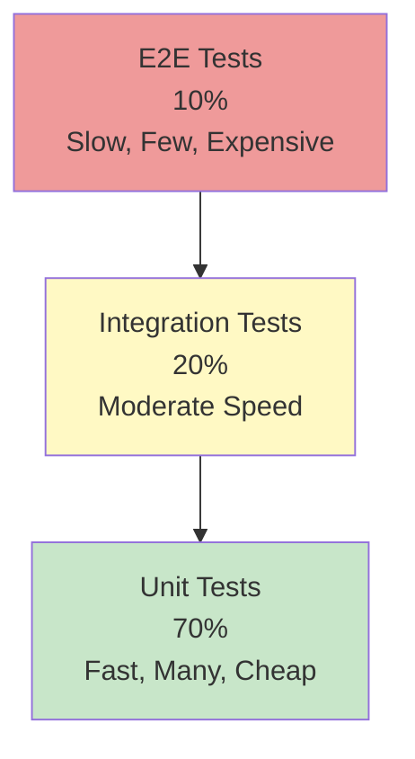
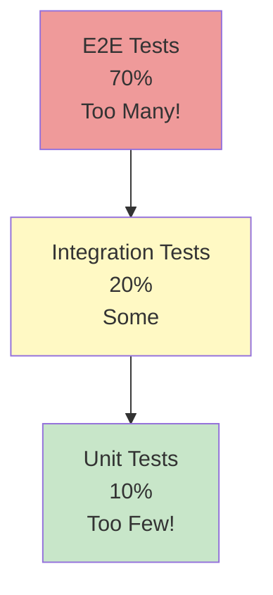

# Lesson 07.2: The Testing Pyramid

**Duration**: 45 minutes | **Difficulty**: Beginner

---

## Learning Objectives

By the end of this lesson, you will understand:
- The three layers of the testing pyramid
- Why the pyramid shape matters
- Characteristics of each test type
- The anti-pattern to avoid (ice cream cone)

---

## The Testing Pyramid



The pyramid shows **how to distribute your testing effort**:
- **70% Unit Tests** — The foundation
- **20% Integration Tests** — The middle layer
- **10% E2E Tests** — The peak

---

## Layer 1: Unit Tests (70%)

**What**: Test individual functions or components in isolation

### Characteristics

| Aspect | Unit Tests |
|--------|-----------|
| Speed | Fast (milliseconds) |
| Count | Many (hundreds/thousands) |
| Scope | Single function/class |
| Dependencies | Mocked |
| Cost | Cheap to write/maintain |

### Example

```typescript
// Testing a single function in isolation
describe('calculateOrderTotal', () => {
  it('should sum item prices', () => {
    const items = [
      { price: 100 },
      { price: 50 }
    ];

    expect(calculateOrderTotal(items)).toBe(150);
  });

  it('should handle empty cart', () => {
    expect(calculateOrderTotal([])).toBe(0);
  });

  it('should apply discount correctly', () => {
    const items = [{ price: 100 }];

    expect(calculateOrderTotal(items, 0.1)).toBe(90); // 10% off
  });
});
```

### What Unit Tests Catch

- Logic errors in calculations
- Edge cases (empty, null, boundary values)
- Type errors
- Algorithm bugs

### What Unit Tests Miss

- Integration issues between components
- Database queries
- API communication
- UI rendering

---

## Layer 2: Integration Tests (20%)

**What**: Test how components work together

### Characteristics

| Aspect | Integration Tests |
|--------|------------------|
| Speed | Moderate (seconds) |
| Count | Some (dozens/hundreds) |
| Scope | Multiple components |
| Dependencies | Real (test instances) |
| Cost | Moderate |

### Example

```typescript
// Testing API endpoint with database
describe('POST /api/orders', () => {
  beforeEach(async () => {
    await testDb.truncate(); // Reset database
  });

  it('should create order and update inventory', async () => {
    // Setup: Create product with stock
    await testDb.products.create({
      id: 'laptop',
      name: 'MacBook Pro',
      stock: 10
    });

    // Act: Create order via API
    const response = await request(app)
      .post('/api/orders')
      .send({
        productId: 'laptop',
        quantity: 2
      });

    // Assert: Order created
    expect(response.status).toBe(201);
    expect(response.body.order.id).toBeDefined();

    // Assert: Inventory updated
    const product = await testDb.products.findById('laptop');
    expect(product.stock).toBe(8); // 10 - 2
  });
});
```

### What Integration Tests Catch

- API/database communication issues
- Service interaction bugs
- Data transformation errors
- Authentication/authorization flows

### What Integration Tests Miss

- UI behavior
- Complete user workflows
- Cross-browser issues

---

## Layer 3: E2E Tests (10%)

**What**: Test complete user journeys through the UI

### Characteristics

| Aspect | E2E Tests |
|--------|-----------|
| Speed | Slow (minutes) |
| Count | Few (5-20 critical paths) |
| Scope | Complete application |
| Dependencies | All real |
| Cost | Expensive |

### Example

```typescript
// Testing complete checkout flow
test('User can complete checkout', async ({ page }) => {
  // 1. Login
  await page.goto('/login');
  await page.fill('[name="email"]', 'user@example.com');
  await page.fill('[name="password"]', 'SecurePass123');
  await page.click('button[type="submit"]');

  // 2. Add to cart
  await page.goto('/products');
  await page.click('[data-product="laptop"]');
  await page.click('button:has-text("Add to Cart")');

  // 3. Checkout
  await page.goto('/cart');
  await page.click('button:has-text("Checkout")');

  // 4. Payment
  await page.fill('[name="cardNumber"]', '4242424242424242');
  await page.fill('[name="expiry"]', '12/25');
  await page.fill('[name="cvc"]', '123');
  await page.click('button:has-text("Pay")');

  // 5. Verify success
  await expect(page.locator('text=Order Confirmed')).toBeVisible();
});
```

### What E2E Tests Catch

- Complete workflow failures
- UI integration issues
- Real-world user scenarios
- Cross-component bugs

### What E2E Tests Miss (Or Are Bad At)

- Edge cases (too slow to test all)
- Specific error conditions
- Implementation details

---

## Why This Distribution?

### Speed vs. Confidence Trade-off

```
Test Type     | Speed    | Confidence | Count
-------------|----------|------------|--------
Unit         | 1ms      | Low-Med    | 1000s
Integration  | 1 sec    | Medium     | 100s
E2E          | 1 min    | High       | 10s
```

**Total suite time:**
- 1000 unit tests × 1ms = 1 second
- 100 integration tests × 1s = 100 seconds
- 10 E2E tests × 1min = 10 minutes

Total: ~12 minutes (acceptable for CI)

### Maintenance Effort

| Test Type | Maintenance |
|-----------|-------------|
| Unit | Low — rarely break during refactoring |
| Integration | Medium — break when APIs change |
| E2E | High — break when UI changes (brittle) |

### Coverage Strategy

| Test Type | What to Test |
|-----------|--------------|
| Unit | All edge cases, all branches |
| Integration | Critical workflows, happy paths |
| E2E | Happy paths only (5-10 critical journeys) |

---

## The Anti-Pattern: Ice Cream Cone



### Problems with Ice Cream Cone

| Issue | Impact |
|-------|--------|
| Slow suite | Hours to run, developers skip it |
| Flaky tests | E2E fails randomly, ignored |
| High maintenance | UI changes break many tests |
| Hard to debug | E2E failures don't pinpoint cause |
| Expensive | Browser automation costs resources |

### How Teams End Up Here

1. "Let's test like users do" → Write E2E tests
2. "We need more coverage" → Write more E2E tests
3. "This is slow" → Run tests less often
4. "Tests are flaky" → Ignore failures
5. "Tests are useless" → Stop testing

### The Solution

**Invert the cone back to a pyramid:**
1. Identify logic that can be unit tested
2. Extract functions from UI components
3. Replace E2E tests with unit + integration
4. Keep only critical-path E2E tests

---

## Practical Distribution Guidelines

### For a Web Application

```
Feature: User Registration

Unit Tests (10+ tests):
- validateEmail() edge cases
- validatePassword() rules
- hashPassword() functionality
- generateToken() format

Integration Tests (3-5 tests):
- POST /api/register creates user
- Duplicate email rejected
- Welcome email sent

E2E Tests (1 test):
- Complete registration flow
```

### For an API

```
Feature: Order Processing

Unit Tests (20+ tests):
- calculateTotal() variations
- applyDiscount() scenarios
- validateInventory() edge cases
- formatReceipt() output

Integration Tests (5-10 tests):
- Create order updates inventory
- Payment processing integration
- Email notification sent
- Webhook triggered

E2E Tests (1-2 tests):
- Complete order flow
- Failed payment recovery
```

---

## SpecWeave Test Distribution

SpecWeave tasks suggest appropriate test types:

```markdown
## T-003: Implement password validation
**Type**: Unit-heavy

### Test Plan
**Unit Tests** (8 tests):
- Valid password (8+ chars, uppercase, number, special)
- Too short
- No uppercase
- No number
- No special char
- Empty string
- Null input
- Unicode characters

**Integration Tests** (1 test):
- Registration endpoint validates password

**E2E Tests** (0):
- Covered by registration E2E test
```

---

## Key Takeaways

1. **Follow the pyramid** — 70% unit, 20% integration, 10% E2E
2. **Unit tests are the foundation** — fast, many, test all edge cases
3. **Integration tests verify connections** — APIs, databases, services
4. **E2E tests cover critical paths** — complete user journeys only
5. **Avoid the ice cream cone** — too many E2E tests = slow, brittle, expensive

---

## Next Lesson

Now let's look at the anatomy of a good test — how to structure tests effectively.

→ [Continue to Lesson 07.3: Test Anatomy](./03-test-anatomy)
