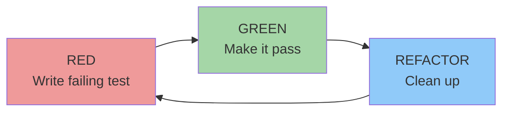

# Lesson 11.1: The Red-Green-Refactor Cycle

**Duration**: 45 minutes | **Difficulty**: Intermediate

---

## Learning Objectives

By the end of this lesson, you will be able to:
- Explain the TDD (Test-Driven Development) philosophy
- Follow the Red-Green-Refactor cycle
- Write tests before implementation
- Use tests to drive design decisions

---

## What is TDD?

**Test-Driven Development** inverts the traditional workflow:

```
Traditional:  Write Code → Write Tests → Debug
TDD:          Write Tests → Write Code → Refactor
```

The TDD mantra: **"Red, Green, Refactor"**



---

## The Three Laws of TDD

**Kent Beck's Three Laws**:

1. **Write production code only to make a failing test pass**
2. **Write only enough of a test to fail** (compilation failures count)
3. **Write only enough production code to make the test pass**

This seems restrictive, but it ensures:
- Every line of code is covered by tests
- You don't write unnecessary code
- Tests document behavior

---

## Step-by-Step Example

Let's build a `PasswordValidator` using TDD.

### Requirements

- Password must be at least 8 characters
- Password must contain at least one uppercase letter
- Password must contain at least one number

### RED: Write First Failing Test

```typescript
// passwordValidator.test.ts
import { describe, it, expect } from 'vitest';
import { validatePassword } from './passwordValidator';

describe('validatePassword', () => {
  it('should reject passwords shorter than 8 characters', () => {
    expect(validatePassword('Short1')).toBe(false);
  });
});
```

**Run the test:**
```bash
npm test

# ❌ FAIL: Cannot find module './passwordValidator'
```

This is **RED** — the test fails (can't even import!).

### GREEN: Minimum Code to Pass

```typescript
// passwordValidator.ts
export function validatePassword(password: string): boolean {
  return password.length >= 8;
}
```

**Run the test:**
```bash
npm test

# ✅ PASS: should reject passwords shorter than 8 characters
```

This is **GREEN** — test passes!

### RED: Add Second Test

```typescript
describe('validatePassword', () => {
  it('should reject passwords shorter than 8 characters', () => {
    expect(validatePassword('Short1')).toBe(false);
  });

  it('should reject passwords without uppercase letters', () => {
    expect(validatePassword('lowercase1')).toBe(false);
  });
});
```

**Run:**
```bash
npm test

# ❌ FAIL: should reject passwords without uppercase letters
# Expected: false
# Received: true
```

**RED** again!

### GREEN: Make It Pass

```typescript
export function validatePassword(password: string): boolean {
  if (password.length < 8) return false;
  if (!/[A-Z]/.test(password)) return false;
  return true;
}
```

**Run:**
```bash
npm test

# ✅ PASS: All tests pass
```

### RED: Third Requirement

```typescript
it('should reject passwords without numbers', () => {
  expect(validatePassword('NoNumbers!')).toBe(false);
});
```

**Run:** ❌ FAIL

### GREEN: Complete Implementation

```typescript
export function validatePassword(password: string): boolean {
  if (password.length < 8) return false;
  if (!/[A-Z]/.test(password)) return false;
  if (!/[0-9]/.test(password)) return false;
  return true;
}
```

**Run:** ✅ PASS

### REFACTOR: Clean Up

Now all tests pass. Can we improve the code?

```typescript
export function validatePassword(password: string): boolean {
  const rules = [
    (p: string) => p.length >= 8,           // Min length
    (p: string) => /[A-Z]/.test(p),         // Has uppercase
    (p: string) => /[0-9]/.test(p),         // Has number
  ];

  return rules.every(rule => rule(password));
}
```

**Run tests after refactoring:** ✅ All still pass!

This is **REFACTOR** — improve code structure while tests ensure behavior is preserved.

---

## Add a Positive Test

We've tested rejections. Let's confirm valid passwords are accepted:

```typescript
it('should accept valid password with all requirements', () => {
  expect(validatePassword('ValidPass1')).toBe(true);
});
```

This test should pass immediately (we've implemented all rules).

---

## Complete Test Suite

```typescript
// passwordValidator.test.ts
import { describe, it, expect } from 'vitest';
import { validatePassword } from './passwordValidator';

describe('validatePassword', () => {
  describe('length requirement', () => {
    it('should reject passwords shorter than 8 characters', () => {
      expect(validatePassword('Short1A')).toBe(false);  // 7 chars
    });

    it('should accept passwords with exactly 8 characters', () => {
      expect(validatePassword('Valid1Aa')).toBe(true);  // 8 chars
    });
  });

  describe('uppercase requirement', () => {
    it('should reject passwords without uppercase letters', () => {
      expect(validatePassword('lowercase1')).toBe(false);
    });

    it('should accept passwords with uppercase letters', () => {
      expect(validatePassword('Uppercase1')).toBe(true);
    });
  });

  describe('number requirement', () => {
    it('should reject passwords without numbers', () => {
      expect(validatePassword('NoNumbers!')).toBe(false);
    });

    it('should accept passwords with numbers', () => {
      expect(validatePassword('HasNumber1')).toBe(true);
    });
  });

  describe('combined requirements', () => {
    it('should accept password meeting all requirements', () => {
      expect(validatePassword('ValidPass1')).toBe(true);
    });

    it('should reject password missing any requirement', () => {
      expect(validatePassword('short')).toBe(false);     // Too short
      expect(validatePassword('nouppercase1')).toBe(false); // No uppercase
      expect(validatePassword('NoNumbers')).toBe(false);  // No number
    });
  });
});
```

---

## TDD Benefits

### 1. Design Emerges from Tests

Tests force you to think about:
- **Interface**: How will the function be called?
- **Inputs**: What parameters does it need?
- **Outputs**: What should it return?
- **Edge cases**: What could go wrong?

### 2. Instant Feedback

```
Write test → See it fail → Write code → See it pass
```

Each cycle is 30 seconds to 2 minutes. Problems surface immediately.

### 3. Confidence to Refactor

With comprehensive tests, you can:
- Rename functions
- Extract helpers
- Optimize algorithms
- Restructure code

If tests pass, behavior is preserved.

### 4. Living Documentation

Tests show exactly how code should work:

```typescript
// This IS the documentation
it('should apply 10% discount for orders over $100', () => {
  expect(calculateDiscount(150)).toBe(15);
});
```

---

## Common TDD Mistakes

### Mistake 1: Skipping Red

```typescript
// ❌ Writing test that already passes
it('should return true', () => {
  expect(true).toBe(true);  // Never fails!
});
```

Always see the test **fail first** to prove it can detect problems.

### Mistake 2: Writing Too Much Code

```typescript
// ❌ Implementing entire feature before testing
function validatePassword(password: string): boolean {
  // 50 lines of validation logic...
  // Did you test all of it?
}
```

**TDD rule**: Write only enough code to make the current test pass.

### Mistake 3: Not Refactoring

```typescript
// ❌ Code works but is messy
function validatePassword(password: string): boolean {
  if (password.length < 8) return false;
  if (!/[A-Z]/.test(password)) return false;
  if (!/[0-9]/.test(password)) return false;
  if (!/[!@#$%^&*]/.test(password)) return false;
  if (password.toLowerCase().includes('password')) return false;
  // Keep adding if statements forever...
}
```

Refactor when tests are green!

---

## TDD with SpecWeave

SpecWeave's `/sw:tdd-cycle` automates TDD:

```bash
# Start TDD cycle
/sw:tdd-cycle

# Or step by step:
/sw:tdd-red     # Write failing tests
/sw:tdd-green   # Implement to pass
/sw:tdd-refactor # Clean up code
```

### Tasks with Embedded Tests

```markdown
## T-005: Implement password validation
**Status**: [ ] pending
**Satisfies ACs**: AC-US2-01

### Test Plan (TDD)
1. RED: `validatePassword('short')` → false (< 8 chars)
2. RED: `validatePassword('nouppercase1')` → false
3. RED: `validatePassword('NoNumber')` → false
4. GREEN: Implement validation rules
5. REFACTOR: Extract rule functions
```

---

## Key Takeaways

1. **Test first, code second** — Tests drive design
2. **Red-Green-Refactor** — The rhythm of TDD
3. **Small steps** — One test, one feature at a time
4. **Always see red first** — Proves the test works
5. **Refactor with confidence** — Tests are your safety net

---

## Practice Exercise

Build a `calculateShipping` function using TDD:

**Requirements**:
- Free shipping for orders over $50
- $5.99 for orders $25-$50
- $9.99 for orders under $25
- International orders add $10

Write tests first, then implement!

---

## Next Lesson

Learn how BDD (Behavior-Driven Development) extends TDD with human-readable specifications.

→ [Continue to Lesson 11.2: BDD and Gherkin](./02-bdd-scenarios)
