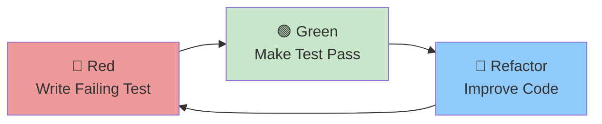

# Module 11: TDD & BDD

**Duration**: 2-3 hours | **Difficulty**: Intermediate

Test-Driven Development (TDD) and Behavior-Driven Development (BDD) are methodologies where tests are written **before** code. This leads to better-designed, more maintainable software.

---

## What You'll Learn

- The Red-Green-Refactor cycle
- TDD in practice
- BDD with Given-When-Then
- Cucumber/Gherkin syntax
- SpecWeave's test-first approach

---

## Module Lessons

| Lesson | Topic | Duration |
|--------|-------|----------|
| [11.1 TDD Fundamentals](./01-tdd-fundamentals) | Red-Green-Refactor cycle | 45 min |
| [11.2 TDD in Practice](./02-tdd-practice) | Complete TDD example | 45 min |
| [11.3 BDD Introduction](./03-bdd-intro) | Behavior-Driven Development | 30 min |
| [11.4 Gherkin Syntax](./04-gherkin) | Writing Given-When-Then scenarios | 30 min |
| [11.5 SpecWeave TDD](./05-specweave-tdd) | Test-first with SpecWeave | 30 min |

---

## The TDD Cycle



1. **Red**: Write a test that fails (code doesn't exist yet)
2. **Green**: Write minimal code to make test pass
3. **Refactor**: Improve code while keeping tests green

---

## BDD Example

```gherkin
Feature: User Login

Scenario: Successful login with valid credentials
  Given a registered user with email "user@example.com"
  And the user's password is "SecurePass123"
  When the user submits the login form
  Then the user should be redirected to the dashboard
  And a session token should be stored
```

---

## Why TDD/BDD?

| Benefit | Description |
|---------|-------------|
| Better Design | Tests force you to think about API before implementation |
| Complete Coverage | Every line has a test by definition |
| Living Docs | Tests show how code should be used |
| Fewer Bugs | Catch bugs before implementation |
| Refactoring Confidence | Tests ensure behavior doesn't change |

---

## Prerequisites

Before starting:
- ✅ Completed Modules 07-10
- ✅ Comfortable writing tests
- ✅ Understanding of test pyramid

---

## Let's Begin

Ready to write tests before code?

→ [Start Lesson 11.1: TDD Fundamentals](./01-tdd-fundamentals)
