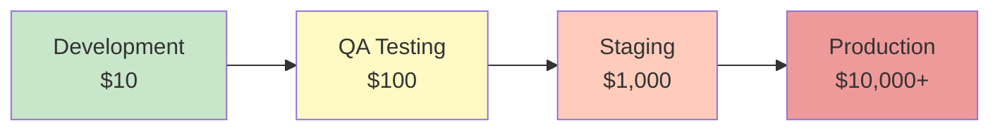
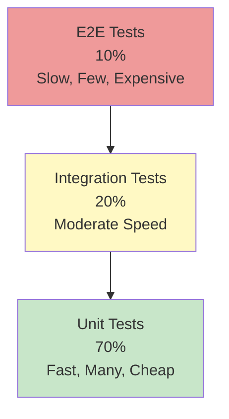

# Part 3: Testing Mastery

**Duration**: 10-15 hours | **Difficulty**: Intermediate

Testing is not just about catching bugs—it's about building confidence in your software, documenting expected behavior, and enabling fearless refactoring. This part takes you from testing fundamentals to advanced TDD workflows.

---

## The Cost of Not Testing



A bug caught during development costs $10 to fix. The same bug in production? $10,000+ including customer support, incident response, and reputation damage.

---

## What You'll Learn

- The testing pyramid and why it matters
- Writing effective unit tests
- Integration testing strategies
- End-to-end testing with Playwright
- Test-Driven Development (TDD) workflow
- Behavior-Driven Development (BDD) with SpecWeave
- Test coverage strategies
- CI/CD test integration

---

## Part 3 Modules

| Module | Topic | Duration |
|--------|-------|----------|
| [Module 07: Testing Fundamentals](./07-testing-fundamentals/) | Why test, testing pyramid, test types | 2-3 hours |
| [Module 08: Unit Testing](./08-unit-testing/) | Testing functions in isolation | 2-3 hours |
| [Module 09: Integration Testing](./09-integration-testing/) | Testing components together | 2-3 hours |
| [Module 10: E2E Testing](./10-e2e-testing/) | Testing complete user journeys | 2-3 hours |
| [Module 11: TDD & BDD](./11-tdd-bdd/) | Test-first development workflows | 2-3 hours |

---

## The Testing Pyramid



- **Unit Tests (70%)**: Fast, test individual functions
- **Integration Tests (20%)**: Test how components work together
- **E2E Tests (10%)**: Test complete user journeys

---

## SpecWeave Testing Integration

SpecWeave embeds testing directly into the development workflow:

### BDD in tasks.md

```markdown
## T-003: Implement password validation
**User Story**: US-001
**Satisfies ACs**: AC-US1-02

### Test Plan (BDD)
```gherkin
Scenario: Valid password accepted
  Given a registration form
  When user enters password "Secure123!"
  Then validation passes

Scenario: Weak password rejected
  Given a registration form
  When user enters password "weak"
  Then error "Password must be 8+ characters" shown
```
```

### Quality Gates

`/sw:done` validates:
- ✓ All tasks have test plans
- ✓ Test coverage meets threshold (default: 70%)
- ✓ All acceptance criteria covered by tests
- ✓ No failing tests

---

## Prerequisites

Before starting this part:
- ✅ Completed Parts 1-2
- ✅ Comfortable with JavaScript functions
- ✅ SpecWeave installed and configured
- ✅ Basic understanding of async/await

---

## Let's Begin

Ready to write tests with confidence?

→ [Start Module 07: Testing Fundamentals](./07-testing-fundamentals/)
