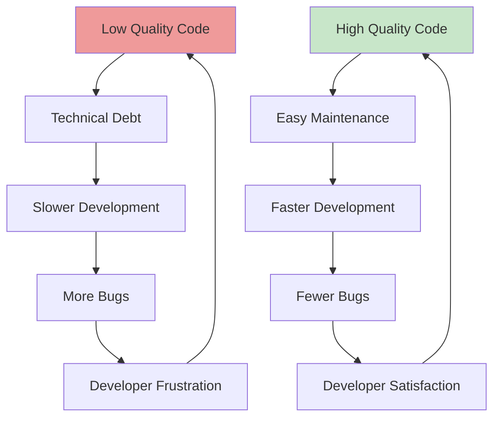

# Part 4: Quality & Code Standards

**Duration**: 6-8 hours | **Difficulty**: Intermediate

Professional software development requires consistent code quality. This part covers the tools and practices that separate amateur code from enterprise-grade software.

---

## What You'll Learn

- Code linting with ESLint
- Automatic formatting with Prettier
- TypeScript for type safety
- Code review best practices
- SpecWeave quality gates

---

## Part 4 Modules

| Module | Topic | Duration |
|--------|-------|----------|
| [Module 12: Linting & Formatting](./12-linting-formatting/) | ESLint, Prettier, EditorConfig | 2-3 hours |
| [Module 13: TypeScript](./13-typescript/) | Type safety for JavaScript | 2-3 hours |
| [Module 14: Code Review](./14-code-review/) | Review practices and SpecWeave QA | 2-3 hours |

---

## Why Quality Matters

---

## SpecWeave Quality Integration

SpecWeave enforces quality through:
- **Pre-commit hooks**: Lint and format before commit
- **Quality gates**: Block `/specweave:done` if quality fails
- **QA Agent**: Reviews code against acceptance criteria

---

## Prerequisites

Before starting:
- ✅ Completed Parts 1-3
- ✅ Working project with tests
- ✅ Basic Git knowledge

---

## Let's Begin

Ready to write professional-grade code?

→ [Start Module 12: Linting & Formatting](./12-linting-formatting/)
