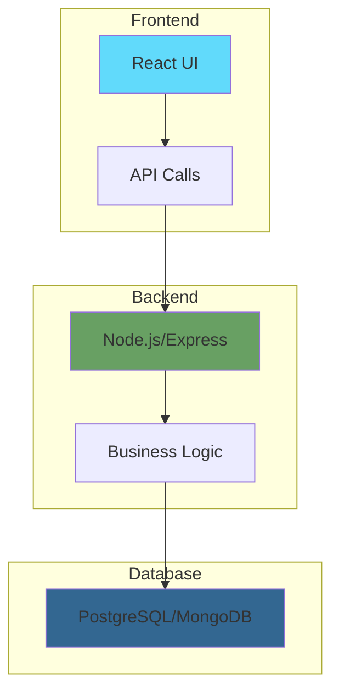

# Part 5: Full Stack Development

**Duration**: 12-15 hours | **Difficulty**: Intermediate

Full stack development combines frontend, backend, and database skills. This part teaches you to build complete, production-ready applications.

---

## What You'll Learn

- Frontend development with React
- Backend APIs with Node.js
- Database design and operations
- Full stack architecture patterns
- SpecWeave for full stack projects

---

## Part 5 Modules

| Module | Topic | Duration |
|--------|-------|----------|
| [Module 15: React Basics](./15-react-basics/) | Component-based UI development | 4-5 hours |
| [Module 16: Node.js Backend](./16-nodejs-backend/) | Building REST APIs | 4-5 hours |
| [Module 17: Databases](./17-databases/) | SQL, NoSQL, and ORMs | 4-5 hours |

---

## The Full Stack



---

## SpecWeave Full Stack Pattern

```markdown
Increment: 0015-user-dashboard

spec.md:
  - US-001: View dashboard (Frontend)
  - US-002: Fetch user data (Backend API)
  - US-003: Store user preferences (Database)

plan.md:
  - ADR-001: React for frontend
  - ADR-002: Express for API
  - ADR-003: PostgreSQL for data

tasks.md:
  - T-001 to T-005: Frontend tasks
  - T-006 to T-010: Backend tasks
  - T-011 to T-015: Database tasks
```

---

## Prerequisites

Before starting:
- ✅ Completed Parts 1-4
- ✅ JavaScript proficiency
- ✅ Basic HTML/CSS knowledge

---

## Let's Begin

Ready to build complete applications?

→ [Start Module 15: React Basics](./15-react-basics/)
