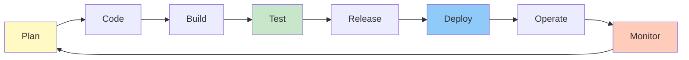

# Part 6: DevOps & CI/CD

**Duration**: 12-15 hours | **Difficulty**: Intermediate-Advanced

DevOps bridges development and operations. This part teaches you to automate everything from builds to deployments, ensuring fast, reliable software delivery.

---

## What You'll Learn

- Continuous Integration/Continuous Deployment
- GitHub Actions workflows
- Docker containerization
- Infrastructure as Code
- Monitoring and observability

---

## Part 6 Modules

| Module | Topic | Duration |
|--------|-------|----------|
| [Module 18: CI/CD Fundamentals](./18-cicd-fundamentals/) | Build, test, deploy automation | 2-3 hours |
| [Module 19: GitHub Actions](./19-github-actions/) | Writing CI/CD workflows | 3-4 hours |
| [Module 20: Docker](./20-docker/) | Containerization basics | 3-4 hours |
| [Module 21: Infrastructure as Code](./21-iac/) | Terraform and cloud resources | 2-3 hours |
| [Module 22: Monitoring](./22-monitoring/) | Observability and alerting | 2-3 hours |

---

## The DevOps Loop



---

## SpecWeave DevOps Integration

SpecWeave fits perfectly into CI/CD:

```yaml
# .github/workflows/specweave.yml
name: SpecWeave CI

on: [push, pull_request]

jobs:
  validate:
    runs-on: ubuntu-latest
    steps:
      - uses: actions/checkout@v3

      - name: Install dependencies
        run: npm ci

      - name: Run tests
        run: npm test

      - name: Validate SpecWeave increment
        run: specweave validate --strict
```

---

## Prerequisites

Before starting:
- ✅ Completed Parts 1-5
- ✅ Full stack project built
- ✅ GitHub account

---

## Let's Begin

Ready to automate your development workflow?

→ [Start Module 18: CI/CD Fundamentals](./18-cicd-fundamentals/)
