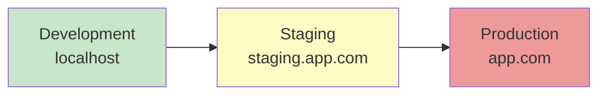

# Part 7: Environments & Configuration

**Duration**: 4-6 hours | **Difficulty**: Intermediate

Real applications run in multiple environments. This part teaches you to manage configuration across development, staging, and production.

---

## What You'll Learn

- Environment variables and secrets
- Configuration management strategies
- Feature flags
- Multi-environment deployments

---

## Part 7 Modules

| Module | Topic | Duration |
|--------|-------|----------|
| [Module 23: Environment Variables](./23-env-variables/) | Managing secrets and config | 2-3 hours |
| [Module 24: Multi-Environment](./24-multi-environment/) | Dev, staging, production | 2-3 hours |

---

## Environment Lifecycle

---

## Prerequisites

Before starting:
- ✅ Completed Parts 1-6
- ✅ CI/CD pipeline set up
- ✅ Docker basics

---

## Let's Begin

→ [Start Module 23: Environment Variables](./23-env-variables/)
