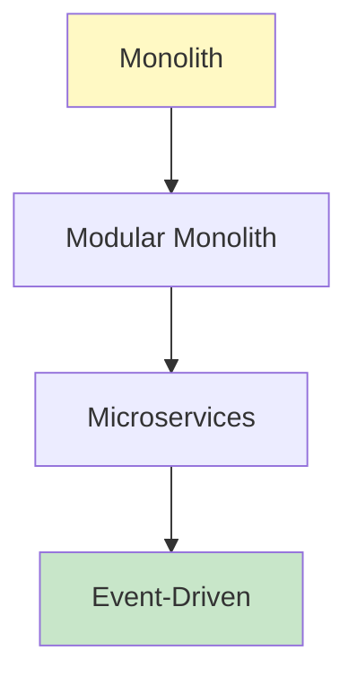

# Part 8: Software Architecture

**Duration**: 10-12 hours | **Difficulty**: Advanced

Architecture is the high-level structure of your software. This part teaches you patterns and principles for designing systems that scale.

---

## What You'll Learn

- Design patterns
- Microservices architecture
- API design best practices
- Event-driven architecture

---

## Part 8 Modules

| Module | Topic | Duration |
|--------|-------|----------|
| [Module 25: Design Patterns](./25-design-patterns/) | Common software patterns | 3-4 hours |
| [Module 26: API Design](./26-api-design/) | RESTful and GraphQL APIs | 2-3 hours |
| [Module 27: Microservices](./27-microservices/) | Service-oriented architecture | 3-4 hours |
| [Module 28: Event-Driven](./28-event-driven/) | Message queues and events | 2-3 hours |

---

## Architecture Evolution

---

## SpecWeave Architecture Support

ADRs (Architecture Decision Records) in `plan.md` document:
- Technology choices
- Trade-off decisions
- System boundaries
- Communication patterns

---

## Prerequisites

Before starting:
- ✅ Completed Parts 1-7
- ✅ Full stack development experience
- ✅ DevOps fundamentals

---

## Let's Begin

→ [Start Module 25: Design Patterns](./25-design-patterns/)
