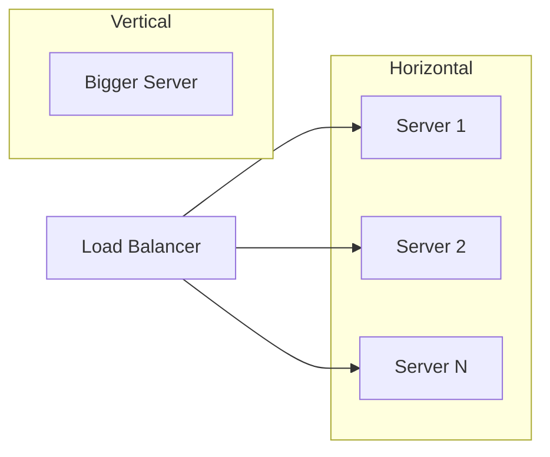

# Part 9: Scale & Performance

**Duration**: 6-8 hours | **Difficulty**: Advanced

When your application succeeds, it needs to scale. This part teaches performance optimization and scaling strategies.

---

## What You'll Learn

- Performance profiling and optimization
- Caching strategies
- Database scaling
- Load balancing and horizontal scaling

---

## Part 9 Modules

| Module | Topic | Duration |
|--------|-------|----------|
| [Module 29: Performance](./29-performance/) | Profiling and optimization | 3-4 hours |
| [Module 30: Scaling](./30-scaling/) | Horizontal and vertical scaling | 3-4 hours |

---

## Performance Matters

```
1 second delay = 7% conversion loss
3 seconds = 40% users leave
5+ seconds = users don't come back
```

---

## Scaling Strategies



---

## Prerequisites

Before starting:
- ✅ Completed Parts 1-8
- ✅ Microservices understanding
- ✅ Database experience

---

## Let's Begin

→ [Start Module 29: Performance](./29-performance/)
