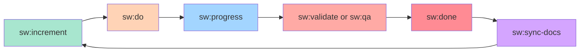

import CommandTabs from '@site/src/components/CommandTabs';

# Commands Overview

SpecWeave provides commands for every stage of your development workflow. You can invoke them in **three ways**: natural language, Claude Code slash commands, or CLI commands in other AI tools. This page covers the **main workflow commands** you'll use daily.

:::info Three Ways to Invoke Commands
Every SpecWeave command can be triggered three ways:

1. **Natural language** -- Just describe what you want. SpecWeave auto-detects intent.
2. **Claude Code** -- Use `sw:*` slash commands for precise control.
3. **Other AI tools** -- Use CLI-style `specweave <command>` syntax (Cursor, Copilot, Windsurf, Aider).

All examples on this page show all three methods. Pick whichever feels natural.
:::

## The Core Workflow



---

## 1. Planning Commands

### Create New Increment

**Most frequently used command** - Start every new feature here.

<CommandTabs
  natural='Let&apos;s build user authentication with JWT'
  claude='sw:increment "User authentication with JWT"'
  other='increment "User authentication with JWT"'
/>

Additional examples:
```bash
sw:increment "Payment processing with Stripe"
sw:increment "Real-time notifications"
```

**What it does**:
- Detects tech stack automatically
- PM-led planning (market research, spec.md, plan)
- Auto-generates tasks.md from plan
- Creates test strategy
- Strategic agent review (Architect, Security, QA, Tech Lead)

**See**: ADR (Architecture Decision Records) for design decisions made during planning.

---

## 2. Implementation Commands

### Execute Tasks

**Smart auto-resume** - Continue from where you left off.

<CommandTabs
  natural='Start implementing'
  claude='sw:do'
  other='do'
/>

To target a specific increment:
```bash
sw:do 0007      # Specific increment
```

**What it does**:
- Resumes from last incomplete task
- Plays sound after each task (via hooks)
- Updates docs inline (CLAUDE.md, README.md, CHANGELOG)
- Syncs to GitHub (if plugin enabled)
- Runs tests continuously

**Key Features**:
- **Cost optimization**: Uses Haiku for simple tasks (3x faster, 20x cheaper)
- **Automatic hooks**: Runs after EVERY task completion
- **Living docs sync**: Updates `.specweave/docs/` after all tasks complete

**See**: [Execute Tasks Documentation](./do)

---

### Autonomous Execution

**Full autonomous mode** - Work until all tasks complete.

<CommandTabs
  natural='Ship while I sleep'
  claude='sw:auto'
  other='auto'
/>

Additional examples with options:
```bash
sw:auto 0001 0002 0003         # Multiple increments
sw:auto --max-iterations 50    # With limits
sw:auto --all-backlog          # All backlog items
```

**What it does**:
- Continuous execution until all tasks complete
- Stop hook prevents exit (feedback loop pattern)
- Self-healing test loop (max 3 attempts)
- Self-assessment scoring (pauses on low confidence)
- Auto-execute with credentials (no manual steps)

**Safety Features**:
- Max iterations limit (default: 100)
- Max hours limit (optional)
- Human gates for sensitive operations
- Circuit breakers for external services
- Low confidence score pauses for review

**See**: [Autonomous Execution Documentation](./auto)

---

### Check Auto Session Status

Check auto session progress.

<CommandTabs
  natural='Check auto status'
  claude='sw:auto-status'
  other='auto-status'
/>

Additional options:
```bash
sw:auto-status --json    # JSON output
```

**See**: [Auto Status Documentation](./auto-status)

---

### Cancel Auto Session

Cancel running auto session.

<CommandTabs
  natural='Stop auto'
  claude='sw:cancel-auto'
  other='cancel-auto'
/>

Additional options:
```bash
sw:cancel-auto --force                            # No confirmation
sw:cancel-auto --reason "Switching to bug fix"    # With reason
```

**See**: [Cancel Auto Documentation](./cancel-auto)

---

## 3. Quality Assurance Commands

### Validate Increment

**120+ checks** - Fast, free validation.

<CommandTabs
  natural='Check quality'
  claude='sw:validate 0007'
  other='validate 0007'
/>

Additional options:
```bash
sw:validate 0007 --quality        # Include AI assessment
sw:validate 0007 --export         # Export suggestions to tasks.md
```

**What it validates**:
- Consistency (spec -> plan -> tasks)
- Completeness (all required sections)
- Quality (testable criteria, actionable tasks)
- Traceability (AC-IDs, ADR references)

---

### Quality Assessment with Risk Scoring

**Comprehensive quality gate** - AI-powered assessment with BMAD risk scoring.

<CommandTabs
  natural='Assess quality'
  claude='sw:qa 0007'
  other='qa 0007'
/>

Additional options:
```bash
sw:qa 0007 --pre             # Before starting work
sw:qa 0007 --gate            # Before closing increment
sw:qa 0007 --export          # Export blockers to tasks.md
```

**7 Quality Dimensions**:
1. Clarity (18% weight)
2. Testability (22% weight)
3. Completeness (18% weight)
4. Feasibility (13% weight)
5. Maintainability (9% weight)
6. Edge Cases (9% weight)
7. **Risk Assessment** (11% weight)

**Quality Gate Decisions**:
- **PASS** - Ready to proceed
- **CONCERNS** - Should fix before release
- **FAIL** - Must fix before proceeding

---

### `npx vitest run` - Test Coverage Check

```bash
npx vitest run 0007
```

**What it checks**:
- Per-task coverage (unit, integration, E2E)
- AC-ID coverage (all acceptance criteria tested)
- Overall coverage vs target (80-90%)
- Missing tests and recommendations

---

## 4. Completion Commands

### Close Increment

**PM validation before closing** - Ensures quality gates pass.

<CommandTabs
  natural='We&apos;re done'
  claude='sw:done 0007'
  other='done 0007'
/>

**What it does**:
- Validates all tasks complete
- Runs quality gate check
- PM agent validates completion
- Creates completion report
- Closes GitHub issues (if plugin enabled)

---

### Synchronize Living Documentation

**Bidirectional sync** - Keep strategic docs and implementation in sync.

<CommandTabs
  natural='Update the docs'
  claude='sw:sync-docs review'
  other='sync-docs review'
/>

Additional mode:
```bash
sw:sync-docs update          # After implementation (update with learnings)
```

**What it syncs**:
- ADRs (Proposed -> Accepted)
- Architecture diagrams (planned -> actual)
- API documentation (contracts -> endpoints)
- Feature lists (planned -> completed)

---

## 5. Monitoring Commands

### Check Increment Progress

<CommandTabs
  natural='What&apos;s the status?'
  claude='sw:progress'
  other='progress'
/>

To check a specific increment:
```bash
sw:progress 0007
```

**What it shows**:
- Task completion (15/42 tasks, 36%)
- Time tracking (1.2 weeks elapsed, 2.1 weeks remaining)
- Current phase and next phase
- Recent completions
- Upcoming tasks

---

### Background Jobs Monitor

Monitor long-running operations that continue even after closing Claude.

<CommandTabs
  natural='Show background jobs'
  claude='sw:jobs'
  other='jobs'
/>

Additional options:
```bash
sw:jobs --follow ae362dfe  # Follow progress live
sw:jobs --logs ae362dfe    # View worker logs
sw:jobs --kill ae362dfe    # Stop running job
sw:jobs --resume ae362dfe  # Resume paused job
```

**Job types**:
- `clone-repos` - Multi-repo cloning (5-30 min)
- `import-issues` - Large issue imports (10-60 min)
- `sync-external` - Bidirectional sync (1-10 min)

**See**: [Full Jobs Documentation](./jobs) | [Background Jobs Concepts](/docs/guides/core-concepts/background-jobs)

---

## 6. Status Management Commands

### Pause Increment

<CommandTabs
  natural='Pause this'
  claude='sw:pause 0007'
  other='pause 0007'
/>

With reason:
```bash
sw:pause 0007 --reason "Blocked by external API"
```

**See**: [Pause Documentation](./pause)

---

### Resume Increment

<CommandTabs
  natural='Resume work'
  claude='sw:resume 0007'
  other='resume 0007'
/>

**See**: [Resume Documentation](./resume)

---

### Abandon Increment

<CommandTabs
  natural='Abandon this'
  claude='sw:abandon 0007'
  other='abandon 0007'
/>

With reason:
```bash
sw:abandon 0007 --reason "Requirements changed"
```

**See**: [Abandon Documentation](./abandon)

---

## All Available Commands

### Essential Workflow (Use These!)

| Natural Language | Claude Code | Other AI Tools | Purpose |
|-----------------|-------------|----------------|---------|
| "Let's build X" | `sw:increment "feature"` | `increment "feature"` | Plan new increment |
| "Start implementing" | `sw:do` | `do` | Execute tasks |
| "Ship it while I sleep" | `sw:auto` | `auto` | Autonomous execution |
| "What's the status?" | `sw:progress` | `progress` | Check progress |
| "Show background jobs" | `sw:jobs` | `jobs` | Monitor long-running ops |
| "Check quality" | `sw:validate` | `validate` | Quick validation |
| "We're done" | `sw:done` | `done` | Close increment |
| "Update the docs" | `sw:sync-docs` | `sync-docs` | Synchronize living docs |

### Auto Mode Commands

| Natural Language | Claude Code | Other AI Tools | Purpose |
|-----------------|-------------|----------------|---------|
| "Run autonomously" | `sw:auto` | `auto` | Start autonomous execution |
| "Check auto status" | `sw:auto-status` | `auto-status` | Check session status |
| "Stop auto" | `sw:cancel-auto` | `cancel-auto` | Cancel running session |

### Status Management

| Natural Language | Claude Code | Other AI Tools | Purpose |
|-----------------|-------------|----------------|---------|
| "Pause this" | `sw:pause` | `pause` | Pause increment (blocked/deprioritized) |
| "Resume work" | `sw:resume` | `resume` | Resume paused increment |
| "Abandon this" | `sw:abandon` | `abandon` | Abandon incomplete increment |
| "Show status" | `sw:status` | `status` | Show increment status overview |

---

## Workflow Example: Standard Feature Development

```bash
# 1. Plan new feature (or say "Let's build user authentication")
sw:increment "User authentication"
# -> Creates: spec.md, plan.md, tasks.md

# 2. Review docs (optional — or say "review the docs")
sw:sync-docs review
# -> Review strategic docs before starting

# 3. Pre-check quality (optional — or say "check quality")
sw:qa 0007 --pre
# -> Pre-implementation quality check

# 4. Implement tasks (or say "start implementing" / "ship while I sleep")
sw:do 0007                 # Manual execution
sw:auto 0007               # Autonomous execution

# 5. Check progress (or say "what's the status?")
sw:progress 0007
# -> See completion status

# 6. Validate quality (or say "validate it")
sw:qa 0007 --gate
# -> Comprehensive quality gate check

# 7. Check test coverage
npx vitest run 0007
# -> Validate all AC-IDs are tested

# 8. Close increment (or say "we're done")
sw:done 0007
# -> PM validates and closes

# 9. Update living docs (or say "update the docs")
sw:sync-docs update
# -> Sync learnings to strategic docs
```

---

## Workflow Example: Autonomous Execution

```bash
# 1. Plan feature (or say "let's build payment processing")
sw:increment "Payment processing"

# 2. Start autonomous execution (or say "ship while I sleep")
sw:auto 0008 --max-hours 8
# -> Works until all tasks complete (max 8 hours)

# 3. Check status anytime (or say "how's auto going?")
sw:auto-status
# -> See iteration, progress, any gates pending

# 4. Cancel if needed (or say "stop auto")
sw:cancel-auto --reason "Need to pivot"
# -> Generates summary, preserves progress

# 5. Resume work anytime (or say "continue working")
sw:do
# -> Continues from where auto left off
```

---

## Integration with External Tools

All sync skills are part of the unified `sw` plugin.

### GitHub Issues

```bash
# Sync increment to GitHub
sw:github-sync 0007
```

**Automatic sync**: When GitHub sync is configured, running implementation (or type `sw:do` in Claude Code) and closing (or type `sw:done` in Claude Code) automatically sync to GitHub.

### JIRA Integration

```bash
# Sync to JIRA
sw:jira-sync 0007
```

### Azure DevOps

```bash
# Sync to Azure DevOps
sw:ado-sync 0007
```

---

## Best Practices

### 1. Follow the Core Flow

Always use the standard workflow for best results:
1. Plan with an increment (or type `sw:increment` in Claude Code) -- START HERE
2. Implement with do or auto (or type `sw:do` or `sw:auto`) -- MAIN WORK
3. Check progress (or type `sw:progress`) -- VISIBILITY
4. Validate quality (or type `sw:qa`) -- QUALITY GATE
5. Close the increment (or type `sw:done`) -- FINISH
6. Sync docs (or type `sw:sync-docs`) -- KEEP CURRENT

### 2. Use Auto Mode for Larger Increments

For increments with 10+ tasks, autonomous execution (or type `sw:auto` in Claude Code) is more efficient:
- No need to keep checking progress
- Self-healing test loops fix issues automatically
- Human gates still require approval

### 3. Validate Early and Often

```bash
# Before starting work
sw:qa 0007 --pre

# Before closing
sw:qa 0007 --gate
```

### 4. Check Test Coverage

```bash
# Always validate tests before closing
npx vitest run 0007
```

### 5. Keep Living Docs Current

```bash
# After completing increment
sw:sync-docs update
```

---

## Configuration

All commands respect `.specweave/config.json`:

```json
{
  "limits": {
    "activeIncrements": 1
  },
  "auto": {
    "enabled": true,
    "maxIterations": 100,
    "maxHours": 24,
    "testCommand": "npm test",
    "coverageThreshold": 80,
    "humanGated": {
      "patterns": ["deploy", "migrate", "publish"],
      "timeout": 1800
    }
  },
  "validation": {
    "quality_judge": {
      "enabled": true,
      "always_run": false
    }
  }
}
```

---

## Glossary Links

Understanding SpecWeave terminology:

- **ADR** - Architecture Decision Records
- **RFC** - Request for Comments (specification format)
- **API** - Application Programming Interface
- **E2E** - End-to-End Testing
- **Node.js** - JavaScript runtime
- **REST** - RESTful API pattern
- **GraphQL** - Query language for APIs
- **Microservices** - Distributed architecture pattern
- **IaC** - Infrastructure as Code

[View full glossary ->](/docs/glossary)

---

## Next Steps

- **Getting Started**: [Quick Start Guide](/docs/guides/getting-started)
- **Workflow Guide**: [Complete Development Workflow](/docs/guides/workflow)
- **Quality Gates**: [Quality Assurance Guide](/docs/guides/quality-gates)
- **Auto Mode**: [Autonomous Execution Documentation](./auto)
- **GitHub Integration**: [GitHub Sync Guide](/docs/guides/github-sync)

---

**Philosophy**:
> SpecWeave commands are designed for **intelligent automation**. The system detects intent, suggests actions, and handles workflow management - you focus on building.
