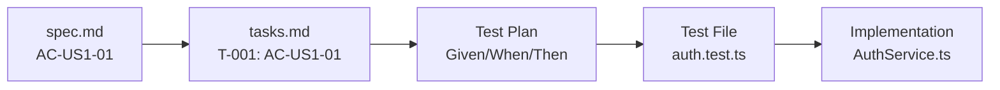

# AC-ID (Acceptance Criteria ID)

**Category**: SpecWeave Core

## Definition

**AC-ID** (Acceptance Criteria ID) is a unique identifier for acceptance criteria in SpecWeave specs. AC-IDs enable complete traceability from specifications through tasks to tests and implementation.

**Format**: `AC-US\{story\}-\{number\}`

**Examples**:
- `AC-US1-01` - User Story 1, Acceptance Criterion 1
- `AC-US1-02` - User Story 1, Acceptance Criterion 2
- `AC-US2-01` - User Story 2, Acceptance Criterion 1

## What Problem Does It Solve?

**The Traceability Problem**:
- ❌ Requirements disconnected from implementation
- ❌ Tests don't map back to specifications
- ❌ No way to verify all requirements are tested
- ❌ Audit compliance difficult (FDA, SOC 2, HIPAA)

**AC-ID Solution**:
- ✅ Unique ID for every acceptance criterion
- ✅ Traceability: spec.md → tasks.md → tests → code
- ✅ Automated coverage validation (`/specweave:check-tests`)
- ✅ Compliance-ready (complete audit trail)

## Traceability Flow



**Example**:

```markdown
# Step 1: spec.md (Define requirement)
## US-001: Basic Login Flow
- **AC-US1-01**: User can log in with email/password (P1, testable)
- **AC-US1-02**: Invalid credentials show error (P1, testable)
- **AC-US1-03**: 5 failed attempts lock account 15min (P2, testable)

# Step 2: tasks.md (Link to AC-IDs)
## T-001: Implement Authentication Service
**AC**: AC-US1-01, AC-US1-02, AC-US1-03

**Test Plan**:
- **Given** user with valid credentials → **When** login → **Then** receive JWT token (AC-US1-01)
- **Given** invalid password → **When** login → **Then** show error (AC-US1-02)
- **Given** 5 failed attempts → **When** login → **Then** account locked (AC-US1-03)

# Step 3: Test file (Implement tests)
// tests/unit/services/auth.test.ts
describe('AuthService', () => {
  it('should allow login with valid credentials (AC-US1-01)', async () => {
    // Test implementation
  });

  it('should reject invalid credentials (AC-US1-02)', async () => {
    // Test implementation
  });

  it('should lock account after 5 failed attempts (AC-US1-03)', async () => {
    // Test implementation
  });
});

# Step 4: Implementation
// src/services/auth/AuthService.ts
export class AuthService {
  async login(email: string, password: string) {
    // Implementation that satisfies AC-US1-01, AC-US1-02, AC-US1-03
  }
}
```

## Naming Convention

**Format**: `AC-US\{story\}-\{number\}`

**Components**:
- `AC` - Acceptance Criteria prefix
- `US` - User Story indicator
- `{story}` - User story number (1, 2, 3, ...)
- `\{number\}` - Acceptance criterion number within story (01, 02, 03, ...)

**Examples**:
```
AC-US1-01  → User Story 1, Acceptance Criterion 1
AC-US1-02  → User Story 1, Acceptance Criterion 2
AC-US2-01  → User Story 2, Acceptance Criterion 1
AC-US10-05 → User Story 10, Acceptance Criterion 5
```

## Real-World Example

**Feature**: User Authentication System

**spec.md**:
```markdown
## US-001: Basic Login Flow
- **AC-US1-01**: User can log in with email/password (P1, testable)
- **AC-US1-02**: Invalid credentials show error "Invalid credentials" (P1, testable)
- **AC-US1-03**: 5 failed attempts lock account for 15min (P2, testable)

## US-002: Password Reset
- **AC-US2-01**: User can request password reset email (P1, testable)
- **AC-US2-02**: Reset link expires after 1 hour (P1, testable)
- **AC-US2-03**: Reset link can only be used once (P2, testable)

## US-003: Social Login
- **AC-US3-01**: User can sign in with Google (P1, testable)
- **AC-US3-02**: User can sign in with GitHub (P2, testable)
```

**tasks.md**:
```markdown
## T-001: Authentication Service
**AC**: AC-US1-01, AC-US1-02, AC-US1-03

## T-002: Password Reset Service
**AC**: AC-US2-01, AC-US2-02, AC-US2-03

## T-003: Social Login Integration
**AC**: AC-US3-01, AC-US3-02
```

**Test Coverage Validation**:
```bash
/specweave:check-tests 0008

# Output:
✅ AC-ID Coverage:
   AC-US1-01: ✅ Covered (auth.test.ts:15)
   AC-US1-02: ✅ Covered (auth.test.ts:25)
   AC-US1-03: ✅ Covered (auth.test.ts:35)
   AC-US2-01: ✅ Covered (password-reset.test.ts:10)
   AC-US2-02: ✅ Covered (password-reset.test.ts:20)
   AC-US2-03: ✅ Covered (password-reset.test.ts:30)
   AC-US3-01: ✅ Covered (social-login.test.ts:10)
   AC-US3-02: ⚠️  Missing test coverage

📊 Summary:
   Total AC-IDs: 8
   Covered: 7 (87.5%)
   Missing: 1 (AC-US3-02)

💡 Recommendation: Add test for AC-US3-02 (GitHub login)
```

## Priority Levels

AC-IDs include priority levels in spec.md:

```markdown
- **AC-US1-01**: User can log in (P1, testable)  ← Priority 1 (Critical)
- **AC-US1-02**: Show error (P1, testable)       ← Priority 1 (Critical)
- **AC-US1-03**: Rate limiting (P2, testable)    ← Priority 2 (High)
```

**Priority Levels**:
- **P1** (Critical): Must have, blocks release
- **P2** (High): Should have, high impact
- **P3** (Medium): Nice to have, low impact
- **P4** (Low): Can defer to later

## Validation

**Automatic Validation**:
```bash
# Validate AC-ID coverage
/specweave:check-tests 0008

# Checks:
# ✅ All AC-IDs from spec.md are referenced in tasks.md
# ✅ All AC-IDs have corresponding test plans
# ✅ All test files reference AC-IDs in comments/describe blocks
# ⚠️ Reports missing coverage
```

**Quality Gates**:
```bash
# QA command includes AC-ID validation
/specweave:qa 0008

# Validates:
# ✅ AC-ID coverage (all ACs have tests)
# ✅ Test coverage percentages
# ✅ Risk assessment per AC-ID
# ✅ Priority alignment (P1 ACs must have 100% coverage)
```

## Best Practices

### 1. **Every AC Needs an ID**
```markdown
✅ CORRECT:
- **AC-US1-01**: User can log in (P1, testable)

❌ WRONG:
- User can log in (no ID, not traceable)
```

### 2. **Reference AC-IDs in Tests**
```typescript
✅ CORRECT:
it('should allow login with valid credentials (AC-US1-01)', async () => {
  // Clear traceability
});

❌ WRONG:
it('should work', async () => {
  // No AC-ID reference
});
```

### 3. **Link AC-IDs in Tasks**
```markdown
✅ CORRECT:
## T-001: Authentication Service
**AC**: AC-US1-01, AC-US1-02, AC-US1-03

❌ WRONG:
## T-001: Authentication Service
(No AC-ID references)
```

### 4. **Use Sequential Numbering**
```markdown
✅ CORRECT:
AC-US1-01, AC-US1-02, AC-US1-03

❌ WRONG:
AC-US1-01, AC-US1-05, AC-US1-12 (gaps in numbering)
```

## Compliance & Auditing

**For Regulated Industries** (FDA, SOC 2, HIPAA):

```
Audit Question: "How do you ensure all requirements are tested?"

SpecWeave Answer:
1. All requirements have AC-IDs (spec.md)
2. All AC-IDs link to tasks (tasks.md)
3. All tasks have test plans (tasks.md)
4. All tests reference AC-IDs (test files)
5. Automated validation (/specweave:check-tests)

Result: 100% traceability, automated verification
```

**Audit Trail**:
```bash
# Generate audit report
/specweave:check-tests 0008 --audit-report > audit-report.txt

# Output includes:
# - All AC-IDs from spec.md
# - Test coverage per AC-ID
# - Test file locations
# - Coverage percentages
# - Missing coverage report
```

## Related Terms

- [Spec](./spec.md) - Specification document
- [Tasks.md](./tasks-md.md) - Task file with embedded tests
- [BDD](./bdd.md) - Behavior-Driven Development
- [User Story](./user-story.md) - User-facing requirement

## Learn More

- [Test-Aware Planning](/docs/workflows/planning#test-aware-planning)
- [Quality Validation](/docs/commands/overview#quality-assurance-commands)
- [Traceability Guide](/docs/guides/core-concepts/traceability)
