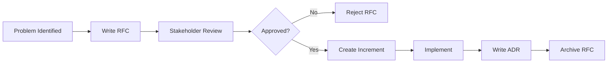

# ADR (Architecture Decision Record)

**Category**: Architecture & Design

## Definition

**ADR** (Architecture Decision Record) is a document that captures an important architectural decision along with its context, consequences, and rationale. ADRs explain **why** we chose option X over option Y, serving as permanent historical context for future developers.

**Purpose**: Document decisions after implementation to preserve institutional knowledge and reasoning.

## What Problem Does It Solve?

**The Lost Context Problem**:
- ❌ "Why did we choose PostgreSQL over MongoDB?" → Nobody remembers
- ❌ New developers repeat past mistakes (propose rejected alternatives)
- ❌ Architecture drift (gradual deviation from original vision)
- ❌ Lack of accountability (who decided? when? why?)

**ADR Solution**:
- ✅ Permanent record of decisions and rationale
- ✅ Historical context preserved (why we chose X)
- ✅ Prevents re-litigating settled decisions
- ✅ Onboarding faster (read ADRs to understand system)

## ADR vs RFC

**Key Difference**: **RFC = Before**, **ADR = After**

| Aspect | RFC | ADR |
|--------|-----|-----|
| **Timing** | Before implementation | After implementation |
| **Purpose** | Gather feedback, build consensus | Document decision for posterity |
| **Audience** | Stakeholders (PM, Eng, Ops) | Future developers |
| **Status** | Draft → Review → Approved/Rejected | Accepted (immutable) |
| **Changes** | Can be revised during review | Cannot be changed (superseded instead) |

**Workflow**:
```
RFC (Proposal) → Feedback → Approval → Implementation → ADR (Record)
```

## ADR Structure

**Standard Format** (Michael Nygard's template):

```markdown
# ADR-001: [Decision Title]

**Status**: Accepted | Superseded | Deprecated
**Date**: 2025-11-06
**Deciders**: [Names/Roles]
**Related**: ADR-002, RFC-004

## Context
What is the issue we're seeing that is motivating this decision?
What forces are at play (technical, business, compliance, etc.)?

## Decision
What is the change we're proposing and why?

## Consequences
What becomes easier or harder to do because of this change?

**Positive**:
- ✅ What we gain

**Negative**:
- ⚠️ What we lose or must maintain

**Neutral**:
- 🔄 Trade-offs with no clear win/loss
```

## Real-World Example

**Scenario**: SpecWeave chose Claude native plugins over custom system.

**ADR-0010: Claude Native Plugin System**

```markdown
# ADR-0010: Claude Native Plugin System

**Status**: Accepted
**Date**: 2025-09-15
**Deciders**: Core Team (Anton Abyzov, PM, Architect)
**Related**: RFC-004, ADR-0009 (Plugin Architecture Principles)

## Context

SpecWeave needed a plugin architecture to reduce context usage from 50K tokens to ~15K. Two options:

1. **Build custom plugin system** (our own loader, discovery, activation)
2. **Adopt Claude Code's native system** (released Sept 2024)

**Forces**:
- Claude Code's system is official Anthropic standard
- Custom system = maintenance burden (20+ hours/month)
- Future-proofing (Anthropic will evolve their system)
- Context efficiency (we measured 70%+ reduction with native)

## Decision

**We will adopt Claude Code's native plugin system** and deprecate our custom architecture.

**Implementation**:
- Use `plugin.json` manifest (Claude standard)
- Skills auto-activate based on description keywords (no manual invocation)
- Agents use Claude's isolation (true role separation)
- Commands integrate with `/` slash command system
- GitHub marketplace distribution (no local copies)

## Consequences

**Positive**:
- ✅ 70%+ context reduction (measured in production)
- ✅ Zero maintenance for plugin system (Anthropic owns it)
- ✅ Future-proof (follows industry standard)
- ✅ Better developer UX (skills auto-activate)
- ✅ Faster installation (<30 seconds vs 2 minutes)

**Negative**:
- ⚠️  Vendor lock-in (dependent on Claude Code)
- ⚠️  Migration effort (3 weeks for 18 plugins)
- ⚠️  Other AI tools (Cursor, Copilot) less supported

**Neutral**:
- 🔄 Claude Code-first approach (explicit design choice)
- 🔄 Breaking change for users on v0.3.x (migration guide provided)

## Alternative: Custom Plugin System

**Why Rejected**:
- ❌ Duplicates Anthropic's work
- ❌ High maintenance burden (20+ hours/month estimated)
- ❌ Would need to evolve in parallel with Anthropic
- ❌ Not a differentiator for SpecWeave (plugins are commodity)
```

## ADR Lifecycle

**Status Values**:
- **Proposed**: Under discussion (rare, usually use RFC instead)
- **Accepted**: Decision made and implemented
- **Superseded**: Replaced by newer ADR (link to successor)
- **Deprecated**: No longer relevant (explain why)

**Example**:
```markdown
# ADR-0005: Use MongoDB for User Data

**Status**: Superseded by ADR-0012
**Date**: 2024-05-10

## Context
...original decision...

## Superseded
This decision was superseded by [ADR-0012: Migrate to PostgreSQL](./0012-postgres.md)
after we discovered MongoDB couldn't handle JOIN-heavy queries efficiently.
```

## Storage Location

**SpecWeave Project Structure**:

```
.specweave/docs/internal/
├── strategy/
│   └── rfc/                          # RFCs (before)
│       └── rfc-004-plugin-arch.md
│
└── architecture/
    └── adr/                          # ADRs (after)
        ├── 0001-use-postgres.md
        ├── 0010-claude-native-plugins.md
        └── 0012-supersede-mongodb.md
```

**Naming Convention**: `####-short-description.md` (4 digits, zero-padded)

**Examples**:
- `0001-use-postgres.md`
- `0010-claude-native-plugins.md`
- `0025-graphql-api.md`

## When to Write an ADR

**Use ADR for**:
- ✅ Major architecture changes (database choice, auth system)
- ✅ Technology selection (framework, library, cloud provider)
- ✅ API design (public API contracts)
- ✅ Security decisions (encryption, authentication)
- ✅ Performance trade-offs (caching strategy)

**Skip ADR for**:
- ❌ Minor implementation details (variable naming)
- ❌ Temporary experiments (POCs, spikes)
- ❌ Obvious choices (using JSON for config)
- ❌ Reversible decisions (can easily change back)

## Best Practices

### 1. **Write ADR After Implementation**
```markdown
❌ WRONG: Write ADR before deciding (use RFC instead)
✅ CORRECT: RFC → Decide → Implement → ADR
```

### 2. **ADRs are Immutable**
```markdown
❌ WRONG: Edit ADR-0010 to change decision
✅ CORRECT: Create ADR-0025 that supersedes ADR-0010
```

### 3. **Include Alternatives**
```markdown
❌ WRONG: Only document chosen option
✅ CORRECT: Show what was rejected and why
```

### 4. **Be Honest About Trade-offs**
```markdown
❌ WRONG: "This is the perfect solution!"
✅ CORRECT: "We gain X but lose Y (acceptable trade-off)"
```

### 5. **Link to Related Docs**
```markdown
✅ Reference:
- RFC-004 (original proposal)
- ADR-0009 (prior decision this builds on)
- Increment 0004 (implementation)
```

## Compliance & Auditing

**For Regulated Industries** (FDA, SOC 2, HIPAA):

ADRs provide audit trail for:
- ✅ Why security architecture was chosen
- ✅ Who approved major decisions
- ✅ When decisions were made
- ✅ What alternatives were considered

**Example Audit Question**:
```
Auditor: "Why did you choose this encryption algorithm?"
Answer: "See ADR-0015: AES-256-GCM Encryption"
→ Complete rationale, security review, alternatives rejected
```

## ADR Templates

**Quick Template** (for simpler decisions):
```markdown
# ADR-{number}: {Title}

**Status**: Accepted
**Date**: YYYY-MM-DD

## Decision
What we decided and why (1-2 paragraphs).

## Consequences
- ✅ What improves
- ⚠️ What gets harder
```

**Full Template** (for major decisions):
See example above (Context, Decision, Consequences, Alternatives)

## Tools & Automation

**Command**:
```bash
# Create new ADR (manual for now)
vim .specweave/docs/internal/architecture/adr/0011-new-decision.md

# Future: Automated ADR generation
/specweave:create-adr "Decision title"
# → Generates template with metadata
```

**Validation**:
```bash
# Check ADR numbering (sequential, no gaps)
/specweave:validate-adrs
```

## RFC to ADR Workflow

**Complete Lifecycle**:



**Example**:
1. **Problem**: Need plugin architecture
2. **RFC-004**: Propose Claude native plugins (gather feedback)
3. **Approval**: Stakeholders approve
4. **Increment 0004**: Implement plugin system
5. **ADR-0010**: Document decision and rationale
6. **RFC-004**: Mark as "Implemented → ADR-0010"

## Related Terms

- [RFC](./rfc.md) - Request for Comments (before implementation)
- [HLD](./hld.md) - High-Level Design (system architecture)
- [Spec](./spec.md) - Specification document (requirements)
- [PRD](./prd.md) - Product Requirements Document (business case)
- [Architecture](./architecture.md) - System architecture

## Learn More

- [ADR GitHub Repo](https://adr.github.io/) - Michael Nygard's ADR standard
- [Architecture & Design](/docs/workflows/architecture/overview) - Design workflow
- [SpecWeave Internal ADRs](/.specweave/docs/internal/architecture/adr/) - See ADRs in action

---

**Category**: Architecture & Design

**Tags**: #adr #architecture #design #planning #decision-records
