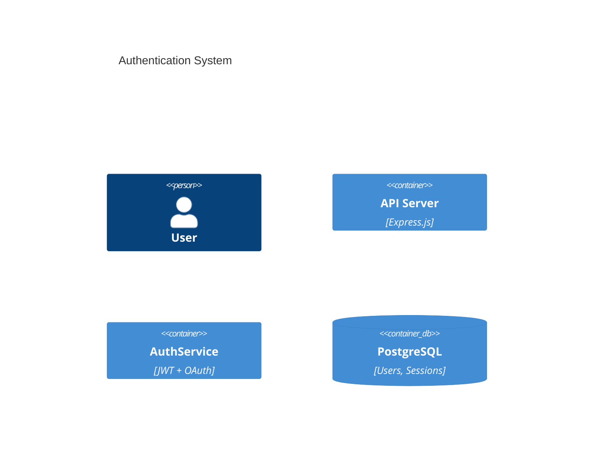
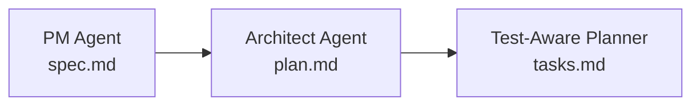

import CommandTabs from '@site/src/components/CommandTabs';

# Architect Agent

The **Architect Agent** is SpecWeave's AI-powered System Architect that designs technical implementations, creates architecture documentation, and makes technology decisions.

## What It Does

The Architect Agent activates after the [PM Agent](/docs/glossary/terms/pm-agent) creates specifications:

**Key responsibilities:**
- 🏗️ **System design** - Creates component architecture
- 📐 **Technology selection** - Chooses appropriate tech stack
- 📝 **ADR creation** - Documents architecture decisions
- 📊 **C4 diagrams** - Generates visual architecture diagrams
- 🧪 **Test strategy** - Defines coverage targets and approach

## Output: plan.md

The Architect Agent generates a `plan.md` file:

```markdown
# Implementation Plan: User Authentication

## Architecture

### Components
1. **AuthService** - Core authentication logic
2. **JWTManager** - Token generation/validation
3. **OAuthProvider** - Google OAuth integration
4. **PasswordHasher** - Bcrypt password hashing

### Technology Stack
- Framework: Express.js + TypeScript
- Auth: JWT (RS256) + Passport.js
- Database: PostgreSQL with Prisma
- Hashing: bcrypt (cost factor: 12)

### C4 Container Diagram


## Test Strategy
- **Unit Tests**: 90% coverage (AuthService, JWTManager)
- **Integration Tests**: 85% coverage (full auth flows)
- **E2E Tests**: Critical paths (login, OAuth, logout)
```

## Architecture Decision Records

The Architect Agent creates ADRs for significant decisions:

```markdown
# ADR-001: JWT vs Session-Based Authentication

## Status
✅ Accepted

## Decision
Use JWT with RS256 signing for stateless authentication.

## Rationale
- Stateless (scales horizontally)
- Standard (RFC 7519)
- Mobile-friendly (no cookies)

## Consequences
+ No server-side session storage
+ Works across multiple servers
- Cannot revoke tokens before expiry (mitigated by short expiry)
```

## Integration with Pipeline



## When It Activates

- After PM creates spec during an increment:

<CommandTabs
  natural="Let's build user authentication"
  claude='/sw:increment "User authentication"'
  other='increment "User authentication"'
/>

- Architecture questions -- when user says "design the system" or asks about design decisions
- Documentation reviews -- say "review architecture docs", use `/sw:sync-docs review` in Claude Code, or type `sync-docs review` in other AI tools

## Related

- ADR - Architecture Decision Records
- [PM Agent](/docs/glossary/terms/pm-agent) - Creates input specs
- [Increments](/docs/glossary/terms/increments) - Contains plan.md
