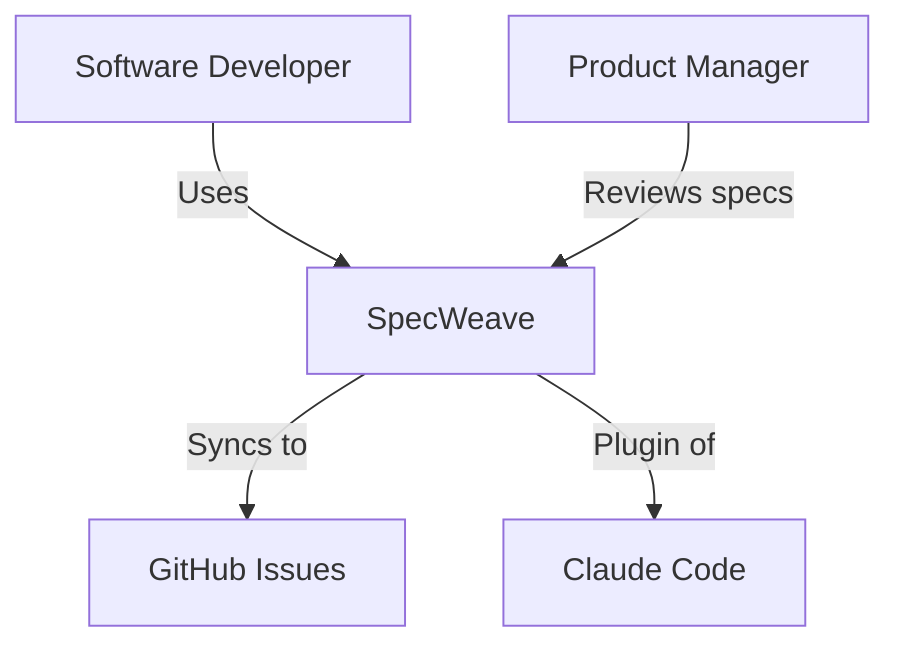
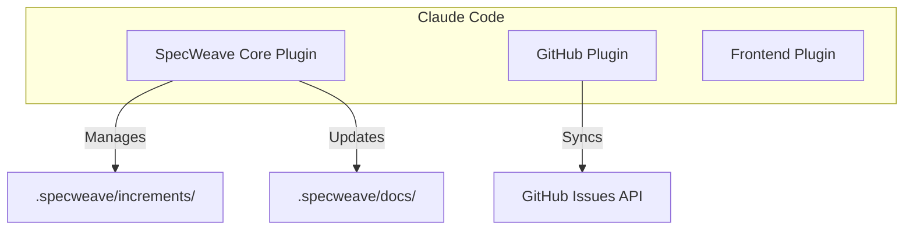
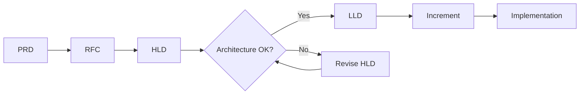

# HLD (High-Level Design)

**Category**: Architecture & Design

## Definition

**HLD** (High-Level Design) is a system-level architecture document that describes the overall structure, major components, and their interactions. HLDs focus on the "big picture" without diving into implementation details.

**Purpose**: Communicate system architecture to stakeholders (engineers, PM, executives) before implementation.

## What Problem Does It Solve?

**The Architecture Clarity Problem**:
- ❌ Team members have different mental models of the system
- ❌ Components designed in isolation (integration issues later)
- ❌ Stakeholders surprised by architecture choices
- ❌ No shared reference for architecture discussions

**HLD Solution**:
- ✅ Shared mental model (everyone understands the system)
- ✅ Early feedback (before costly implementation)
- ✅ Integration points clear (components fit together)
- ✅ Reference document (onboarding, reviews, troubleshooting)

## HLD vs LLD

| Aspect | HLD (High-Level Design) | LLD (Low-Level Design) |
|--------|------------------------|----------------------|
| **Scope** | System-wide | Single component/module |
| **Audience** | All stakeholders | Engineers only |
| **Detail** | Components, interactions | Classes, functions, algorithms |
| **Diagrams** | C4 Context, Container | C4 Component, Code, UML |
| **Example** | Microservices architecture | AuthService class design |

## HLD Structure

**Standard Sections**:

```markdown
# HLD: [System Name]

**Version**: 1.0
**Date**: 2025-11-06
**Author**: Architect
**Reviewers**: PM, Tech Lead, Security

## Executive Summary
One-page overview of the system (for executives/PM).

## System Context (C4 Level 1)
Who uses the system? What external systems does it interact with?
- Users/Actors
- External systems
- System boundaries

## System Architecture (C4 Level 2)
Major components and how they communicate:
- Containers (services, databases, apps)
- Communication protocols
- Data flow

## Key Design Decisions
Why did we choose this architecture?
- Technology choices (React, PostgreSQL, K8s)
- Architecture patterns (microservices, event-driven)
- Trade-offs (consistency vs availability)

## Data Architecture
How is data stored and accessed?
- Database schema (high-level)
- Data flow
- Caching strategy

## Infrastructure
Where does the system run?
- Deployment model (cloud, on-prem)
- Scalability approach
- HA/DR strategy

## Security Architecture
How is the system secured?
- Authentication/Authorization
- Data encryption
- Network security

## Performance & Scalability
How does the system handle load?
- Throughput targets
- Latency requirements
- Scaling strategy

## Failure Modes & Resilience
What can go wrong and how do we handle it?
- Single points of failure
- Failover strategy
- Monitoring & alerting

## Technology Stack
What technologies are used?
- Frontend: React, TypeScript
- Backend: Node.js, Express
- Database: PostgreSQL
- Infrastructure: Kubernetes, AWS

## Open Questions
What needs to be resolved before LLD?
```

## Real-World Example

**SpecWeave HLD** (simplified):

```markdown
# HLD: SpecWeave Framework

## Executive Summary
SpecWeave is a spec-driven development framework built on Claude Code's plugin system. It reduces context usage by 75% through modular plugins and automates living documentation.

## System Context (C4 Level 1)
- **Users**: Software developers using Claude Code
- **External Systems**: GitHub (sync), Claude Code (plugin host)
- **Boundaries**: SpecWeave operates within Claude Code as a collection of plugins

## System Architecture (C4 Level 2)
```
┌─────────────────────────────────────────────┐
│           Claude Code (Host)                 │
├─────────────────────────────────────────────┤
│  ┌──────────────────────────────────────┐  │
│  │ SpecWeave Core Plugin (12K tokens)  │  │
│  │  • 9 Skills                          │  │
│  │  • 22 Agents                         │  │
│  │  • 22 Commands                       │  │
│  │  • 8 Hooks                           │  │
│  └──────────────────────────────────────┘  │
│                                             │
│  ┌──────────────┐  ┌──────────────┐       │
│  │ GitHub Plugin│  │ Frontend     │       │
│  │ (opt-in)     │  │ Plugin       │       │
│  └──────────────┘  └──────────────┘       │
└─────────────────────────────────────────────┘
        │
        ▼
┌─────────────────────────────────────────────┐
│      Project .specweave/ Folder             │
│  • increments/ (work units)                 │
│  • docs/ (living documentation)             │
│  • logs/ (execution history)                │
└─────────────────────────────────────────────┘
```

## Key Design Decisions
1. **Claude Native Plugins**: Use Claude Code's system (not custom)
   - Rationale: Future-proof, zero maintenance, 70%+ context reduction
   - See: ADR-0010

2. **Root-Level .specweave/**: One source of truth (no nesting)
   - Rationale: Simple, clear ownership, no duplication
   - See: ADR-0015

3. **Modular Architecture**: Core + optional plugins
   - Rationale: Context efficiency (load only needed)
   - See: ADR-0018

## Technology Stack
- **Core**: TypeScript 5.x, Node.js 18+
- **CLI**: Commander.js, Inquirer.js
- **Docs Site**: Docusaurus 3.x
- **Testing**: Jest, Playwright (E2E)
- **Distribution**: NPM package

## Performance & Scalability
- **Context Usage**: 75%+ reduction vs monolithic (12K tokens core)
- **Installation**: <30 seconds (GitHub marketplace)
- **Scalability**: Unlimited plugins (load on-demand)
```

## C4 Model Integration

**HLD uses C4 diagrams** to visualize architecture:

### C4 Level 1: System Context


### C4 Level 2: Container Diagram


## When to Write an HLD

**Write HLD for**:
- ✅ New systems (greenfield projects)
- ✅ Major refactoring (architecture changes)
- ✅ Complex features (multi-component)
- ✅ Cross-team projects (need shared understanding)

**Skip HLD for**:
- ❌ Simple features (use spec.md only)
- ❌ Bug fixes (just fix it)
- ❌ Internal implementation (LLD sufficient)

## Best Practices

### 1. **Start with Context**
```markdown
✅ CORRECT: Show system context first (who uses it? external systems?)
❌ WRONG: Jump into component details immediately
```

### 2. **Use Diagrams**
```markdown
✅ CORRECT: C4 diagrams, sequence diagrams, data flow
❌ WRONG: Text-only (harder to understand)
```

### 3. **Explain "Why"**
```markdown
✅ CORRECT: We chose PostgreSQL because we need strong ACID guarantees for financial data
❌ WRONG: We use PostgreSQL (no rationale)
```

### 4. **Keep It High-Level**
```markdown
✅ CORRECT: "Authentication Service handles login/logout"
❌ WRONG: "AuthService.login() uses bcrypt with cost factor 12..." (too detailed, use LLD)
```

## HLD Workflow



**Steps**:
1. **PRD**: Business requirements (why build this?)
2. **RFC**: Gather feedback on approach
3. **HLD**: Design system architecture
4. **Review**: Architect, Tech Lead, Security review
5. **LLD**: Component-level design (if needed)
6. **Increment**: Create tasks for implementation

## Storage Location

**SpecWeave Project Structure**:
```
.specweave/docs/internal/
└── architecture/
    ├── hld-system.md           # Main system HLD
    ├── hld-auth-subsystem.md   # Subsystem HLD
    └── adr/
        └── 0010-hld-decisions.md  # ADRs reference HLD
```

## Related Terms

- [LLD](./lld.md) - Low-Level Design (component details)
- [ADR](./adr.md) - Architecture Decision Record (why we chose X)
- [RFC](./rfc.md) - Request for Comments (proposal)
- [C4 Model](./c4-model.md) - Architecture visualization framework
- [PRD](./prd.md) - Product Requirements Document (business case)

## Learn More

- [C4 Model](https://c4model.com/) - Architecture diagram standard
- [System Design Primer](https://github.com/donnemartin/system-design-primer) - HLD best practices
- [SpecWeave Architecture](/docs/architecture/overview) - See HLD in action

---

**Category**: Architecture & Design

**Tags**: #hld #architecture #design #system-design #c4-model
