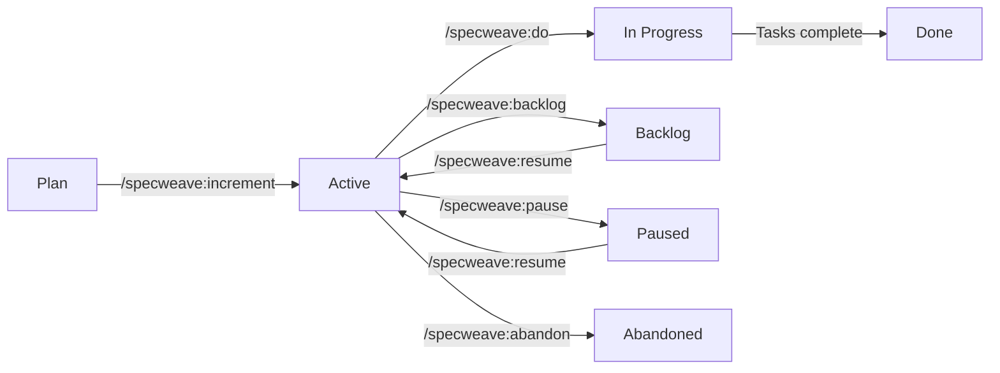

# Increment

**Category**: SpecWeave Core

## Definition

An **increment** (also called **product increment**) is a focused, measurable unit of work in SpecWeave. It represents a complete, testable feature or change that delivers value to users. Each increment contains:
- **spec.md**: Requirements with user stories and acceptance criteria
- **plan.md**: Implementation strategy and architecture
- **tasks.md**: Actionable tasks with embedded test plans (BDD format)

## What Problem Does It Solve?

**The Problem of Unfocused Development**:
- ❌ Working on 5 features simultaneously (context switching)
- ❌ No clear definition of "done"
- ❌ Features 80% complete but never shipped
- ❌ Lost track of what was built and why

**Increment-Based Solution**:
- ✅ ONE active increment at a time (maximum focus)
- ✅ Clear success criteria (acceptance criteria define "done")
- ✅ Complete before starting next (ship, don't accumulate WIP)
- ✅ Complete audit trail (spec → tasks → tests → code)

## Increment Types

SpecWeave supports six increment types:

| Type | Use When | Can Interrupt? | Examples |
|------|----------|----------------|----------|
| **feature** | Adding new functionality | No | User authentication, payment integration |
| **hotfix** | Critical production fix | ✅ Yes (emergency) | Security patch, critical bug |
| **bug** | Production bug with investigation | ✅ Yes (emergency) | Memory leak, performance degradation |
| **change-request** | Stakeholder requests | No | UI redesign, API contract changes |
| **refactor** | Code improvement | No | Extract service layer, improve test coverage |
| **experiment** | POC/spike work | No | Evaluate GraphQL vs REST, test new library |

**Key Insight**: The increment structure (spec.md, plan.md, tasks.md) works for ALL types. Even a bug investigation needs:
- **spec.md**: What's broken? Expected behavior?
- **plan.md**: Investigation strategy, tools, hypothesis
- **tasks.md**: Investigation steps, fix implementation, verification

## Increment Structure

```
.specweave/increments/
└── 0001-user-authentication/          # Increment folder
    ├── spec.md                        # Requirements (user stories, AC)
    ├── plan.md                        # Implementation strategy
    ├── tasks.md                       # Tasks with embedded tests
    ├── metadata.json                  # Increment metadata
    ├── reports/                       # Analysis, summaries
    │   ├── COMPLETION-REPORT.md       # Living completion report
    │   └── SCOPE-CHANGES.md           # Scope evolution log
    ├── scripts/                       # Helper scripts
    └── logs/                          # Execution logs
```

## Naming Convention

**Format**: `####-descriptive-kebab-case-name`

**Examples**:
- ✅ `0001-core-framework`
- ✅ `0002-user-authentication`
- ✅ `0003-payment-integration`
- ❌ `0003` (too generic, rejected)
- ❌ `feature-authentication` (no number, rejected)

**Why Descriptive Names?**
- Clear intent at a glance
- Easy to reference in conversations
- Better git history
- Searchable by feature name

## Increment Lifecycle



**States**:
- **Planned**: Spec created via `/specweave:increment`
- **Active**: Currently being worked on (counts towards WIP limits)
- **Backlog**: Planned but not ready to start (does NOT count towards WIP)
- **Paused**: Temporarily blocked by external dependency (does NOT count towards WIP)
- **Done**: All tasks complete, docs synced
- **Abandoned**: Requirements changed, no longer needed

**Key Difference: Backlog vs Paused**:
- **Backlog**: Never started, planned for future (use when prioritizing work)
- **Paused**: Started but blocked (use when external dependency blocks progress)

## WIP Limits (Work In Progress)

**The Iron Rule**: ONE active increment at a time (maximum focus)

**Configuration** (`.specweave/config.json`):
```json
{
  "limits": {
    "maxActiveIncrements": 1,     // Focus-first
    "hardCap": 2,                  // Emergency ceiling
    "allowEmergencyInterrupt": true // hotfix/bug can interrupt
  }
}
```

**Enforcement**:
- **0 active** → Create new (no warnings)
- **1 active** → Warn about context switching (allow with confirmation)
- **2 active** → HARD BLOCK (must complete or pause one first)

**Exception**: Hotfix/bug can interrupt to start 2nd active (emergency only)

**Why This Matters**:
- 1 task = 100% productivity
- 2 tasks = 20% slower (context switching cost)
- 3+ tasks = 40% slower + more bugs

## Using the Backlog

**When to Use Backlog**:
- ✅ **Planning ahead**: Create specs for future features without violating WIP
- ✅ **Prioritization**: Have multiple ideas, move lower priority to backlog
- ✅ **Stakeholder requests**: Plan requested features for later
- ✅ **Waiting for decisions**: Spec ready, but waiting for approval to start

**Backlog Workflow**:
```bash
# Create and plan increment
/specweave:increment "Feature B"
# Creates 0032-feature-b/

# Not ready to start? Move to backlog
/specweave:backlog 0032 --reason="Low priority, focus on 0031 first"
# ✅ Does NOT count towards WIP limits

# Later, when ready to start
/specweave:resume 0032
# Moves from backlog → active

# Now start work
/specweave:do
```

**Benefits**:
- ✅ Plan multiple increments without context switching
- ✅ Maintain clear priorities
- ✅ Stakeholders can see planned work
- ✅ Don't lose ideas (capture in backlog)

## Real-World Example

**Scenario**: Building user authentication system

```bash
# 1. Create increment (PM agent generates spec)
/specweave:increment "Add user authentication"

# Generated files:
# spec.md:
#   - US-001: Basic login flow (AC-US1-01, AC-US1-02, AC-US1-03)
#   - US-002: Password reset (AC-US2-01, AC-US2-02)
#   - US-003: Remember me (AC-US3-01)
#   [+ 7 more user stories]

# plan.md:
#   - Architecture: JWT tokens, bcrypt hashing
#   - Database: Users table, Sessions table
#   - Test Strategy: 85% unit, 80% integration, 100% E2E

# tasks.md:
#   - T-001: Authentication Service (US-001)
#   - T-002: Password Reset (US-002)
#   - T-003: Session Management (US-003)
#   [+ 7 more tasks with embedded tests]

# 2. Implement tasks
/specweave:do
# Executes T-001 with TDD:
# - Write failing tests (BDD format: Given/When/Then)
# - Implement to pass tests
# - Refactor while keeping tests green

# 3. Validate quality
/specweave:qa 0001
# Output:
# ✅ Test Coverage: 87% (target: 85%)
# ✅ All AC-IDs covered
# ✅ Risk Score: LOW
# ⚠️ Consider edge case: rate limiting

# 4. Complete increment
/specweave:done 0001
# - Syncs living docs to .specweave/docs/internal/specs/
# - Creates GitHub issue (if enabled)
# - Marks increment as complete
# - Can now start next increment
```

## Best Practices

### 1. **Keep Increments Focused**
- ✅ 3-5 user stories per increment
- ✅ Ship within 1-2 weeks
- ❌ Don't combine unrelated features

### 2. **Define Clear Success Criteria**
- ✅ Measurable acceptance criteria
- ✅ Specific test coverage targets
- ❌ Avoid vague goals ("Users will be happy")

### 3. **Complete Before Starting Next**
- ✅ All tasks marked complete
- ✅ Living docs synced
- ✅ Tests passing
- ❌ Don't accumulate WIP

### 4. **Use Living Completion Reports**
- ✅ Update report during work (scope changes, decisions)
- ✅ Capture rationale when fresh
- ❌ Don't write report at the end (context lost)

## Common Patterns

### Multiple Related Increments

**Pattern**: Break large features into multiple increments

```
Feature: E-commerce Platform

Increments:
├── 0001-product-catalog (MVP)
├── 0002-shopping-cart (core functionality)
├── 0003-checkout-flow (basic payment)
└── 0004-payment-providers (Stripe, PayPal)
```

**Benefits**:
- Ship incrementally (MVP first)
- Adapt based on feedback
- Maintain focus (one increment at a time)

### Hotfix Pattern

**Pattern**: Interrupt active increment for critical fix

```bash
# Working on 0005-product-search
/specweave:do  # Building T-003...

# Production alert: SQL injection vulnerability!
/specweave:increment "0006-sql-injection-hotfix" --type hotfix
# Allowed because hotfix can interrupt (emergency)

# Fix deployed, now resume
/specweave:done 0006
/specweave:do  # Resume 0005 where left off
```

## Related Terms

- [SpecWeave](./specweave.md) - The framework
- [Spec](./spec.md) - Specification document
- [Tasks.md](./tasks-md.md) - Task file with embedded tests
- [Living Docs](./living-docs.md) - Permanent documentation
- [WIP Limits](./wip-limits.md) - Work in progress discipline

## Learn More

- [what is an Increment?](/docs/glossary/terms/increment)
- [Complete Workflow](/docs/workflows/overview)
- [Planning Guide](/docs/workflows/planning)
- [Implementation Guide](/docs/workflows/implementation)
