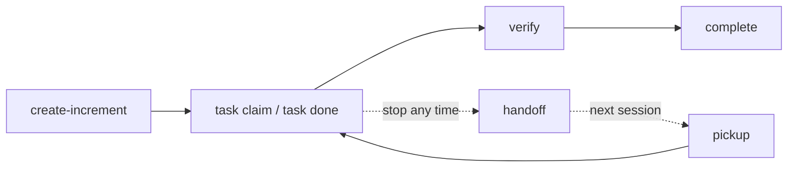

# Increment

An **increment** is one unit of work: a feature, a bug fix, a refactor. It lives in its own folder and carries everything another agent needs to continue it: the intent, the acceptance criteria, the tasks, and a record of who did what.

## What is in the folder

```
.specweave/increments/0042-checkout-resume/
├── spec.md          # Problem, Scope, Acceptance Criteria, Approach, Open questions, Tasks
├── ledger.jsonl     # append-only task events: claim, done, release, skip, block, note, ...
├── metadata.json    # status, type, timestamps; written by the CLI only
├── reports/         # verify.md, verify.json, task run logs (created as you work)
└── handoff.md       # written by `specweave handoff` when a session stops
```

`plan.md` appears only when you ask for it with `--with-plan`. Increments created with 2.x also have a [tasks.md](/docs/glossary/terms/tasks-md), which keeps working.

| File | Role |
|---|---|
| [spec.md](/docs/glossary/terms/spec-md) | What and why, how it is checked, and the task list. The one file an agent reads. |
| [ledger.jsonl](/docs/glossary/terms/ledger) | The only place task state lives. Lines are appended, never edited. |
| [metadata.json](/docs/glossary/terms/metadata-json) | Machine state that agents do not need to read. |

## Lifecycle



```bash
specweave create-increment "Keep checkout resumable"   # creates 0042-keep-checkout-resumable, active
specweave task next                                     # next task with its AC text
specweave task claim T-01
specweave task done T-01 --run "npm test -- draft"      # stores real output as evidence
specweave verify                                        # tests, lint, build, AC check
specweave complete 0042
```

The statuses are `planned`, `active`, `paused`, `completed` and `abandoned`. Only CLI commands change them (`start`, `pause`, `resume`, `abandon`, `complete`); nobody edits `metadata.json` by hand. See the [increment status reference](/docs/guides/increment-status-reference).

## How big

Small enough that one session, or one Claude Code Projects thread, can own it: one branch, one pull request. A handful of acceptance criteria and tasks is typical. A one-line fix needs no increment at all.

If new work touches files an open increment already owns, add criteria and tasks to that increment instead of opening a second one. To replace an increment, create the new one with `--supersedes 0042`; the old one is abandoned with a recorded reason.

## Numbering

Ids are four digits plus a slug (`0042-checkout-resume`). `specweave create-increment` picks the next free number; `specweave next-id` prints it without creating anything.

## Related

- [What is an increment](/docs/guides/core-concepts/what-is-an-increment)
- [Your first increment](/docs/getting-started/first-increment)
- [Claude Code Projects and threads](/docs/guides/claude-code-projects)
- [Handoff](/docs/glossary/terms/handoff)
