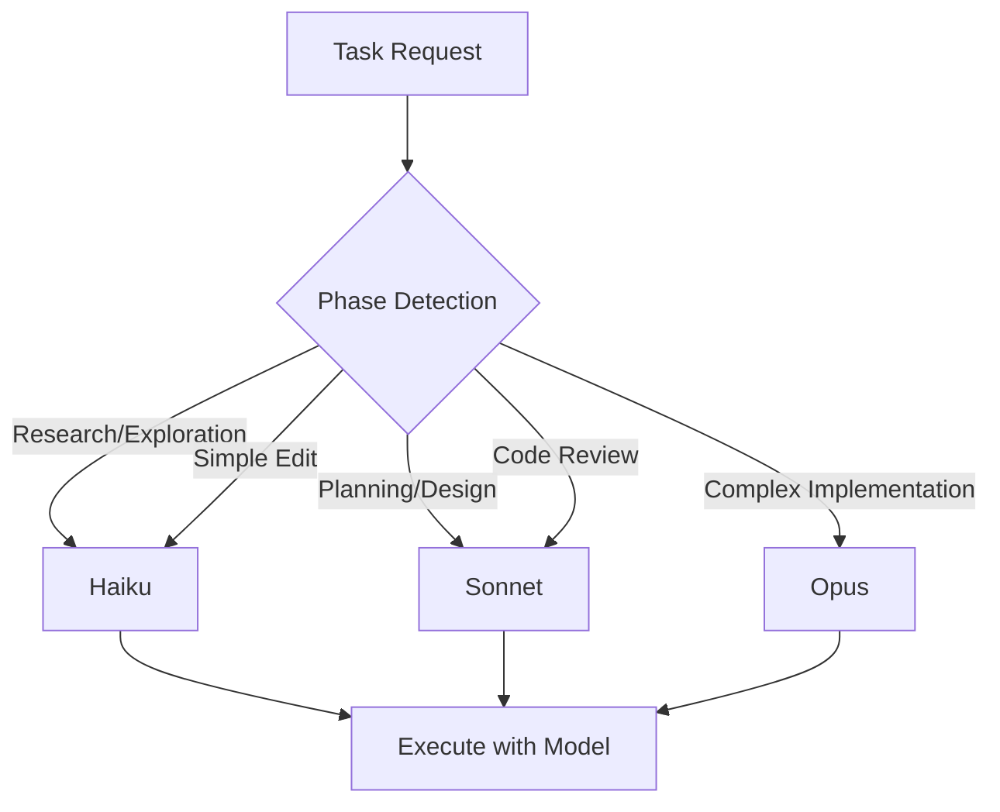

# Intelligent Model Selection

**Intelligent Model Selection** is SpecWeave's automatic system for choosing the right AI model (Claude Haiku, Sonnet, or Opus) based on task complexity. This optimizes both cost and quality by using cheaper models for simple tasks and more capable models for complex ones.

---

## How It Works



---

## Model Tiers

| Model | Cost | Best For | Use Cases |
|-------|------|----------|-----------|
| **Haiku** | $ | Quick tasks | File search, simple questions, log parsing |
| **Sonnet** | $$ | Standard work | Planning, code review, implementation |
| **Opus** | $$$ | Complex tasks | Architecture, multi-file refactoring, novel problems |

---

## Phase Detection

SpecWeave detects the current phase to select the appropriate model:

| Phase | Typical Model | Why |
|-------|---------------|-----|
| **Exploration** | Haiku | Fast file search, codebase navigation |
| **Research** | Haiku/Sonnet | Reading docs, understanding context |
| **Planning** | Sonnet | Generating specs, breaking down work |
| **Architecture** | Sonnet/Opus | Design decisions, ADRs |
| **Implementation** | Sonnet | Writing code, tests |
| **Review** | Sonnet | Code review, validation |
| **Debugging** | Sonnet/Opus | Complex problem solving |

---

## Cost Impact

Intelligent model selection can reduce AI costs by 40-60%:

```
Without intelligent selection:
  10 tasks × Opus = 10 × $15 = $150

With intelligent selection:
  3 research tasks × Haiku = 3 × $0.25 = $0.75
  5 standard tasks × Sonnet = 5 × $3 = $15
  2 complex tasks × Opus = 2 × $15 = $30
  Total: $45.75 (70% savings)
```

---

## Configuration

Model selection is automatic but can be influenced:

```json
// .specweave/config.json
{
  "ai": {
    "default_model": "sonnet",
    "use_intelligent_selection": true,
    "prefer_cost_optimization": true
  }
}
```

---

## Override Model Selection

Force a specific model when needed:

```bash
# Force Opus for complex task
/specweave:do --model opus

# Use Haiku for simple search
Task agent with model: haiku
```

---

## Related Terms

- [Cost Tracking](/docs/reference/cost-tracking)
- [Phase Detection](/docs/glossary/terms/skills-vs-agents)
- [Hooks](/docs/glossary/terms/hooks)
