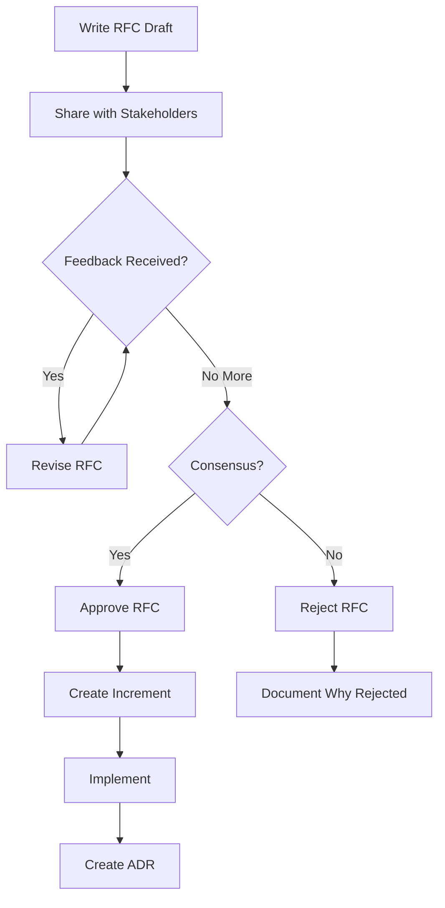

# RFC (Request for Comments)

**Category**: Planning & Requirements

## Definition

**RFC** (Request for Comments) is a proposal document for significant technical or architectural changes in SpecWeave projects. RFCs enable collaborative decision-making by soliciting feedback from stakeholders before implementation.

**Purpose**: Gather input, build consensus, and document decisions for major changes that affect system architecture, APIs, or development workflows.

## What Problem Does It Solve?

**The Premature Implementation Problem**:
- ❌ Major changes implemented without stakeholder buy-in
- ❌ Architecture decisions made in isolation (no team input)
- ❌ Expensive rework when concerns arise late
- ❌ Lost institutional knowledge (why was X chosen over Y?)

**RFC Solution**:
- ✅ Early feedback from all stakeholders (before implementation)
- ✅ Multiple perspectives considered (engineering, PM, security, ops)
- ✅ Documented rationale for future reference
- ✅ Reduced risk of costly rework

## When to Write an RFC

**Use RFC for**:
- ✅ Major architecture changes (switching databases, changing auth system)
- ✅ API design (public APIs, breaking changes)
- ✅ New framework patterns (new testing approach, CI/CD changes)
- ✅ Security-critical decisions (encryption, authentication)
- ✅ Cross-team impacts (changes affecting multiple teams/projects)

**Skip RFC for**:
- ❌ Bug fixes (just fix it)
- ❌ Minor refactoring (use PR description)
- ❌ Internal implementation details (not architectural)
- ❌ Straightforward features (use spec.md instead)

## RFC Structure

**Standard Sections**:

```markdown
# RFC-001: [Title - What You're Proposing]

**Status**: Draft | Review | Approved | Rejected | Implemented
**Created**: 2025-11-06
**Author**: [Your Name]
**Stakeholders**: [PM, Architect, Security, Ops, etc.]

## Summary (Executive Summary)
One-paragraph overview of what you're proposing.

## Motivation (Why?)
- What problem does this solve?
- Why is change needed now?
- What happens if we don't do this?

## Proposal (What?)
Detailed technical proposal:
- Architecture changes
- API designs
- Implementation approach
- Migration strategy (if applicable)

## Alternatives Considered (What Else?)
Other options you evaluated and why they were rejected:
- **Option A**: Description → Rejected because...
- **Option B**: Description → Rejected because...

## Trade-offs (Costs & Benefits)
**Benefits**:
- ✅ What we gain

**Costs**:
- ⚠️  What we give up or must maintain
- ⚠️  Migration effort
- ⚠️  Breaking changes

## Implementation Plan (How?)
1. Phase 1: [What]
2. Phase 2: [What]
3. Phase 3: [What]

**Timeline**: X weeks/months
**Dependencies**: What must be done first?

## Security & Compliance
- Security implications
- Compliance requirements (GDPR, HIPAA, etc.)
- Risk assessment

## Metrics & Success Criteria
How will we know this succeeded?
- Performance benchmarks
- Adoption metrics
- Quality gates

## Open Questions
What needs to be resolved before implementation?

## References
- Links to related docs (ADRs, PRDs, specs)
- External resources
- Prior art

## Feedback & Discussion
[Stakeholder comments and responses]
```

## RFC Workflow



**Steps**:
1. **Draft**: Author writes RFC
2. **Review**: Stakeholders provide feedback (async, comments in doc)
3. **Revise**: Author addresses concerns, updates RFC
4. **Decision**: Approve, Reject, or Request More Info
5. **Implementation**: If approved, create increment(s)
6. **ADR**: After implementation, create Architecture Decision Record

## Real-World Example

**Scenario**: SpecWeave needs to decide on plugin architecture approach.

**RFC-004: Claude Native Plugin System vs Custom Plugin Architecture**

```markdown
# RFC-004: Claude Native Plugin System vs Custom Plugin Architecture

**Status**: Approved → Implemented
**Created**: 2025-09-01
**Author**: Anton Abyzov
**Stakeholders**: Core Team, Plugin Developers

## Summary
Proposal to adopt Claude Code's native plugin system instead of building custom plugin architecture.

## Motivation
- Claude Code released official plugin system (Sept 2024)
- Our custom system duplicates Anthropic's work
- Native integration = better performance, less maintenance

## Proposal
Adopt Claude native plugins:
- Use `plugin.json` manifest (Claude standard)
- Skills auto-activate based on description keywords
- Agents use Claude's isolation
- Commands integrate with slash command system

## Alternatives Considered
**Option A: Custom Plugin System**
- ❌ Rejected: Duplicates Anthropic's work, high maintenance burden

**Option B: No Plugins (Monolithic)**
- ❌ Rejected: Poor scalability, high context usage

## Trade-offs
**Benefits**:
- ✅ 70%+ context reduction (load only needed plugins)
- ✅ Future-proof (follows Anthropic standards)
- ✅ Zero maintenance for plugin system

**Costs**:
- ⚠️  Migration effort from custom system
- ⚠️  Dependent on Claude Code (vendor lock-in)

## Implementation Plan
1. Phase 1: Create plugin.json manifests
2. Phase 2: Migrate skills/agents/commands
3. Phase 3: Update installation process
4. Phase 4: Deprecate custom system

**Timeline**: 3 weeks
**Dependencies**: None

## Metrics & Success Criteria
- Context usage reduced by 70%+
- All 18 plugins migrated successfully
- Installation time &lt;30 seconds

## Decision
**APPROVED** - 2025-09-15

## Implementation
- Increment 0004: Plugin Architecture
- ADR-0010: Claude Native Plugin System
```

## RFC vs Other Documents

| Document | Purpose | When | Audience |
|----------|---------|------|----------|
| **RFC** | Gather feedback on proposal | Before implementation | All stakeholders |
| **ADR** | Document decision & rationale | After implementation | Future developers |
| **PRD** | Business requirements | Before RFC/spec | PM, stakeholders |
| **Spec** | Implementation details | After RFC approval | Engineering team |
| **HLD** | System architecture | After RFC/spec | Architects, engineers |

**Workflow**:
```
PRD → RFC → Spec → Increment → Implementation → ADR
```

## Storage Location

**SpecWeave Project Structure**:

```
.specweave/docs/internal/
├── strategy/
│   └── rfc/                          # RFCs stored here
│       ├── rfc-001-auth-system.md
│       ├── rfc-002-api-redesign.md
│       └── rfc-003-plugin-arch.md
│
└── architecture/
    └── adr/                          # ADRs (after implementation)
        ├── 0001-use-postgres.md
        └── 0002-jwt-tokens.md
```

**Naming Convention**: `rfc-###-short-description.md`

## RFC Status

**Lifecycle**:
- **Draft**: Work in progress, not ready for review
- **Review**: Open for stakeholder feedback
- **Approved**: Consensus reached, ready to implement
- **Rejected**: Not moving forward (document why!)
- **Implemented**: Done, ADR created

**Status Updates** (in frontmatter):
```yaml
---
status: Draft
created: 2025-11-06
updated: 2025-11-10
decision_date: 2025-11-15
---
```

## Best Practices

### 1. **Write RFC Before Coding**
```markdown
❌ WRONG: Code first, RFC later (justification document)
✅ CORRECT: RFC first, gather feedback, then code
```

### 2. **Include Alternatives**
```markdown
❌ WRONG: Only present your preferred option
✅ CORRECT: Show 2-3 alternatives with pros/cons
```

### 3. **Be Specific**
```markdown
❌ WRONG: "We should improve performance"
✅ CORRECT: "Migrate from REST to gRPC for 10x throughput"
```

### 4. **Quantify Trade-offs**
```markdown
❌ WRONG: "This will be faster"
✅ CORRECT: "Reduces latency from 500ms to 50ms (10x improvement)"
```

### 5. **Create ADR After Implementation**
```markdown
✅ Workflow:
1. Write RFC (proposal)
2. Get approval
3. Implement
4. Create ADR (record decision)
```

## Acceptance Criteria

**An RFC is complete when it has**:
- [ ] Clear problem statement (Motivation)
- [ ] Detailed proposal (What & How)
- [ ] 2-3 alternatives considered
- [ ] Trade-offs documented (costs & benefits)
- [ ] Implementation plan with timeline
- [ ] Stakeholder feedback addressed
- [ ] Decision recorded (Approved/Rejected)

## User Story

**US-001: RFC Creation**
- **AC-US1-01**: Author can write RFC using standard template (P1, manual)
- **AC-US1-02**: Stakeholders can comment on RFC async (P1, manual)
- **AC-US1-03**: RFC status updated through lifecycle (P1, manual)

## Brownfield

**Existing projects** often have RFCs scattered across:
- Google Docs
- Confluence
- GitHub Discussions
- Email threads

**Migration**:
```bash
# Import existing RFCs
/specweave:import-docs --source confluence --type rfc
# → Creates .specweave/docs/internal/strategy/rfc/
```

**See**: [Brownfield Onboarding](/docs/workflows/brownfield)

## Related Terms

- [ADR](./adr.md) - Architecture Decision Record (after implementation)
- [Acceptance Criteria](./acceptance-criteria.md) - How to verify user story is complete
- [Spec](./spec.md) - Specification document (detailed requirements)
- [PRD](./prd.md) - Product Requirements Document (business case)
- [HLD](./hld.md) - High-Level Design (system architecture)
- [Brownfield](./brownfield.md) - Existing codebase integration

## Learn More

- [RFC Best Practices](#best-practices) - See best practices section above
- [Related Terms](#related-terms) - ADR, Spec, PRD, HLD
- [SpecWeave Planning Workflow](/docs/intro#how-specweave-works) - Complete workflow overview

---

**Category**: Planning & Requirements

**Tags**: #rfc #requirements #specification #planning #user-stories
