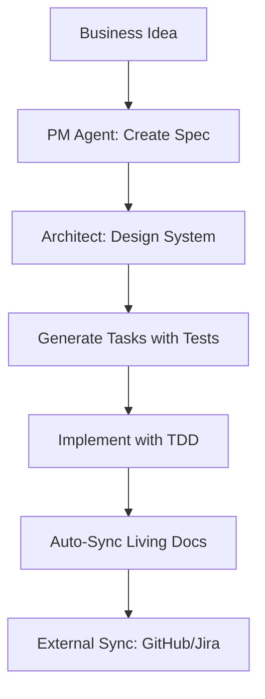

# SpecWeave

**Category**: SpecWeave Core

## Definition

SpecWeave is a spec-driven development framework that brings enterprise-level discipline to AI-assisted software development. It combines Claude Code's native plugin system with structured workflows, living documentation, and automated quality gates to ensure every line of code traces back to specifications.

## What Problem Does It Solve?

**The Challenge of AI-Assisted Development**:
- ❌ AI generates code without clear requirements
- ❌ Documentation becomes stale immediately
- ❌ No traceability from spec to implementation
- ❌ Context bloat (AI sees everything, focuses on nothing)
- ❌ Team members can't understand what was built or why

**SpecWeave's Solution**:
- ✅ Spec-first workflow (write requirements before code)
- ✅ Living documentation (auto-syncs as you build)
- ✅ Complete traceability (spec → tasks → tests → code)
- ✅ 75%+ context reduction (modular plugin architecture)
- ✅ Enterprise-ready (compliance, auditing, onboarding)

## Key Features

### 1. **Structured Workflows**
- Increment-based development (focused work units)
- PM-led planning (market research, spec generation)
- Test-aware implementation (embedded test plans)

### 2. **Living Documentation**
- Automatic sync after task completion
- Permanent knowledge base (`.specweave/docs/internal/`)
- Complete project history

### 3. **Plugin Architecture**
- Core plugin: Always loaded (~12K tokens)
- Optional plugins: GitHub, Figma, Kubernetes, etc.
- 70%+ context reduction vs monolithic

### 4. **Quality Gates**
- Rule-based validation
- AI-powered quality assessment
- Risk scoring (BMAD pattern)

## How It Works



**Workflow**:
1. **Plan**: `/specweave:increment "feature"` → Generates spec.md, plan.md, tasks.md
2. **Build**: `/specweave:do` → Implements tasks with embedded tests
3. **Validate**: `/specweave:qa` → Quality assessment with risk scoring
4. **Close**: `/specweave:done` → Syncs living docs, closes increment

## Real-World Example

**Scenario**: Building user authentication

```bash
# 1. Plan (PM agent generates spec with user stories)
/specweave:increment "Add user authentication"
# Creates:
# - spec.md (20 user stories with acceptance criteria)
# - plan.md (architecture, test strategy)
# - tasks.md (5 tasks with embedded test plans)

# 2. Implement (TDD workflow)
/specweave:do
# Executes T-001: Authentication Service
# - Writes tests first (BDD format)
# - Implements to pass tests
# - Auto-syncs living docs after completion

# 3. Quality check
/specweave:qa 0008
# Validates:
# - 87% test coverage ✅
# - All AC-IDs covered ✅
# - Risk score: LOW ✅

# 4. Close
/specweave:done 0008
# Syncs living docs permanently
# Creates GitHub issue automatically
```

## Philosophy

SpecWeave follows three core principles:

1. **Spec-First Discipline**
   - Requirements before implementation
   - Testable acceptance criteria
   - Clear success metrics

2. **Living Documentation**
   - Documentation = code (never stale)
   - Automatic sync (zero manual effort)
   - Complete traceability

3. **Focus = Velocity**
   - One active increment at a time
   - WIP limits prevent context switching
   - Discipline ensures completion

## Why SpecWeave?

**For Solo Developers**:
- ✅ Clear structure for AI collaboration
- ✅ Never lose track of what you're building
- ✅ Professional documentation for portfolio

**For Teams**:
- ✅ Consistent workflow across all developers
- ✅ Easy onboarding (read living docs)
- ✅ Compliance & auditing (complete history)

**For Enterprises**:
- ✅ Regulatory compliance (FDA, SOC 2, HIPAA)
- ✅ Audit trails (know who built what and why)
- ✅ Knowledge preservation (no "tribal knowledge")

## Related Terms

- [Increment](./increment.md) - Focused unit of work
- [Living Docs](./living-docs.md) - Auto-syncing documentation
- [Plugin](./plugin.md) - Modular capabilities
- [Spec](./spec.md) - Specification document

## Learn More

- [Getting Started Guide](/docs/intro)
- [Core Concepts](/docs/glossary/terms/increment)
- [Complete Workflow](/docs/workflows/overview)
- [Commands Reference](/docs/commands/overview)
