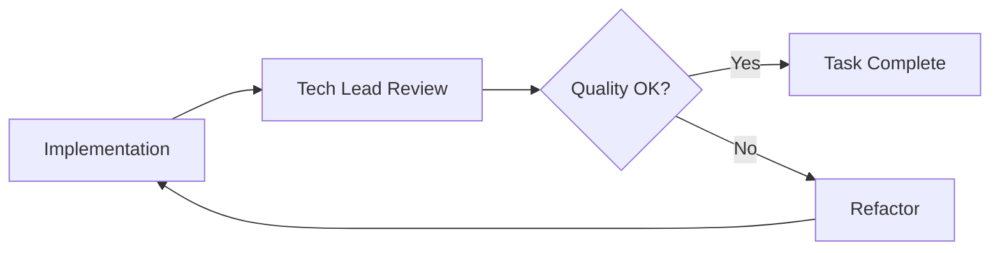

# Tech Lead Agent

The **Tech Lead Agent** is SpecWeave's AI-powered Technical Lead that handles code review, best practices enforcement, and implementation guidance.

## What It Does

**Key responsibilities:**
- 🔍 **Code review** - Reviews code for quality and best practices
- 📝 **Implementation guidance** - Suggests implementation approaches
- 🛠️ **Refactoring** - Identifies improvement opportunities
- 📊 **Technical debt** - Tracks and prioritizes tech debt
- ✅ **Standards enforcement** - Ensures coding standards compliance

## When It Activates

- `/specweave:do` - During implementation, provides guidance
- Code review requests - When asked to review code
- Refactoring tasks - When cleaning up code
- Technical questions - When implementation approach is unclear

## Example Interaction

```
Tech Lead Agent: "I've reviewed the AuthService implementation. Here's my assessment:

✅ Strengths:
- Good separation of concerns
- Proper error handling
- Type safety with TypeScript

⚠️ Suggestions:
1. Extract token generation to separate TokenService
2. Add input validation middleware
3. Consider rate limiting for login endpoint

📊 Code Quality Score: 85/100

Shall I help implement these improvements?"
```

## Code Review Output

```markdown
## Code Review: AuthService.ts

### Summary
Good implementation with room for improvement.

### Findings

#### ✅ Positive
- Clean method signatures
- Proper async/await usage
- Comprehensive error handling

#### ⚠️ Improvements
1. **Extract Token Logic** (Maintainability)
   - Move JWT operations to dedicated TokenService
   - Improves testability and separation of concerns

2. **Add Validation** (Security)
   - Validate email format before database query
   - Sanitize inputs to prevent injection

3. **Rate Limiting** (Security)
   - Add rate limiting to prevent brute force
   - Suggest: 5 attempts per minute per IP

### Recommended Actions
- [ ] Create TokenService (30 min)
- [ ] Add input validation (20 min)
- [ ] Implement rate limiting (45 min)
```

## Integration with Workflow



## Related Agents

| Agent | Role | Focus |
|-------|------|-------|
| [PM Agent](/docs/glossary/terms/pm-agent) | Product Manager | Requirements |
| [Architect Agent](/docs/glossary/terms/architect-agent) | System Architect | Design |
| **Tech Lead Agent** | Technical Lead | Implementation |
| QA Lead Agent | Quality Assurance | Testing |

## Related

- [PM Agent](/docs/glossary/terms/pm-agent) - Creates specifications
- [Architect Agent](/docs/glossary/terms/architect-agent) - Designs architecture
- [TDD](/docs/glossary/terms/tdd) - Test-first development
- [Increments](/docs/glossary/terms/increments) - Work units
