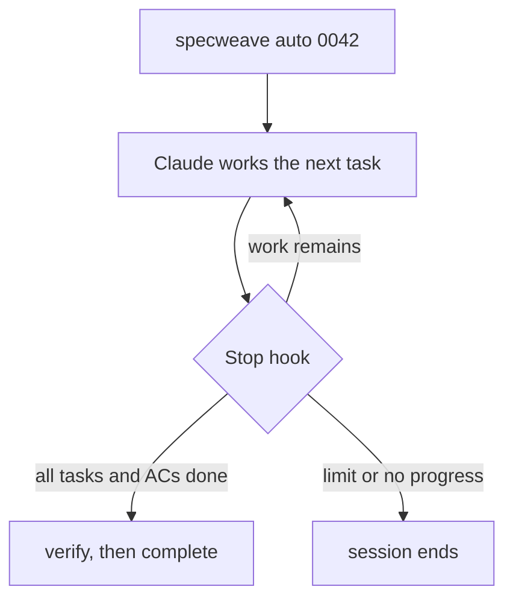

# Autonomous execution

Auto mode lets Claude Code keep working on an increment until its tasks are done, without you typing "continue". There is no daemon and no background process. `specweave auto` writes a small session file, and the SpecWeave plugin's Stop hook reads it every time Claude tries to end its turn.

Auto mode depends on the Stop hook, so it works in Claude Code with the `sw` plugin loaded. Other tools run the same loop turn by turn (see [the loop](/docs/integrations/generic-ai-tools#the-loop-with-only-the-cli)).

## Start, check, stop

```bash
specweave auto                 # continue with the increments that are already active
specweave auto 0042 0043       # activate these increments and start
specweave auto --all-backlog   # activate every planned or backlog increment
specweave auto --dry-run       # show what would be activated, change nothing
specweave auto --reset         # clear stale auto-mode state files

specweave auto-status          # is a session active, and which increments are open
specweave auto-status --json
specweave cancel-auto          # end the session (asks first)
specweave cancel-auto --force
```

In Claude Code you can also type `/sw:auto` or say "run this until it's done".

Only start auto mode on an increment whose spec is settled. Open questions in `spec.md` become guesses when nobody is watching.

## How the loop decides



Each time Claude tries to stop, the hook checks, in order:

1. No active auto session: the session ends normally.
2. The session file is older than `auto.maxSessionAge` (default 7200 seconds): released.
3. More than `auto.maxTurns` turns (default 20): released as a safety stop.
4. Three turns in a row with no change in remaining work: released by the loop guard.
5. No increment left to work on: released.
6. No tasks or acceptance criteria remain: Claude is sent back once with `all_complete_needs_closure`, its cue to run `specweave verify` and close the increment.
7. Otherwise: Claude is sent back with how many tasks and acceptance criteria remain.

Any error inside the hook lets the session end. An ordinary session without an auto session file is never held.

## What the agent does inside the loop

The same loop as `/sw:do`:

```bash
specweave task next 0042
specweave task claim T-03 0042
# edit only the task's Files, commit as "0042: what changed"
specweave task done T-03 0042 --run "npm test -- cart"
```

A failing test is fixed in the next turn; a task is never marked done without a passing run. When a task is genuinely blocked (a missing secret, an ambiguous criterion), the agent records it and stops:

```bash
specweave task block T-04 0042 --reason "needs STRIPE_TEST_KEY"
```

A blocked task still counts as remaining work, so after three turns without progress the loop guard ends the session and the block is waiting for you in `specweave pickup`.

When everything is done: `specweave verify 0042`, then `specweave complete 0042`.

## Configuration

```json
{
  "auto": {
    "maxTurns": 20,
    "maxSessionAge": 7200,
    "requireTests": true
  }
}
```

`requireTests` (or `testing.mode` set to `TDD`) adds "all tests must pass" to the completion criteria printed at start. The Stop hook itself only counts remaining tasks and acceptance criteria; the tests are run by `task done --run` and `specweave verify`, and `specweave complete` refuses to close without a passing verify report unless you give `--reason`.

## Running out of tokens mid-run

Auto mode does not survive a usage limit on its own. Before a long run, make sure the agent knows the fallback in `AGENTS.md`: on any stop, run `specweave handoff --reason "<why>"`, which pushes the branch and uncommitted edits when there is a remote. The next session, in any tool or account, starts with `specweave pickup` (or "pick up"). See [Cross-tool handoff](/docs/guides/cross-tool-handoff).

## See also

- [Agent teams](/docs/guides/agent-teams-and-swarms): several agents on one increment
- [Increment statuses](/docs/guides/increment-status-reference)
