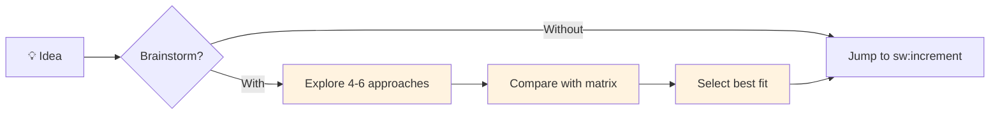
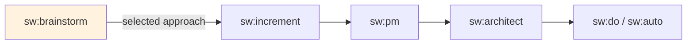

import CommandTabs from '@site/src/components/CommandTabs';

# Brainstorming with Cognitive Lenses

**Version**: 1.0.365+

`sw:brainstorm` is a structured ideation skill that explores problems from multiple perspectives before you commit to an implementation path. It uses established cognitive frameworks (Six Thinking Hats, SCAMPER, TRIZ) to expand the solution space beyond the "obvious" answer.

## Why This Exists

When you ask an AI to brainstorm, you typically get 3-4 approaches ranked by popularity — JWT first for auth, React first for frontends, PostgreSQL first for databases. The same list every time.

Cognitive lenses **force** exploration off the beaten path. The Black Hat finds risks everyone ignores. SCAMPER's "Eliminate" asks what you can remove entirely. TRIZ inverts your core assumptions. These aren't random — they're backed by decades of creativity research.

### The Gap It Fills



Without brainstorming, the path from "idea" to "spec" is a straight line — and that's where most bad architectural decisions get locked in. `sw:brainstorm` adds a structured exploration phase that saves hours of rework later.

## Quick Start

<CommandTabs
  natural="Let's brainstorm how to handle real-time notifications"
  claude='sw:brainstorm "how should we handle real-time notifications"'
  other='brainstorm "how should we handle real-time notifications"'
/>

Additional options (works in Claude Code and other AI tools):
```bash
# Quick mode (~2 min): 3 approaches, fast comparison
sw:brainstorm "JWT vs OAuth vs Passkeys" --depth quick

# Deep mode (~15 min): multiple cognitive lenses, full analysis
sw:brainstorm "microservices vs monolith for our SaaS" --depth deep

# Specific lens
sw:brainstorm "payment gateway architecture" --lens six-hats

# Resume a previous session
sw:brainstorm "payment gateway" --resume

# Custom evaluation criteria
sw:brainstorm "marketing strategy" --criteria "brand-fit,audience-reach,cost,differentiation"
```

## The 5-Phase Flow

### Phase 1: Frame

Every brainstorm starts by sharpening the problem. Most bad solutions come from solving the wrong problem.

**What happens:**
- Restates your topic as a clear, one-sentence problem statement
- Runs **Starbursting** (5W1H): Who/What/When/Where/Why/How
- Asks 1-2 targeted clarifying questions

**Example**: You say "we need caching." Starbursting reveals the real pain is N+1 database queries, not cache misses. The brainstorm pivots from "which cache" to "how to eliminate redundant queries" — a fundamentally different and better question.

### Phase 2: Diverge

This is the core innovation. Instead of generating approaches from one perspective, cognitive **lenses** force the model to think from structurally different angles.

**5 available lenses:**

| Lens | Perspectives | Best For |
|------|-------------|----------|
| **Default** | Conservative, Bold, Speed, Extensibility, Lateral, Hybrid | General engineering decisions |
| **Six Thinking Hats** | Facts, Feelings, Caution, Optimism, Creativity, Process | Team decisions, product strategy |
| **SCAMPER** | Substitute, Combine, Adapt, Modify, Repurpose, Eliminate, Reverse | Improving existing systems |
| **TRIZ** | 13 inventive principles + constraint inversion | Breaking through technical contradictions |
| **Adjacent Possible** | What recently became feasible (web-search-enhanced) | New products, tech modernization |

In **deep mode**, each lens facet is dispatched as a separate parallel subagent — Six Thinking Hats literally runs 6 agents simultaneously, each thinking from one perspective.

### Phase 3: Evaluate

All approaches are scored on a comparison matrix (1-5 scale):

```
| Criterion     | Approach A | Approach B | Approach C |
|---------------|:----------:|:----------:|:----------:|
| Complexity    |    2/5     |    4/5     |    3/5     |
| Time          |    4/5     |    2/5     |    3/5     |
| Risk          |    4/5     |    3/5     |    4/5     |
| Extensibility |    2/5     |    5/5     |    3/5     |
| Alignment     |    5/5     |    2/5     |    4/5     |
| Total         |    17      |    16      |    17      |
```

Criteria are customizable — use `--criteria` for domain-specific evaluation (marketing, infrastructure, business).

An explicit recommendation with rationale is provided. You can accept, explore deeper, or run more lenses.

### Phase 4: Deepen (Deep Mode Only)

Goes beyond comparison into structural analysis:

- **Abstraction Laddering**: Zoom out (are we solving the right problem?) and zoom in (what are the first 3 concrete steps?)
- **Analogical Reasoning**: "This is similar to how Netflix solved X" — distant-field analogies that reveal non-obvious solutions
- **Hidden Assumptions**: List implicit assumptions and invert each one to check for blind spots
- **Pre-Mortem**: "Imagine this approach failed. Why?" — Gary Klein's technique for catching risks that optimistic planning misses

### Phase 5: Output

Saves a persistent brainstorm document to `.specweave/docs/brainstorms/YYYY-MM-DD-topic.md` and offers handoff:

1. **Turn into increment** — passes brainstorm context (problem frame, selected approach, risks, constraints) to `sw:increment` so the PM agent has a head start
2. **Go deeper** — re-run with different lenses or deeper mode
3. **Park for later** — the document and idea tree persist for revisiting

## Depth Modes

| Mode | Phases | Duration | Use When |
|------|--------|----------|----------|
| `quick` | 1 + 3 | ~2 min | Binary decisions, simple comparisons |
| `standard` | 1-3 + 5 | ~5 min | Typical feature decisions, architecture choices |
| `deep` | All 5 | ~15 min | Major architectural decisions, new product ideation, high-stakes choices |

## Cognitive Lenses in Detail

### Default Lens

Generates 4-6 approaches with different strategic orientations:

1. **Conservative**: Build on what exists. Minimal change, maximum reuse.
2. **Bold**: Rethink from scratch. What's ideal with no constraints?
3. **Speed**: Optimize for fastest delivery. Simplest thing that works.
4. **Extensibility**: Optimize for future growth. What won't you regret in 2 years?
5. **Lateral** (optional): What would a completely different industry do?
6. **Hybrid** (optional): Combine the best parts of other approaches.

### Six Thinking Hats (de Bono)

Forces 6 structurally different perspectives:

| Hat | Focus | Example Output |
|-----|-------|---------------|
| **White** (Facts) | Data, evidence, metrics | "Our current auth handles 10K req/s. JWT validation adds 2ms latency." |
| **Red** (Feelings) | Intuition, user emotions | "Users hate password reset flows. Passkeys feel magical." |
| **Black** (Caution) | Risks, worst cases | "If the OAuth provider goes down, all users are locked out." |
| **Yellow** (Optimism) | Opportunities, best cases | "Passkeys unlock biometric login — 3x faster onboarding." |
| **Green** (Creativity) | Novel, unconventional | "What if auth is optional? Public-by-default with audit trails." |
| **Blue** (Process) | Structure, methodology | "Phase 1: JWT for MVP. Phase 2: Add OAuth. Phase 3: Passkeys for power users." |

**When to use**: Product decisions with multiple stakeholders. Marketing strategy. Any decision where emotional and political factors matter as much as technical ones.

### SCAMPER

7 systematic transformations applied to the current system:

| Letter | Question | Example |
|--------|----------|---------|
| **S**ubstitute | What can we replace? | Replace REST with GraphQL |
| **C**ombine | What can we merge? | Combine auth + billing into one service |
| **A**dapt | What can we borrow? | Adapt Stripe's hosted checkout pattern |
| **M**odify | What can we scale up/down? | Minimize the API surface to 5 endpoints |
| **P**ut to other use | What can we repurpose? | Use the audit log as an analytics source |
| **E**liminate | What can we remove? | Eliminate the custom admin panel — use Retool |
| **R**everse | What can we invert? | Push notifications instead of pull/polling |

**When to use**: Improving or rethinking existing systems. Reducing complexity. Finding optimizations.

### TRIZ (Inventive Principles + Constraint Inversion)

Applies selected inventive principles from Altshuller's 40 TRIZ principles, adapted for software:

| Principle | Software Adaptation |
|-----------|-------------------|
| Segmentation | Break monolith into microservices |
| Extraction | Extract cross-cutting concerns into middleware |
| Merging | Combine multiple API calls into batch endpoints |
| Preliminary Action | Pre-compute, cache, warm up at build time |
| The Other Way Round | Invert control flow (push vs pull, event sourcing) |
| Dynamicity | Feature flags, config-driven behavior |
| Blessing in Disguise | Turn constraints into features (rate limiting becomes fair usage) |
| Intermediary | Add proxy, gateway, anti-corruption layer |
| Self-Service | User-facing admin panels, API key management |

Then inverts core assumptions: "Users must authenticate first" → "What if data is public by default?" This is how Google Docs sharing works.

**When to use**: Technical contradictions. "We need X but it conflicts with Y." Breaking through seemingly impossible constraints.

### Adjacent Possible

Web-search-enhanced lens that asks: "What recently became feasible?"

Uses live web search to ground ideas in reality — not just model knowledge but actual recent developments, new tools, cost changes, and emerging patterns.

**When to use**: New products. Modernization efforts. "Should we build or buy?" decisions. Any situation where the landscape changed recently.

## Resume Mode

Brainstorms are persistent. Every session saves a state file and document that you can resume later:

<CommandTabs
  natural="Let's brainstorm notification architecture"
  claude='sw:brainstorm "notification architecture"'
  other='brainstorm "notification architecture"'
/>

Then come back later and go deeper:
```bash
sw:brainstorm "notification architecture" --resume --depth deep --lens triz
```

Resume mode:
- Loads the previous session's problem frame and approaches
- Skips phases you already completed
- Lets you explore abandoned branches from the idea tree
- Applies new lenses to the same problem with accumulated context

## Custom Evaluation Criteria

The default criteria (Complexity, Time, Risk, Extensibility, Alignment) work for engineering decisions. For other domains, use `--criteria`:

```bash
# Marketing brainstorm
sw:brainstorm "launch strategy" --criteria "brand-fit,audience-reach,cost,differentiation"

# Database selection
sw:brainstorm "database choice" --criteria "read-perf,write-perf,ops-complexity,cost,ecosystem"

# Business decision
sw:brainstorm "pricing model" --criteria "revenue-impact,customer-retention,implementation-effort,competitive-position"
```

**Preset auto-detection**: If you don't specify `--criteria`, the skill detects context and picks appropriate criteria:

| Context | Auto-Detected Criteria |
|---------|----------------------|
| Engineering | Complexity, Time, Risk, Extensibility, Alignment |
| Marketing/Product | Brand Fit, Audience Reach, Cost, Differentiation, Time-to-Market |
| Infrastructure | Performance, Reliability, Cost, Operational Complexity, Scalability |
| Business | Revenue Impact, Cost, Time-to-Value, Strategic Alignment, Risk |

## Real-World Examples

### Example 1: Auth Architecture Decision

<CommandTabs
  natural="Brainstorm authentication approaches for our B2B SaaS — go deep with Six Thinking Hats"
  claude='sw:brainstorm "authentication for our B2B SaaS" --depth deep --lens six-hats'
  other='brainstorm "authentication for our B2B SaaS" --depth deep --lens six-hats'
/>

**What you get**:
- **White Hat**: "Current competitors use OAuth2 + SAML. Enterprise customers require SSO."
- **Red Hat**: "Developers hate SAML integration. Users love magic links."
- **Black Hat**: "Custom auth is the #1 source of security vulnerabilities."
- **Yellow Hat**: "Passkeys eliminate password-related support tickets entirely."
- **Green Hat**: "What if we delegate 100% of auth to a managed provider and own zero credentials?"
- **Blue Hat**: "Phase 1: Auth0 for MVP. Phase 2: Add SAML for enterprise. Phase 3: Passkeys for end users."

**Evaluation matrix** scores each on Complexity/Time/Risk/Extensibility/Alignment.
**Recommendation**: Blue Hat's phased approach — lowest risk, fastest start, clear upgrade path.

### Example 2: Payment Flow Optimization

```bash
sw:brainstorm "our checkout flow has 40% drop-off" --lens scamper
```

**SCAMPER produces**:
- **Substitute**: Replace multi-step form with single-page checkout
- **Combine**: Merge shipping + billing into one address entry
- **Eliminate**: Remove account creation requirement (guest checkout)
- **Reverse**: Show order summary first, then collect payment (Amazon's approach)
- **Adapt**: Borrow Apple Pay's one-click pattern

### Example 3: New Product Ideation

```bash
sw:brainstorm "developer productivity tool for code review" --depth deep --lens adjacent
```

**Adjacent Possible** uses web search to find:
- AI code review tools that launched in 2025-2026
- Cost of LLM API calls dropping below $1/1M tokens
- New IDE extension APIs enabling inline suggestions
- Emerging patterns from CodeRabbit, Graphite, etc.

**Generates approaches grounded in what's actually possible today**, not generic "use AI" suggestions.

## Integration with SpecWeave Workflow



The brainstorm output feeds directly into the increment workflow:
- **Problem frame** → PM agent skips basic discovery questions
- **Selected approach** → Architect agent starts with a direction instead of from scratch
- **Risks and constraints** → get converted into acceptance criteria
- **Evaluation matrix** → becomes a reference for architecture decision records (ADRs)

The brainstorm document persists at `.specweave/docs/brainstorms/` and is bidirectionally linked to its resulting increment.

## Output Location

| Artifact | Path |
|----------|------|
| Brainstorm document | `.specweave/docs/brainstorms/YYYY-MM-DD-topic-slug.md` |
| Session state | `.specweave/state/brainstorm-YYYY-MM-DD-topic-slug.json` |

## Tips

- **Start quick, go deep later**: Use `--depth quick` for initial exploration, then `--resume --depth deep` on the most promising direction
- **Combine lenses**: In deep mode, select multiple lenses to get perspectives from different frameworks
- **Use for marketing too**: Six Thinking Hats works great for positioning, messaging, and go-to-market decisions — not just engineering
- **Share the document**: The brainstorm doc is markdown — paste it in a PR description, Slack thread, or design review for team alignment
- **Revisit abandoned branches**: Use `--resume` to explore approaches you initially discarded — sometimes they become viable as constraints change

## Related

- [Planning Workflow](/docs/workflows/planning) — The full planning flow that brainstorming precedes
- [Skills Reference: brainstorm](/docs/reference/skills#brainstorm) — Quick reference for all arguments
- [Deep Interview Mode](/docs/guides/deep-interview-mode) — Complementary feature for detailed requirement gathering
