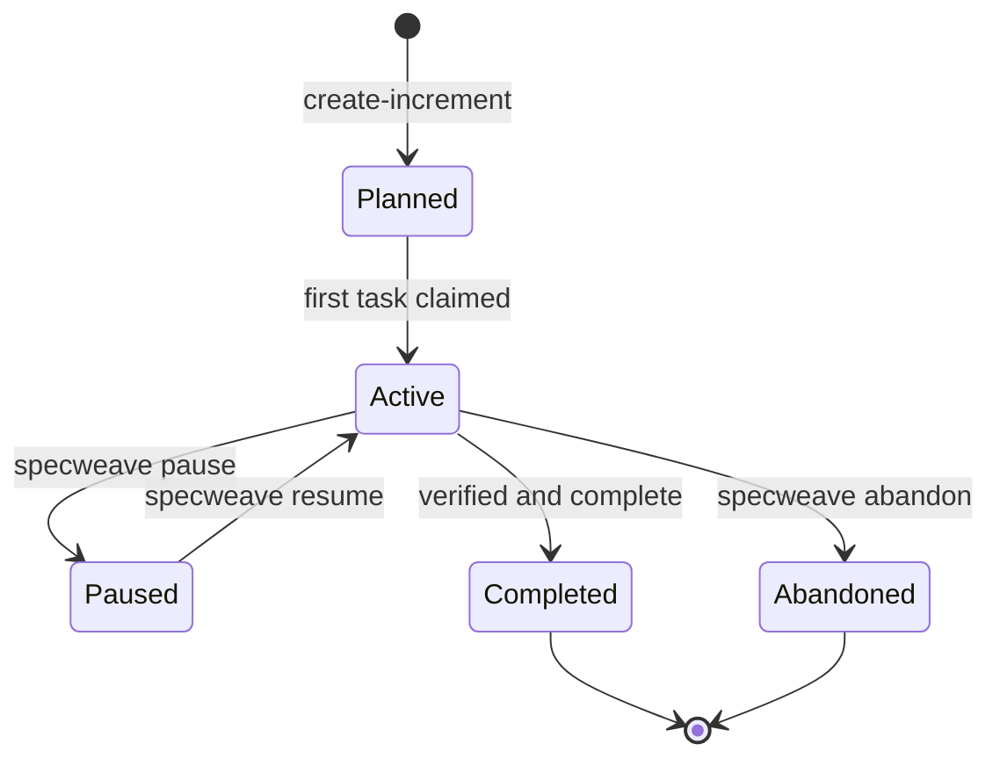

import CommandTabs from '@site/src/components/CommandTabs';

# What is an Increment?

An **increment** is SpecWeave's unit of work: one change with a clear definition of done. In a Claude Code Project it is one thread; in git it is one branch and one pull request.

## What is inside

Since 3.0, a new increment is one file you read and write, plus machine state you do not:

```
.specweave/increments/0042-checkout-recovery/
├── spec.md          # the only file you and the agent edit
├── ledger.jsonl     # append-only state: claims, done, notes, sessions
├── metadata.json    # id, status, type, tracker links (machine state)
└── handoff.md       # written by specweave handoff
```

`spec.md` has five sections:

- **Problem**: the outcome, in the user's words.
- **Scope**: what is in and what is out.
- **Acceptance Criteria**: numbered, `- AC-01 …`. This is the definition of done.
- **Approach**: files, order, risks and decisions.
- **Tasks**: one line per task, naming the criteria it covers, `- T-02 Restore it on return (AC-01, AC-02)`.

State is never written back into markdown. When the agent claims or finishes a task, SpecWeave appends to `ledger.jsonl`. An acceptance criterion is met when every task that covers it is done, so nobody ticks boxes by hand.

A separate `plan.md` is still available for a genuinely large design. Increments created with 2.x, which have a `tasks.md`, keep working unchanged.

## Why one file

Every token an agent spends rereading bookkeeping is a token it does not spend on your code. In 2.x, `tasks.md` was two thirds derived state that the ledger already held, and the agent reread the whole spec on every task to find its criteria. In 3.0, `specweave task next` prints the task with the text of its criteria, so the agent reads a few lines per task.

## Working through an increment

<CommandTabs
  natural="Let's make checkout resumable when a customer comes back"
  claude='sw:increment "keep checkout resumable"'
  other='specweave create-increment "keep checkout resumable"'
/>

```bash
specweave task next                       # next task, with its acceptance criteria
specweave task claim T-02                 # claim it (and the files it owns)
specweave task done T-02 --run "npm test" # record the real verification
specweave verify 0042                     # run the project's checks
specweave complete 0042                   # close with evidence
```

When you switch tools or hit a usage limit, `specweave handoff --push` in the old tool and `specweave pickup` in the new one. See [Cross-tool handoff](/docs/guides/cross-tool-handoff).

## Lifecycle



Changing status does not touch GitHub, Jira or Azure DevOps. A tracker is updated only when you run `specweave sync push`, or when you turn on close-on-complete.

## Increment types

The type is a label for tracking; every type has the same layout.

| Type | Use when |
|------|----------|
| **feature** | New functionality |
| **hotfix** | A critical production fix |
| **bug** | A defect that needs investigation |
| **change-request** | A stakeholder asked for a change |
| **refactor** | Improving code without changing behaviour |
| **experiment** | A spike or proof of concept |

## Good habits

1. **One outcome per increment.** If a request touches files an open increment already owns, add scope there instead of opening a second one.
2. **Criteria you can check.** "Returning within 24 hours restores the cart" beats "checkout is better".
3. **Verify before closing.** A task is done when its check passed, not when the code was written.
4. **Hand off explicitly.** Run `specweave handoff` before you switch tools, so the next one starts where you stopped.

## Next steps

- [Your first increment](/docs/getting-started/first-increment)
- [Claude Code Projects and threads](/docs/guides/claude-code-projects)
- [SpecWeave 3.0](/docs/guides/specweave-3)
