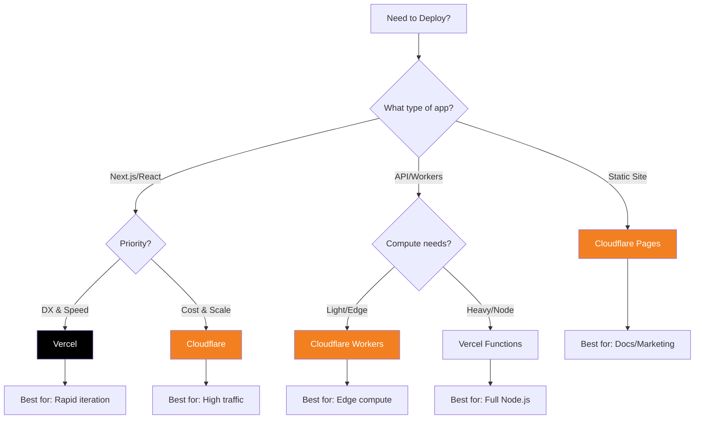
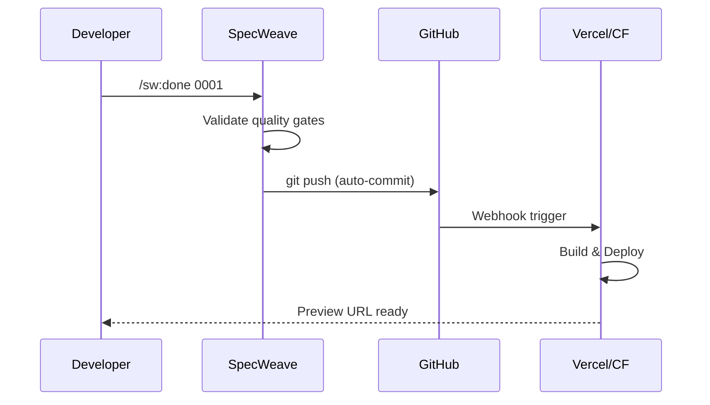
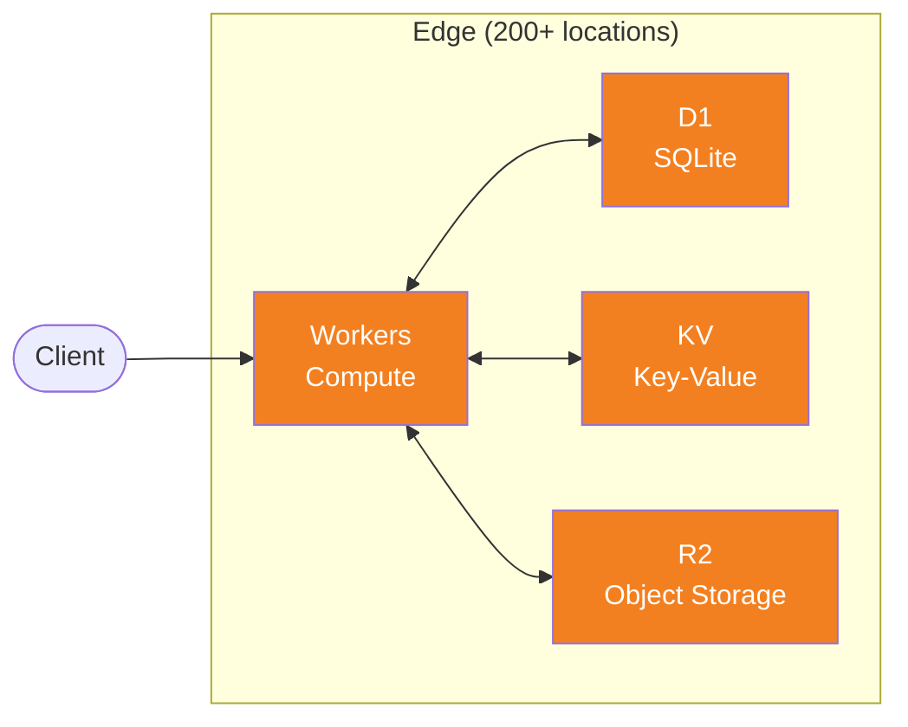
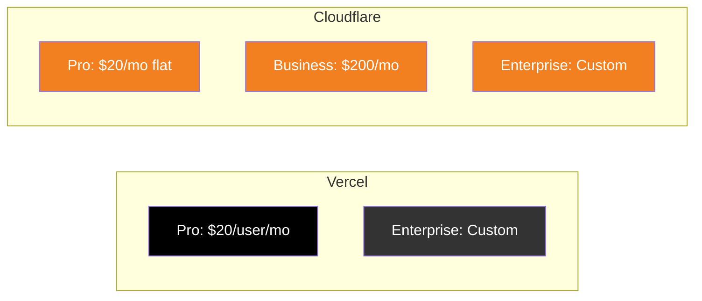
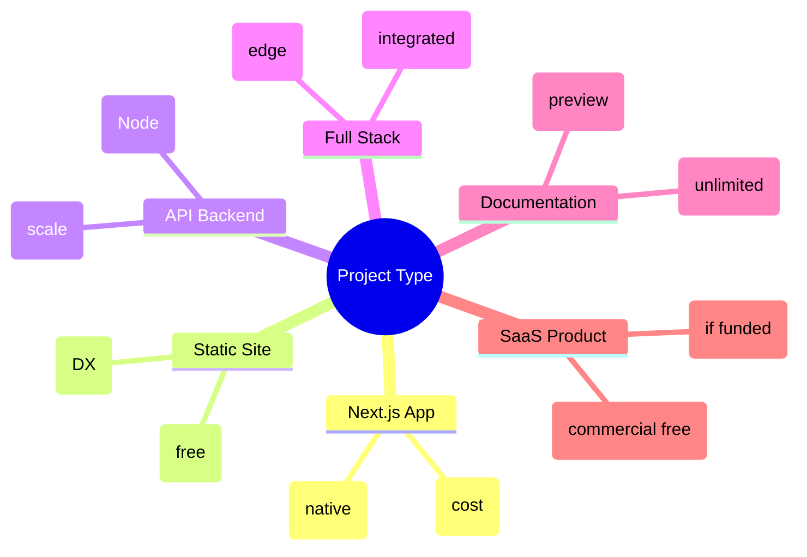

# Deployment Platforms: Vercel vs Cloudflare

**Choose the right hosting for your AI-built applications.**

When your increment is complete and ready to ship, you need a deployment target. This guide helps you choose between the two most popular platforms for modern web applications.

---

## Quick Decision



---

## Free Tier Comparison

| Feature | Vercel Free | Cloudflare Free |
|---------|-------------|-----------------|
| **Bandwidth** | 100 GB/month | **Unlimited** |
| **Builds** | 6,000 min/month | 500 builds/month |
| **Serverless Invocations** | 100K/month | **100K/day** (Workers) |
| **Edge Requests** | 1M/month | **Unlimited** (Pages) |
| **Team Members** | 1 (Hobby) | **Unlimited** |
| **Commercial Use** | No (Hobby) | **Yes** |
| **Custom Domains** | Yes | Yes |
| **SSL** | Automatic | Automatic |
| **Global CDN** | Yes | Yes (200+ PoPs) |

:::tip Winner by Category
- **Bandwidth-heavy apps**: Cloudflare (unlimited)
- **High-traffic APIs**: Cloudflare (100K/day vs 100K/month)
- **Build-heavy CI/CD**: Vercel (6000 min vs 500 builds)
- **Startup/Commercial**: Cloudflare (allows commercial use on free tier)
:::

---

## Platform Strengths

### Vercel

```
┌─────────────────────────────────────────────────────────────┐
│                    VERCEL STRENGTHS                          │
├─────────────────────────────────────────────────────────────┤
│                                                              │
│  ✓ Next.js native (they created it)                         │
│  ✓ Zero-config deployments                                  │
│  ✓ Preview deployments per PR                               │
│  ✓ Automatic HTTPS                                          │
│  ✓ Edge + Serverless functions                              │
│  ✓ Built-in analytics                                       │
│  ✓ Image optimization included                              │
│  ✓ Best-in-class DX                                         │
│                                                              │
│  BEST FOR:                                                   │
│  - Next.js applications                                      │
│  - Rapid prototyping                                         │
│  - Teams wanting zero-config                                 │
│  - Projects with moderate traffic                            │
│                                                              │
└─────────────────────────────────────────────────────────────┘
```

### Cloudflare

```
┌─────────────────────────────────────────────────────────────┐
│                  CLOUDFLARE STRENGTHS                        │
├─────────────────────────────────────────────────────────────┤
│                                                              │
│  ✓ Unlimited bandwidth on free tier                         │
│  ✓ 100K requests/DAY (not month!)                          │
│  ✓ Commercial use allowed on free                           │
│  ✓ Workers (edge compute everywhere)                        │
│  ✓ R2 (S3-compatible, no egress fees)                       │
│  ✓ D1 (SQLite at the edge)                                  │
│  ✓ KV (global key-value store)                              │
│  ✓ 200+ edge locations                                      │
│                                                              │
│  BEST FOR:                                                   │
│  - High-traffic applications                                 │
│  - API-heavy workloads                                       │
│  - Startups (commercial use on free)                         │
│  - Edge-first architecture                                   │
│  - Cost-conscious teams                                      │
│                                                              │
└─────────────────────────────────────────────────────────────┘
```

---

## SpecWeave Deployment Integration

### Auto-Deploy on Increment Completion

Both platforms integrate with SpecWeave's workflow:



### Configuration Examples

**Vercel (`vercel.json`)**:
```json
{
  "buildCommand": "npm run build",
  "outputDirectory": "dist",
  "framework": "nextjs",
  "regions": ["iad1", "sfo1"]
}
```

**Cloudflare (`wrangler.toml`)**:
```toml
name = "my-specweave-app"
main = "src/index.ts"
compatibility_date = "2024-01-01"

[site]
bucket = "./dist"

[[r2_buckets]]
binding = "ASSETS"
bucket_name = "my-assets"
```

---

## Cloudflare Serverless Ecosystem

Cloudflare offers a complete serverless stack that runs at the edge — no cold starts, global by default.



### Workers (Compute)

**What**: JavaScript/TypeScript functions that run at the edge
**Why**: Sub-millisecond cold starts, runs in 200+ locations

```typescript
// src/index.ts - A simple Worker
export default {
  async fetch(request: Request, env: Env): Promise<Response> {
    const url = new URL(request.url);

    if (url.pathname === '/api/users') {
      // Query D1 database
      const users = await env.DB.prepare('SELECT * FROM users').all();
      return Response.json(users.results);
    }

    return new Response('Hello from the edge!');
  }
};
```

### D1 (SQLite at the Edge)

**What**: Serverless SQLite database, globally distributed
**Why**: SQL without infrastructure, automatic replication

```typescript
// Query D1 from a Worker
const result = await env.DB.prepare(
  'INSERT INTO posts (title, content) VALUES (?, ?)'
)
  .bind('Hello World', 'My first post')
  .run();

// Read with automatic read replicas
const posts = await env.DB.prepare(
  'SELECT * FROM posts ORDER BY created_at DESC LIMIT 10'
).all();
```

**Free tier**: 5 GB storage, 5M rows read/day, 100K rows written/day

### KV (Key-Value Store)

**What**: Global, low-latency key-value storage
**Why**: Session data, feature flags, cached API responses

```typescript
// Store data (eventually consistent, ~60s global propagation)
await env.KV.put('user:123:session', JSON.stringify(sessionData), {
  expirationTtl: 86400 // 24 hours
});

// Read data (instant from nearest edge)
const session = await env.KV.get('user:123:session', 'json');
```

**Free tier**: 100K reads/day, 1K writes/day, 1 GB storage

### R2 (Object Storage)

**What**: S3-compatible storage with **zero egress fees**
**Why**: Store files, images, backups without bandwidth costs

```typescript
// Upload file to R2
await env.BUCKET.put('uploads/image.png', imageBuffer, {
  httpMetadata: { contentType: 'image/png' }
});

// Generate signed URL for downloads
const object = await env.BUCKET.get('uploads/image.png');
return new Response(object.body, {
  headers: { 'Content-Type': 'image/png' }
});
```

**Free tier**: 10 GB storage, 10M reads/month, 1M writes/month, **$0 egress**

### When to Use Each

| Service | Use Case | Example |
|---------|----------|---------|
| **Workers** | API endpoints, auth, routing | REST API, auth middleware |
| **D1** | Relational data, transactions | User profiles, orders |
| **KV** | Fast reads, config, sessions | Feature flags, JWT sessions |
| **R2** | Files, images, large objects | User uploads, static assets |

### Full Stack Example

```toml
# wrangler.toml - Complete serverless app
name = "my-saas-app"
main = "src/index.ts"

[[d1_databases]]
binding = "DB"
database_name = "my-app-db"
database_id = "xxx-xxx-xxx"

[[kv_namespaces]]
binding = "KV"
id = "xxx-xxx-xxx"

[[r2_buckets]]
binding = "BUCKET"
bucket_name = "my-uploads"
```

```typescript
// Full stack Worker with all services
export default {
  async fetch(request: Request, env: Env) {
    const url = new URL(request.url);

    // Auth check via KV (fast)
    const session = await env.KV.get(`session:${getToken(request)}`);
    if (!session) return new Response('Unauthorized', { status: 401 });

    // CRUD via D1 (relational)
    if (url.pathname.startsWith('/api/posts')) {
      const posts = await env.DB.prepare('SELECT * FROM posts').all();
      return Response.json(posts.results);
    }

    // File upload via R2 (storage)
    if (url.pathname === '/api/upload' && request.method === 'POST') {
      const file = await request.arrayBuffer();
      await env.BUCKET.put(`uploads/${Date.now()}`, file);
      return Response.json({ success: true });
    }

    return new Response('Not found', { status: 404 });
  }
};
```

:::tip Why This Matters for SpecWeave Projects
When your increment includes backend features, Cloudflare's stack lets you deploy a complete app — database, storage, API — with zero infrastructure management. All at the edge, all on free tier for small projects.
:::

---

## Decision Matrix

Use this matrix to make your decision:

| Scenario | Recommendation | Why |
|----------|----------------|-----|
| **Next.js app, solo developer** | Vercel | Native Next.js, best DX |
| **High-traffic marketing site** | Cloudflare Pages | Unlimited bandwidth |
| **API with 10K+ daily requests** | Cloudflare Workers | 100K/day vs 100K/month |
| **Startup, need commercial use** | Cloudflare | Free tier allows commercial |
| **Need preview per PR** | Either | Both support this |
| **Image-heavy app** | Vercel | Built-in optimization |
| **Global edge compute** | Cloudflare Workers | 200+ locations |
| **Database at edge** | Cloudflare D1 | SQLite everywhere |
| **Large file storage** | Cloudflare R2 | No egress fees |
| **Team > 1 person (free)** | Cloudflare | Unlimited team members |

---

## Cost Comparison (Paid Tiers)

When you outgrow free tiers:



| Tier | Vercel | Cloudflare |
|------|--------|------------|
| **Entry Paid** | $20/user/month | $20/month (flat) |
| **5-person team** | $100/month | $20/month |
| **10-person team** | $200/month | $20/month |
| **Bandwidth overage** | $40/100GB | Free (unlimited) |

:::warning Per-User vs Flat Pricing
Vercel charges per team member. Cloudflare charges per account. For teams > 2 people, Cloudflare becomes significantly cheaper.
:::

---

## Migration Paths

### From Vercel to Cloudflare

```bash
# 1. Install Wrangler
npm install -g wrangler

# 2. Login
wrangler login

# 3. Initialize
wrangler init

# 4. Deploy
wrangler deploy
```

### From Cloudflare to Vercel

```bash
# 1. Install Vercel CLI
npm install -g vercel

# 2. Login
vercel login

# 3. Deploy (auto-detects framework)
vercel
```

---

## SpecWeave Commands for Deployment

```bash
# Deploy to Vercel
/sw:done 0001  # Closes increment, triggers git push
vercel         # Deploy (or auto via GitHub integration)

# Deploy to Cloudflare
/sw:done 0001  # Closes increment, triggers git push
wrangler deploy # Deploy Workers
wrangler pages deploy dist # Deploy Pages

# Check deployment status
vercel ls      # List Vercel deployments
wrangler pages deployment list # List CF deployments
```

---

## Recommendations by Project Type



---

## TL;DR

| You should choose... | If you... |
|----------------------|-----------|
| **Vercel** | Want zero-config Next.js, best DX, and don't mind per-user pricing |
| **Cloudflare** | Need unlimited bandwidth, high API traffic, commercial use on free, or team > 1 |

**Both are excellent.** You can't go wrong. The difference is in edge cases:
- Vercel excels at **developer experience**
- Cloudflare excels at **scale and cost efficiency**

---

## Related Resources

- [SpecWeave Quickstart](/docs/guides/getting-started/quickstart) — Get started with your first increment
- [Quality Gates](/docs/academy/specweave-essentials/05-quality-gates) — Ensure code is ready before deployment
- [GitHub Integration](/docs/academy/specweave-essentials/14-github-integration) — Auto-deploy via GitHub webhooks
