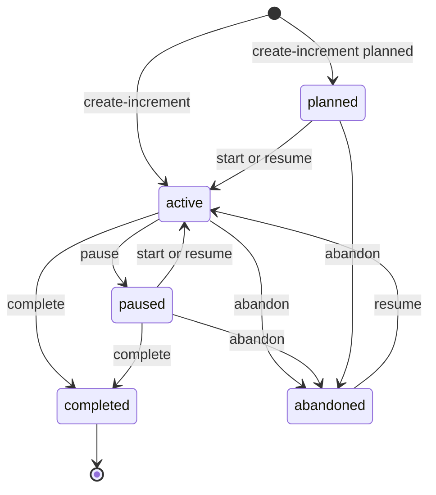

# Increment statuses

An increment's status lives in its `metadata.json`. You change it only with CLI commands (or the skills that call them), never by editing the file. Task progress is a separate thing: it lives in `ledger.jsonl`, and moving a task does not change the increment's status.

## The statuses

| Status | Meaning |
|---|---|
| `planned` | Specified, not started. Backlog work. |
| `active` | Being worked on. `task`, `verify` and `handoff` resolve to the active increment when you give no id. |
| `paused` | Stopped for now, for example waiting on someone else. |
| `completed` | Closed with `specweave complete`. |
| `abandoned` | Dropped, with a reason. Also used when another increment supersedes it. |

Increments from 1.x may still show `backlog` or `ready_for_review`. Both keep working: `start` and `resume` accept `backlog`, and `complete` closes a `ready_for_review` increment.



## The commands

```bash
specweave create-increment "Keep checkout resumable"              # new, active
specweave create-increment "Dark mode" --planned                   # new, planned (backlog)
specweave create-increment "Checkout recovery v2" --supersedes 0042   # new; 0042 is abandoned with a closeReason

specweave start 0043                    # planned, backlog or paused -> active
specweave pause 0042 --reason "waiting on API keys"
specweave resume 0042                   # paused, abandoned, planned or backlog -> active
specweave abandon 0042 --reason "requirements changed"
specweave complete 0042                 # -> completed (alias: done)
```

| Command | From | To | Notes |
|---|---|---|---|
| `create-increment` | | `active` | `--planned` creates it as `planned` |
| `create-increment --supersedes <id>` | | `active` | The old increment becomes `abandoned`, with the reason recorded |
| `start <id>` | `planned`, `backlog`, `paused` | `active` | |
| `pause <id>` | `active` | `paused` | `--reason`; `--force` updates the reason of an already paused increment |
| `resume <id>` | `paused`, `abandoned`, `planned`, `backlog` | `active` | |
| `abandon <id>` | anything but `completed` | `abandoned` | `--reason` |
| `complete <id>` | `active`, `paused`, `planned` | `completed` | Needs a passing `reports/verify.json` |

A completed increment cannot be resumed or abandoned. For follow-up work, open a new increment.

## Closing

`specweave complete` checks the closure gate first: the increment needs a passing `reports/verify.json` from `specweave verify`. If you decide to close without one, say why:

```bash
specweave verify 0042
specweave complete 0042
specweave complete 0042 --reason "flaky e2e suite, tracked in 0045"    # stored as metadata.closeReason
specweave complete --all --reason "end of sprint cleanup"             # every active increment whose tasks are all done or skipped
```

`complete` accepts several ids at once. `--yes` skips the confirmation, and `--skip-validation` bypasses the gate entirely; avoid it, because nothing records why.

## Status changes do not touch trackers

Starting, pausing, resuming or abandoning an increment never creates, updates or closes a GitHub issue or a Jira or Azure DevOps work item. Trackers change only when you run `specweave sync push`, and when `complete` closes an already linked issue because the close-on-complete setting is on (see [GitHub sync](/docs/guides/github-sync) and [Jira and Azure DevOps](/docs/guides/jira-ado-sync) for the close-on-complete setting).

## How many active increments

`limits.activeIncrements` in `.specweave/config.json` (default 3) is advisory. `specweave auto` and `specweave check-discipline` print a note when you are over it; nothing is blocked. Pausing an increment takes it out of the count.

## Useful checks

```bash
specweave status                 # overview of increments and their status (alias: progress)
specweave check-discipline       # status counts, the WIP note and metadata consistency
specweave doctor --fix-status    # repair a metadata.json and spec.md status mismatch
specweave archive --archive-completed --dry-run
```

## See also

- [What is an increment](/docs/guides/core-concepts/what-is-an-increment)
- [Metadata reference](/docs/reference/metadata-reference)
- [Autonomous execution](/docs/guides/autonomous-execution)
