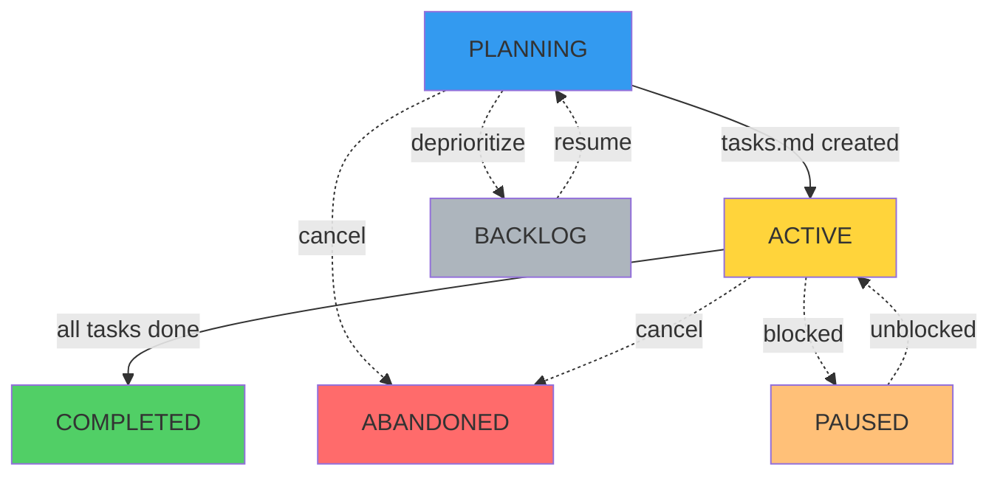
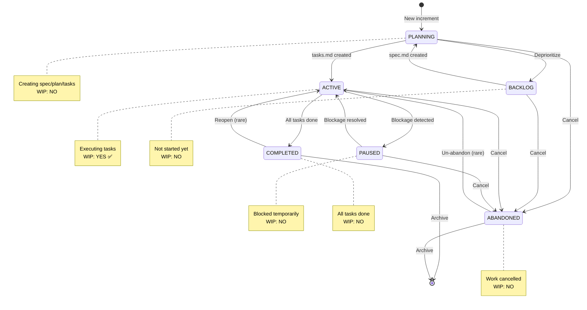

# Increment Status Reference

Complete guide to increment statuses, lifecycle, and auto-transitions in SpecWeave.

---

## Status Overview

SpecWeave tracks increment progress through **6 distinct statuses**:



**Legend**:
- **Solid arrows** → Normal progression
- **Dotted arrows** → State transitions

---

## Status Definitions

### PLANNING (Blue)

**Status**: `planning`
**Icon**: 📋
**WIP Count**: ❌ No

**Meaning**: Creating spec.md, plan.md, tasks.md

**When**:
- New increment just created
- PM agent generating specification
- Architect agent creating implementation plan
- Test planner generating tasks with embedded tests

**Auto-Transitions**:
- ✅ **PLANNING → ACTIVE**: When tasks.md created and first task starts
- ✅ **BACKLOG → PLANNING**: When spec.md created (resume planning)

**Example**:
```bash
/sw:increment "user authentication"
# Creates increment in PLANNING status
# PM generates spec.md
# Architect generates plan.md
# Test planner generates tasks.md
# Status: planning
```

---

### ACTIVE (Yellow)

**Status**: `active`
**Icon**: ⏳
**WIP Count**: ✅ Yes (counts toward limit)

**Meaning**: Currently executing tasks, writing code

**When**:
- Tasks.md exists and tasks are being completed
- Developer is actively working on implementation
- This is the PRIMARY work status

**Auto-Transitions**:
- ✅ **PLANNING → ACTIVE**: Automatically when tasks.md created
- ✅ **PAUSED → ACTIVE**: When blockage resolved
- ✅ **ACTIVE → COMPLETED**: When all tasks marked done

**Example**:
```bash
/sw:do
# Executes tasks in ACTIVE increment
# Marks tasks complete
# Status: active
```

**WIP Impact**:
```
Active increments: 1/1 (at limit)
Planning increments: 3 (doesn't count)
Total WIP: 1 ✅
```

---

### BACKLOG (Gray)

**Status**: `backlog`
**Icon**: 📦
**WIP Count**: ❌ No

**Meaning**: Planned but not started yet

**When**:
- Increment planned for future
- Not ready to start due to dependencies
- Waiting for priorities to shift

**Transitions**:
- ✅ **BACKLOG → PLANNING**: When spec.md created (resume planning)
- ✅ **PLANNING → BACKLOG**: When deprioritized
- ✅ **BACKLOG → ABANDONED**: When cancelled

**Example**:
```bash
/sw:status 0009 --reason="waiting for API design"
# Moves increment to backlog
# Doesn't count toward WIP
# Can resume later
```

---

### PAUSED (Orange)

**Status**: `paused`
**Icon**: ⏸️
**WIP Count**: ❌ No

**Meaning**: Temporarily blocked by external dependency

**When**:
- Waiting for external API keys or credentials
- Blocked by external approvals
- Dependency on other team's work
- Environmental issues

**Auto-Transitions**:
- ✅ **ACTIVE → PAUSED**: Automatically when blockage detected
- ✅ **PAUSED → ACTIVE**: Automatically when blockage resolved

**Example**:
```bash
# SpecWeave detects missing API key
# Automatically pauses increment
# Status: paused
# Reason: "Missing STRIPE_API_KEY environment variable"

# User adds API key
# SpecWeave detects resolution
# Automatically resumes
# Status: active
```

**Manual Pause**:
```bash
/sw:pause 0008 --reason="waiting for DevOps approval"
```

---

### COMPLETED (Green)

**Status**: `completed`
**Icon**: ✅
**WIP Count**: ❌ No

**Meaning**: All tasks done, increment shipped

**When**:
- All tasks marked complete
- All tests passing
- Living docs synced
- PM validation passed

**Transitions**:
- ✅ **ACTIVE → COMPLETED**: Via `/sw:done`
- ✅ **COMPLETED → ACTIVE**: Can reopen if issues found

**Example**:
```bash
/sw:done 0008
# Validates all gates
# Marks increment complete
# Syncs living docs
# Status: completed
```

---

### ABANDONED (Red)

**Status**: `abandoned`
**Icon**: ❌
**WIP Count**: ❌ No

**Meaning**: Work cancelled, not completing

**When**:
- Requirements changed
- Feature no longer needed
- Strategic pivot
- Long-term deprioritization

**Transitions**:
- ✅ **Any → ABANDONED**: Via `/sw:abandon`
- ✅ **ABANDONED → ACTIVE**: Can un-abandon if needed (rare)

**Example**:
```bash
/sw:abandon 0008 --reason="Pivot to enterprise, consumer features on hold"
# Marks increment abandoned
# Documents reason
# Status: abandoned
```

---

## Status Lifecycle Flow

### Normal Flow (Happy Path)

```
NEW INCREMENT
     ↓
[PLANNING] ← PM generates spec, architect creates plan
     ↓
spec.md created
     ↓
plan.md created
     ↓
tasks.md created
     ↓
AUTO-TRANSITION ✨
     ↓
[ACTIVE] ← Developer executes tasks
     ↓
All tasks complete
     ↓
/sw:done
     ↓
[COMPLETED] ← Shipped!
```

### Blocked Flow

```
[ACTIVE] ← Working on tasks
     ↓
Missing API key detected
     ↓
AUTO-TRANSITION ✨
     ↓
[PAUSED] ← Waiting for dependency
     ↓
API key added
     ↓
AUTO-TRANSITION ✨
     ↓
[ACTIVE] ← Resume work
```

### Deprioritized Flow

```
[PLANNING] ← Creating spec
     ↓
Business priorities change
     ↓
/sw:status
     ↓
[BACKLOG] ← Not started yet
     ↓
Priorities shift back
     ↓
spec.md created
     ↓
AUTO-TRANSITION ✨
     ↓
[PLANNING] ← Resume planning
```

---

## Auto-Transition Rules

SpecWeave **automatically transitions** statuses based on file activity and blockers:

### Rule 1: PLANNING → ACTIVE

**Trigger**: tasks.md created

```bash
# Increment in PLANNING
# tasks.md gets created
# Status automatically becomes ACTIVE
```

### Rule 2: BACKLOG → PLANNING

**Trigger**: spec.md created

```bash
# Increment in BACKLOG
# spec.md gets created (resume planning)
# Status automatically becomes PLANNING
```

### Rule 3: Any → ACTIVE (Override)

**Trigger**: Task marked in-progress

```bash
# Increment in any status
# User marks task with [⏳] or [🔄]
# Status automatically becomes ACTIVE
```

### Rule 4: ACTIVE → PAUSED

**Trigger**: Blockage detected

```bash
# Missing environment variables
# External API unavailable
# Build failures
# Status automatically becomes PAUSED
```

### Rule 5: PAUSED → ACTIVE

**Trigger**: Blockage resolved

```bash
# Environment variables added
# External API available
# Build fixed
# Status automatically becomes ACTIVE
```

---

## WIP Limit Rules

**CRITICAL**: Only `active` status counts toward WIP limits!

| Status | Counts? | Reason |
|--------|---------|--------|
| planning | ❌ No | Planning ≠ active work |
| **active** | ✅ **YES** | Actively executing |
| backlog | ❌ No | Not started |
| paused | ❌ No | Blocked, not active |
| completed | ❌ No | Already done |
| abandoned | ❌ No | Cancelled |

**Example**:
```
Increments:
- 0007-docs (planning) → WIP: 0
- 0008-auth (active) → WIP: 1
- 0009-payments (active) → WIP: 1
- 0010-search (backlog) → WIP: 0
- 0011-analytics (paused) → WIP: 0

Total WIP: 2/2 (hard cap reached) ⚠️
```

---

## Command Reference

### View Status

```bash
/sw:status
# Shows all increments with statuses
```

### Manual Transitions

```bash
# Pause (usually automatic)
/sw:pause 0008 --reason="waiting for approval"

# Resume (usually automatic)
/sw:resume 0008

# Move to backlog
/sw:status 0008 --reason="low priority"

# Abandon
/sw:abandon 0008 --reason="requirements changed"

# Complete
/sw:done 0008
```

---

## Best Practices

### 1. Trust Auto-Transitions

✅ **DO**: Let SpecWeave manage status automatically
```bash
# SpecWeave detects blockage → auto-pauses
# SpecWeave detects resolution → auto-resumes
```

❌ **DON'T**: Manually change status unless business decision
```bash
# Don't manually pause for technical blocks
# SpecWeave handles this automatically
```

### 2. Understand WIP Counts

✅ **DO**: Remember only ACTIVE counts toward WIP
```bash
# Planning 3 increments = OK (WIP: 0)
# Active 2 increments = At hard cap (WIP: 2)
```

❌ **DON'T**: Confuse PLANNING with ACTIVE
```bash
# PLANNING doesn't block new work
# ACTIVE does block new work (WIP limit)
```

### 3. Complete Before Starting New

✅ **DO**: Finish current work first
```bash
/sw:do  # Complete current
/sw:done 0008  # Close increment
/sw:increment "new feature"  # Start next
```

❌ **DON'T**: Start new while others active
```bash
# 0008 active (80% complete)
/sw:increment "new feature"  # BAD! Complete 0008 first
```

---

## Common Questions

### Q: Why doesn't PLANNING count toward WIP?

**A**: Planning (creating spec/plan/tasks) is preparation, not execution. It doesn't consume active work capacity. You can plan multiple increments while actively working on one.

### Q: When does status auto-transition?

**A**: Automatically when:
- tasks.md created (PLANNING → ACTIVE)
- Task marked in-progress (Any → ACTIVE)
- Blockage detected (ACTIVE → PAUSED)
- Blockage resolved (PAUSED → ACTIVE)

### Q: Can I manually change status?

**A**: Only for business decisions (backlog, abandon). Technical status (planning, active, paused) is managed automatically.

### Q: What's the difference between PAUSED and BACKLOG?

**A**:
- **PAUSED**: Was active, now blocked (technical block)
- **BACKLOG**: Never started, waiting for priority (business decision)

---

## Status Flow Diagram (Complete)



---

## Related Documentation

- [Increments](/docs/glossary/terms/increments) - Complete increment guide
- WIP Limits - Work in progress limits
- [Status Command](/docs/commands/status) - Status monitoring
- [Workflow Guide](/docs/guides/workflow) - Development workflow

---

## Summary

**6 Statuses**:
1. **PLANNING** - Creating spec/plan/tasks (WIP: No)
2. **ACTIVE** - Executing tasks (WIP: **Yes**)
3. **BACKLOG** - Not started (WIP: No)
4. **PAUSED** - Blocked (WIP: No)
5. **COMPLETED** - Done (WIP: No)
6. **ABANDONED** - Cancelled (WIP: No)

**Auto-Transitions**:
- PLANNING → ACTIVE (when tasks.md created)
- BACKLOG → PLANNING (when spec.md created)
- ACTIVE ↔ PAUSED (blockage detection/resolution)

**WIP Rule**: **ONLY `active` counts toward WIP limits!**

**Philosophy**: Status follows work, not the other way around. SpecWeave manages status automatically based on actual progress.
