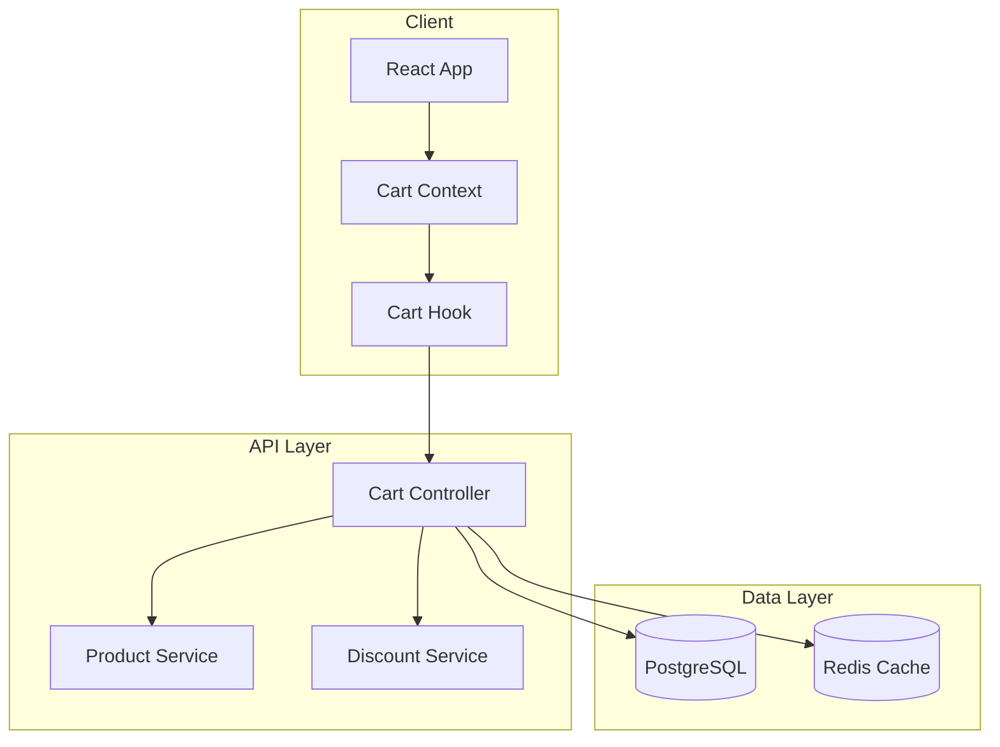
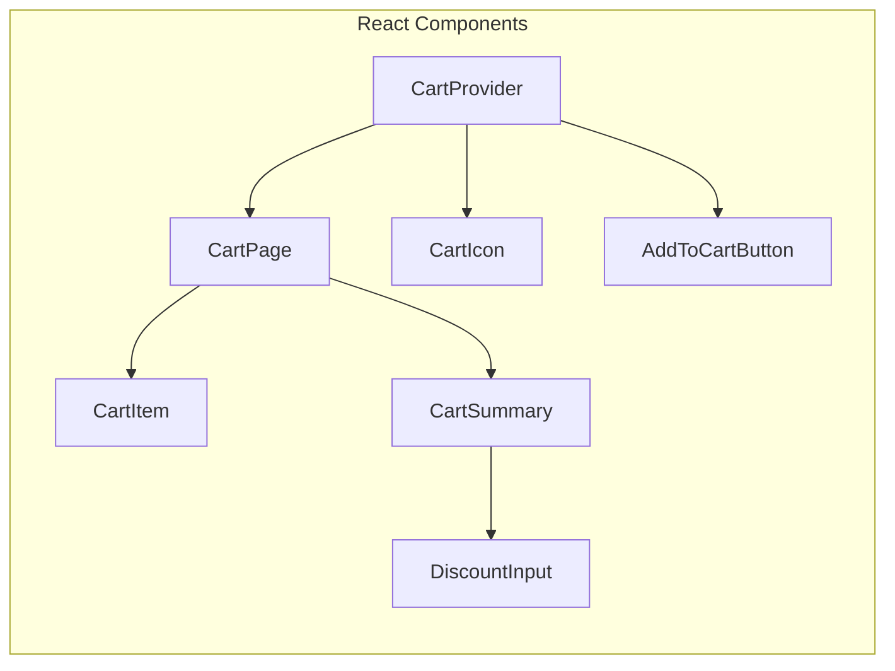

# Lesson 2: The Three-File Structure Deep Dive

**Duration**: 45 minutes
**Prerequisites**: Lesson 1 (Getting Started)
**Outcome**: Master the three-file structure with real-world examples

---

## Why Three Files?

### The Separation of Concerns

```
┌─────────────────────────────────────────────────────────────────────┐
│                     THREE-FILE PHILOSOPHY                           │
├─────────────────────────────────────────────────────────────────────┤
│                                                                     │
│  spec.md (WHAT)         plan.md (HOW)         tasks.md (DO)        │
│  ─────────────          ───────────           ────────────          │
│                                                                     │
│  Owner: PM              Owner: Architect      Owner: Developer      │
│                                                                     │
│  Audience:              Audience:             Audience:             │
│  • Stakeholders         • Developers          • Developers          │
│  • QA                   • Tech Leads          • QA                  │
│  • Everyone                                                         │
│                                                                     │
│  Language:              Language:             Language:             │
│  Business               Technical             Technical + Tests     │
│                                                                     │
│  Questions:             Questions:            Questions:            │
│  "What are we          "How will we          "What steps to        │
│   building?"            build it?"            implement?"           │
│                                                                     │
└─────────────────────────────────────────────────────────────────────┘
```

### Single Source of Truth

Each concept lives in **exactly one place**:

| Concept | Lives In | Never In |
|---------|----------|----------|
| User Stories | spec.md | plan.md, tasks.md |
| Acceptance Criteria | spec.md | plan.md, tasks.md |
| Architecture | plan.md | spec.md, tasks.md |
| Technical Decisions | plan.md | spec.md, tasks.md |
| Implementation Steps | tasks.md | spec.md, plan.md |
| Test Plans | tasks.md | spec.md, plan.md |

---

## File 1: spec.md — The Business Contract

### Purpose

spec.md answers: **"What are we building and why?"**

- Written in **business language** (stakeholder-readable)
- Defines **success criteria** (testable conditions)
- Contains **no technical implementation details**

### Complete Example: E-Commerce Cart Feature

```markdown
---
increment: 0042-shopping-cart
feature_id: FS-012
status: in-progress
created: 2025-11-25
---

# Shopping Cart Feature

## Summary

Enable customers to add products to a shopping cart, modify quantities,
apply discount codes, and proceed to checkout. The cart should persist
across sessions and synchronize across devices for logged-in users.

## Business Context

**Problem**: Users currently cannot save items for later purchase,
resulting in 45% cart abandonment rate.

**Goal**: Reduce cart abandonment to under 20% by providing a
persistent, user-friendly cart experience.

**Success Metric**: Cart-to-purchase conversion rate > 80%

---

## User Stories

### US-001: Add Product to Cart

**As a** customer browsing products,
**I want** to add items to my shopping cart,
**So that** I can purchase multiple items in one transaction.

#### Acceptance Criteria

- **AC-US1-01**: Clicking "Add to Cart" adds the product with quantity 1
- **AC-US1-02**: If product already in cart, quantity increases by 1
- **AC-US1-03**: Cart icon shows total item count (badge)
- **AC-US1-04**: Toast notification confirms addition ("Added to cart")
- **AC-US1-05**: Out-of-stock products show "Notify Me" instead

---

### US-002: Modify Cart Quantities

**As a** customer reviewing my cart,
**I want** to change product quantities or remove items,
**So that** I can adjust my order before checkout.

#### Acceptance Criteria

- **AC-US2-01**: Quantity selector allows values 1-99
- **AC-US2-02**: "Remove" button removes item with confirmation
- **AC-US2-03**: Quantity 0 triggers remove confirmation
- **AC-US2-04**: Subtotal updates within 200ms of quantity change
- **AC-US2-05**: Empty cart shows "Your cart is empty" with CTA

---

### US-003: Apply Discount Code

**As a** customer with a promo code,
**I want** to apply it to my cart,
**So that** I can receive my discount.

#### Acceptance Criteria

- **AC-US3-01**: "Apply Code" field visible in cart summary
- **AC-US3-02**: Valid code shows discount amount and new total
- **AC-US3-03**: Invalid code shows specific error message
- **AC-US3-04**: Only one code can be active at a time
- **AC-US3-05**: Code persists in cart until removed or expired

---

### US-004: Cart Persistence

**As a** returning customer,
**I want** my cart to remember my items,
**So that** I don't lose my selections between visits.

#### Acceptance Criteria

- **AC-US4-01**: Guest cart persists for 7 days (localStorage)
- **AC-US4-02**: Logged-in cart syncs across devices (server-side)
- **AC-US4-03**: Guest cart merges with user cart on login
- **AC-US4-04**: Merge conflicts resolved by keeping higher quantity

---

## Functional Requirements

- **FR-001**: Cart must support up to 50 unique products
- **FR-002**: Cart must calculate taxes based on shipping address
- **FR-003**: Cart must validate product availability before checkout
- **FR-004**: Cart must support multiple currencies (display only)

## Non-Functional Requirements

- **NFR-001**: Add-to-cart response time < 300ms (p95)
- **NFR-002**: Cart page load time < 1 second (p95)
- **NFR-003**: Cart data must sync within 5 seconds across devices
- **NFR-004**: Cart must handle 10,000 concurrent users

## Constraints

- Must integrate with existing product catalog API
- Must use existing user authentication system
- Discount codes must validate against promotions service

## Out of Scope

- Wishlist functionality (separate increment)
- Gift wrapping options (Phase 2)
- Cart sharing with other users
```

### spec.md Rules

**MUST contain**:
- Summary with business value
- User stories with acceptance criteria
- Functional and non-functional requirements

**MUST NOT contain**:
- Class names, function names, file paths
- Technical implementation details
- Code snippets or type definitions
- Task breakdowns (those are in tasks.md)

---

## File 2: plan.md — The Technical Blueprint

### Purpose

plan.md answers: **"How will we build this?"**

- Written in **technical language** (developer-readable)
- Documents **architecture decisions**
- Contains **component designs** and **data models**

### Complete Example: Shopping Cart Architecture

```markdown
# Implementation Plan: Shopping Cart

## Architecture Overview

### System Context



### Component Architecture



---

## Components

### Component: CartContext (Frontend)

**Purpose**: Global cart state management
**Pattern**: React Context + useReducer
**File**: `src/contexts/CartContext.tsx`

**Responsibilities**:
- Store cart items in memory
- Sync with localStorage (guest) or API (authenticated)
- Provide cart actions (add, remove, update quantity)
- Calculate totals, taxes, discounts

**State Shape**:
```typescript
interface CartState {
  items: CartItem[];
  discountCode: string | null;
  discountAmount: number;
  subtotal: number;
  tax: number;
  total: number;
  isLoading: boolean;
  error: string | null;
}

interface CartItem {
  productId: string;
  name: string;
  price: number;
  quantity: number;
  imageUrl: string;
  maxQuantity: number;
}
```

**Actions**:
```typescript
type CartAction =
  | { type: 'ADD_ITEM'; payload: CartItem }
  | { type: 'REMOVE_ITEM'; payload: string }
  | { type: 'UPDATE_QUANTITY'; payload: { productId: string; quantity: number } }
  | { type: 'APPLY_DISCOUNT'; payload: { code: string; amount: number } }
  | { type: 'CLEAR_CART' }
  | { type: 'SYNC_CART'; payload: CartState }
  | { type: 'SET_ERROR'; payload: string };
```

---

### Component: CartService (Backend)

**Purpose**: Business logic for cart operations
**Pattern**: Service Layer
**File**: `src/services/CartService.ts`

**Responsibilities**:
- CRUD operations for cart
- Discount validation and application
- Tax calculation
- Inventory validation
- Cart persistence (database)

**Dependencies**:
- `ProductRepository` - fetch product details
- `DiscountRepository` - validate promo codes
- `TaxService` - calculate taxes
- `InventoryService` - check stock levels

**API Contract**:
```typescript
class CartService {
  async getCart(userId: string): Promise<Cart>;
  async addItem(userId: string, productId: string, quantity: number): Promise<Cart>;
  async updateQuantity(userId: string, productId: string, quantity: number): Promise<Cart>;
  async removeItem(userId: string, productId: string): Promise<Cart>;
  async applyDiscount(userId: string, code: string): Promise<DiscountResult>;
  async clearCart(userId: string): Promise<void>;
  async mergeGuestCart(userId: string, guestItems: CartItem[]): Promise<Cart>;
}
```

---

### Component: CartController (API)

**Purpose**: REST API endpoints for cart
**Pattern**: Controller
**File**: `src/controllers/CartController.ts`

**Endpoints**:

| Method | Path | Description |
|--------|------|-------------|
| GET | `/api/cart` | Get current user's cart |
| POST | `/api/cart/items` | Add item to cart |
| PATCH | `/api/cart/items/:productId` | Update item quantity |
| DELETE | `/api/cart/items/:productId` | Remove item |
| POST | `/api/cart/discount` | Apply discount code |
| DELETE | `/api/cart/discount` | Remove discount code |
| DELETE | `/api/cart` | Clear entire cart |

---

## Data Models

### Database Schema

```sql
-- Cart table
CREATE TABLE carts (
  id UUID PRIMARY KEY DEFAULT gen_random_uuid(),
  user_id UUID REFERENCES users(id),
  session_id VARCHAR(255),  -- For guest carts
  discount_code VARCHAR(50),
  created_at TIMESTAMP DEFAULT NOW(),
  updated_at TIMESTAMP DEFAULT NOW(),
  CONSTRAINT user_or_session CHECK (
    (user_id IS NOT NULL) OR (session_id IS NOT NULL)
  )
);

-- Cart items table
CREATE TABLE cart_items (
  id UUID PRIMARY KEY DEFAULT gen_random_uuid(),
  cart_id UUID REFERENCES carts(id) ON DELETE CASCADE,
  product_id UUID REFERENCES products(id),
  quantity INT NOT NULL CHECK (quantity > 0 AND quantity <= 99),
  added_at TIMESTAMP DEFAULT NOW(),
  UNIQUE(cart_id, product_id)
);

-- Indexes for performance
CREATE INDEX idx_carts_user_id ON carts(user_id);
CREATE INDEX idx_carts_session_id ON carts(session_id);
CREATE INDEX idx_cart_items_cart_id ON cart_items(cart_id);
```

### TypeScript Interfaces

```typescript
// src/types/cart.ts

interface Cart {
  id: string;
  userId?: string;
  sessionId?: string;
  items: CartItem[];
  discountCode?: string;
  discountAmount: number;
  subtotal: number;
  tax: number;
  total: number;
  createdAt: Date;
  updatedAt: Date;
}

interface CartItem {
  id: string;
  productId: string;
  product: Product;  // Populated from product service
  quantity: number;
  addedAt: Date;
}

interface DiscountResult {
  valid: boolean;
  code: string;
  discountType: 'percentage' | 'fixed';
  discountValue: number;
  discountAmount: number;  // Calculated amount
  errorMessage?: string;
}
```

---

## Technical Decisions

### TD-001: State Management Approach

**Decision**: React Context + useReducer (not Redux)
**Rationale**:
- Cart state is relatively simple
- No need for Redux DevTools complexity
- Context sufficient for component tree
- Easier testing without Redux boilerplate

**Trade-offs**:
- Less powerful debugging than Redux DevTools
- May need migration if state grows complex

### TD-002: Guest Cart Storage

**Decision**: localStorage with 7-day expiry
**Rationale**:
- No server dependency for guest users
- Instant page loads
- Privacy-friendly (data stays on device)

**Trade-offs**:
- Won't sync across devices for guests
- Lost if user clears browser data

### TD-003: Cart Merge Strategy

**Decision**: Keep higher quantity on merge conflicts
**Rationale**:
- User intent is usually to buy more, not less
- Prevents accidental item loss
- Simple mental model

**Alternatives Considered**:
- Sum quantities (risk of exceeding stock)
- Show merge dialog (poor UX)
- Keep most recent (data loss risk)

---

## Integration Points

### External Services

| Service | Purpose | Endpoint |
|---------|---------|----------|
| Product Catalog | Fetch product details | `GET /api/products/:id` |
| Inventory | Check stock levels | `GET /api/inventory/:productId` |
| Promotions | Validate discount codes | `POST /api/promotions/validate` |
| Tax Service | Calculate taxes | `POST /api/tax/calculate` |

### Events (Pub/Sub)

| Event | Publisher | Subscribers |
|-------|-----------|-------------|
| `cart.item.added` | CartService | Analytics, Recommendations |
| `cart.item.removed` | CartService | Analytics |
| `cart.abandoned` | CartService (cron) | Email Service |
| `cart.checked_out` | CheckoutService | Inventory, Analytics |

---

## Implementation Phases

### Phase 1: Core Cart (8 hours)
- CartContext and reducer
- Add/remove/update operations
- localStorage persistence
- Basic UI components

### Phase 2: Backend Integration (6 hours)
- CartService implementation
- Database schema and migrations
- API endpoints
- Authentication integration

### Phase 3: Discount System (4 hours)
- Discount code validation
- Discount application logic
- UI for code entry
- Error handling

### Phase 4: Polish & Edge Cases (4 hours)
- Cart merge on login
- Out-of-stock handling
- Loading and error states
- Performance optimization

**Total Estimated**: 22 hours
```

### plan.md Rules

**MUST contain**:
- Architecture diagrams (Mermaid)
- Component specifications
- Data models and interfaces
- Technical decisions with rationale
- Integration points

**MUST NOT contain**:
- Acceptance criteria (those are in spec.md)
- User stories
- Task checklists with checkboxes
- "As a user" language

---

## File 3: tasks.md — The Execution Plan

### Purpose

tasks.md answers: **"What specific steps do we take?"**

- Contains **checkable implementation steps**
- Embeds **test plans** (BDD format)
- Links to **acceptance criteria** via AC-IDs

### Complete Example: Shopping Cart Tasks

```markdown
# Tasks: Shopping Cart Feature

## Progress Summary

| Metric | Value |
|--------|-------|
| Total Tasks | 12 |
| Completed | 5 |
| In Progress | 1 |
| Remaining | 6 |
| Progress | 42% |

---

## Phase 1: Core Cart

### T-001: Implement CartContext and Reducer (P1)

**Effort**: 3h | **AC-IDs**: AC-US1-01, AC-US1-02, AC-US2-01

**Implementation**:
- [x] Create `src/contexts/CartContext.tsx`
- [x] Define CartState interface
- [x] Implement cartReducer with all actions
- [x] Create CartProvider component
- [x] Export useCart hook
- [x] Add JSDoc documentation

**Test Plan** (BDD):
- **Given** an empty cart
- **When** ADD_ITEM action dispatched with product
- **Then** cart contains product with quantity 1

- **Given** cart with product (qty: 2)
- **When** ADD_ITEM action dispatched for same product
- **Then** quantity increases to 3

**Test Cases**:
- Unit (`CartContext.test.tsx`):
  - `reducer_addItem_toEmptyCart_addsWithQuantity1`
  - `reducer_addItem_existingProduct_incrementsQuantity`
  - `reducer_removeItem_existingProduct_removesFromCart`
  - `reducer_updateQuantity_validQuantity_updatesQuantity`
  - `reducer_updateQuantity_zero_removesItem`
  - `reducer_clearCart_nonEmptyCart_emptiesCart`
  - Coverage: 98%

**Files Changed**:
- `src/contexts/CartContext.tsx` (new) ✅
- `src/contexts/index.ts` (update) ✅
- `src/hooks/useCart.ts` (new) ✅
- `tests/unit/contexts/CartContext.test.tsx` (new) ✅

**Status**: [x] completed

---

### T-002: Implement localStorage Persistence (P1)

**Effort**: 2h | **AC-IDs**: AC-US4-01

**Implementation**:
- [x] Create `src/utils/cartStorage.ts`
- [x] Implement `saveCart(cart)` function
- [x] Implement `loadCart()` function
- [x] Add 7-day expiry logic
- [x] Integrate with CartContext
- [x] Handle storage errors gracefully

**Test Plan** (BDD):
- **Given** cart with items saved to localStorage
- **When** page is refreshed
- **Then** cart loads with saved items

- **Given** cart saved 8 days ago
- **When** loadCart() is called
- **Then** returns empty cart (expired)

**Test Cases**:
- Unit (`cartStorage.test.ts`):
  - `saveCart_validCart_persistsToLocalStorage`
  - `loadCart_existingCart_returnsCart`
  - `loadCart_expiredCart_returnsEmpty`
  - `loadCart_corruptData_returnsEmpty`
  - `saveCart_storageFullError_handlesGracefully`
  - Coverage: 95%

**Files Changed**:
- `src/utils/cartStorage.ts` (new) ✅
- `src/contexts/CartContext.tsx` (update) ✅
- `tests/unit/utils/cartStorage.test.ts` (new) ✅

**Status**: [x] completed

---

### T-003: Create AddToCartButton Component (P1)

**Effort**: 2h | **AC-IDs**: AC-US1-01, AC-US1-04, AC-US1-05

**Implementation**:
- [x] Create `src/components/cart/AddToCartButton.tsx`
- [x] Implement click handler with useCart hook
- [x] Add loading state during add operation
- [x] Show toast notification on success
- [x] Handle out-of-stock state ("Notify Me")
- [x] Add aria labels for accessibility

**Test Plan** (BDD):
- **Given** in-stock product displayed
- **When** user clicks "Add to Cart"
- **Then** toast shows "Added to cart"

- **Given** out-of-stock product
- **When** component renders
- **Then** button shows "Notify Me" (disabled)

**Test Cases**:
- Unit (`AddToCartButton.test.tsx`):
  - `render_inStockProduct_showsAddToCart`
  - `render_outOfStock_showsNotifyMe`
  - `click_inStock_addsToCartAndShowsToast`
  - `click_loading_disablesButton`
  - Coverage: 92%

- Integration (`AddToCart.integration.test.tsx`):
  - `addToCart_updatesCartIconBadge`
  - Coverage: 85%

**Files Changed**:
- `src/components/cart/AddToCartButton.tsx` (new) ✅
- `src/components/cart/index.ts` (update) ✅
- `tests/unit/components/cart/AddToCartButton.test.tsx` (new) ✅
- `tests/integration/AddToCart.integration.test.tsx` (new) ✅

**Status**: [x] completed

---

### T-004: Create CartPage Component (P1)

**Effort**: 4h | **AC-IDs**: AC-US2-01, AC-US2-02, AC-US2-03, AC-US2-04, AC-US2-05

**Implementation**:
- [ ] Create `src/pages/CartPage.tsx`
- [ ] Implement CartItem subcomponent
- [ ] Add quantity selector (1-99)
- [ ] Implement remove button with confirmation
- [ ] Show empty state with CTA
- [ ] Add loading skeleton
- [ ] Implement real-time subtotal updates

**Test Plan** (BDD):
- **Given** cart with 3 items
- **When** CartPage renders
- **Then** displays all 3 items with quantities

- **Given** cart item with qty 2
- **When** user increases to 3
- **Then** subtotal updates within 200ms

- **Given** cart with items
- **When** user removes last item
- **Then** empty state displays

**Test Cases**:
- Unit (`CartPage.test.tsx`):
  - `render_cartWithItems_displaysAllItems`
  - `render_emptyCart_showsEmptyState`
  - `quantityChange_validValue_updatesSubtotal`
  - `quantityChange_invalidValue_showsError`
  - `removeItem_withConfirmation_removesItem`
  - Coverage: >90%

- E2E (`cart-page.e2e.test.ts`):
  - `fullCartWorkflow_addUpdateRemove_success`
  - Coverage: >80%

**Files Changed**:
- `src/pages/CartPage.tsx` (new)
- `src/components/cart/CartItem.tsx` (new)
- `src/components/cart/CartSummary.tsx` (new)
- `tests/unit/pages/CartPage.test.tsx` (new)
- `tests/e2e/cart-page.e2e.test.ts` (new)

**Status**: [ ] in_progress

---

### T-005: Implement CartIcon with Badge (P2)

**Effort**: 1.5h | **AC-IDs**: AC-US1-03

**Implementation**:
- [ ] Create `src/components/cart/CartIcon.tsx`
- [ ] Add badge showing item count
- [ ] Implement badge animation on change
- [ ] Handle count > 99 display ("99+")
- [ ] Add click navigation to cart page

**Test Plan** (BDD):
- **Given** cart with 5 items
- **When** CartIcon renders
- **Then** badge shows "5"

- **Given** cart with 100+ items
- **When** CartIcon renders
- **Then** badge shows "99+"

**Test Cases**:
- Unit (`CartIcon.test.tsx`):
  - `render_cartWithItems_showsBadgeWithCount`
  - `render_emptyCart_noBadge`
  - `render_over99Items_shows99Plus`
  - `itemAdded_badgeAnimates`
  - Coverage: >95%

**Files Changed**:
- `src/components/cart/CartIcon.tsx` (new)
- `src/components/layout/Header.tsx` (update)
- `tests/unit/components/cart/CartIcon.test.tsx` (new)

**Status**: [ ] pending

---

## Phase 2: Backend Integration

### T-006: Create CartService Backend (P1)

**Effort**: 4h | **AC-IDs**: AC-US4-02, AC-US4-03, AC-US4-04

**Implementation**:
- [ ] Create `src/services/CartService.ts`
- [ ] Implement getCart(userId)
- [ ] Implement addItem(userId, productId, quantity)
- [ ] Implement updateQuantity(userId, productId, quantity)
- [ ] Implement removeItem(userId, productId)
- [ ] Implement mergeGuestCart(userId, guestItems)
- [ ] Add inventory validation

**Test Plan** (BDD):
- **Given** user has cart with 2 items
- **When** getCart(userId) called
- **Then** returns cart with both items and calculated totals

- **Given** guest cart with item A (qty: 2)
- **And** user cart with item A (qty: 3)
- **When** mergeGuestCart() called
- **Then** result has item A with qty: 3 (higher wins)

**Test Cases**:
- Unit (`CartService.test.ts`):
  - `getCart_existingUser_returnsCart`
  - `getCart_newUser_createsEmptyCart`
  - `addItem_newProduct_addsToCart`
  - `addItem_existingProduct_incrementsQuantity`
  - `addItem_outOfStock_throwsError`
  - `updateQuantity_valid_updates`
  - `updateQuantity_exceedsStock_throwsError`
  - `mergeGuestCart_conflict_keepsHigherQuantity`
  - Coverage: >95%

**Files Changed**:
- `src/services/CartService.ts` (new)
- `src/services/index.ts` (update)
- `tests/unit/services/CartService.test.ts` (new)

**Status**: [ ] pending

---

### T-007: Create Cart API Endpoints (P1)

**Effort**: 3h | **AC-IDs**: AC-US1-01, AC-US2-01, AC-US2-02

**Implementation**:
- [ ] Create `src/controllers/CartController.ts`
- [ ] Implement GET /api/cart
- [ ] Implement POST /api/cart/items
- [ ] Implement PATCH /api/cart/items/:productId
- [ ] Implement DELETE /api/cart/items/:productId
- [ ] Add authentication middleware
- [ ] Add input validation (Zod)
- [ ] Add error handling

**Test Plan** (BDD):
- **Given** authenticated user
- **When** GET /api/cart called
- **Then** returns 200 with cart data

- **Given** unauthenticated request
- **When** GET /api/cart called
- **Then** returns 401 Unauthorized

**Test Cases**:
- Integration (`CartController.integration.test.ts`):
  - `getCart_authenticated_returns200WithCart`
  - `getCart_unauthenticated_returns401`
  - `addItem_validProduct_returns201`
  - `addItem_invalidProduct_returns404`
  - `updateQuantity_valid_returns200`
  - `deleteItem_existing_returns204`
  - Coverage: >90%

**Files Changed**:
- `src/controllers/CartController.ts` (new)
- `src/routes/cart.ts` (new)
- `src/routes/index.ts` (update)
- `tests/integration/CartController.integration.test.ts` (new)

**Status**: [ ] pending

---

## Phase 3: Discount System

### T-008: Implement Discount Validation (P2)

**Effort**: 2.5h | **AC-IDs**: AC-US3-01, AC-US3-02, AC-US3-03, AC-US3-04

**Implementation**:
- [ ] Create `src/services/DiscountService.ts`
- [ ] Implement validateCode(code, cartTotal)
- [ ] Handle percentage vs fixed discounts
- [ ] Check code expiry
- [ ] Check minimum purchase requirement
- [ ] Return specific error messages

**Test Plan** (BDD):
- **Given** valid 20% discount code
- **When** validateCode() called with $100 cart
- **Then** returns { valid: true, discountAmount: 20 }

- **Given** expired discount code
- **When** validateCode() called
- **Then** returns { valid: false, errorMessage: "Code expired" }

**Test Cases**:
- Unit (`DiscountService.test.ts`):
  - `validateCode_validPercentage_calculatesDiscount`
  - `validateCode_validFixed_appliesFixed`
  - `validateCode_expired_returnsError`
  - `validateCode_belowMinimum_returnsError`
  - `validateCode_unknown_returnsError`
  - Coverage: >95%

**Files Changed**:
- `src/services/DiscountService.ts` (new)
- `tests/unit/services/DiscountService.test.ts` (new)

**Status**: [ ] pending

---

### T-009: Create DiscountInput Component (P2)

**Effort**: 1.5h | **AC-IDs**: AC-US3-01, AC-US3-02, AC-US3-03, AC-US3-05

**Implementation**:
- [ ] Create `src/components/cart/DiscountInput.tsx`
- [ ] Add text input with "Apply" button
- [ ] Show success state with discount amount
- [ ] Show error state with specific message
- [ ] Add "Remove" button for active code

**Test Plan** (BDD):
- **Given** no discount applied
- **When** DiscountInput renders
- **Then** shows input field and Apply button

- **Given** valid code entered
- **When** Apply clicked
- **Then** shows discount amount and Remove button

**Test Cases**:
- Unit (`DiscountInput.test.tsx`):
  - `render_noDiscount_showsInputAndApply`
  - `submit_validCode_showsSuccessState`
  - `submit_invalidCode_showsErrorMessage`
  - `remove_activeDiscount_clearsDiscount`
  - Coverage: >90%

**Files Changed**:
- `src/components/cart/DiscountInput.tsx` (new)
- `src/components/cart/CartSummary.tsx` (update)
- `tests/unit/components/cart/DiscountInput.test.tsx` (new)

**Status**: [ ] pending

---

## Phase 4: Polish

### T-010: Implement Cart Merge on Login (P2)

**Effort**: 2h | **AC-IDs**: AC-US4-03, AC-US4-04

**Implementation**:
- [ ] Update login flow to trigger merge
- [ ] Call CartService.mergeGuestCart()
- [ ] Clear localStorage after merge
- [ ] Show toast if items were merged

**Test Cases**:
- Integration (`CartMerge.integration.test.ts`):
  - `login_withGuestCart_mergesItems`
  - `login_conflictingItems_keepsHigher`
  - `login_emptyGuestCart_noMerge`
  - Coverage: >85%

**Status**: [ ] pending

---

### T-011: Add Loading and Error States (P3)

**Effort**: 1.5h | **AC-IDs**: NFR-002

**Implementation**:
- [ ] Add Skeleton loaders to CartPage
- [ ] Implement error boundary
- [ ] Add retry mechanism for failed API calls
- [ ] Show friendly error messages

**Status**: [ ] pending

---

### T-012: Performance Optimization (P3)

**Effort**: 2h | **AC-IDs**: NFR-001, NFR-002

**Implementation**:
- [ ] Add debouncing to quantity updates
- [ ] Implement optimistic UI updates
- [ ] Add React.memo to CartItem
- [ ] Profile and optimize re-renders

**Status**: [ ] pending
```

### tasks.md Rules

**MUST contain per task**:
- Task ID (T-XXX) and priority (P1/P2/P3)
- Effort estimate and **AC-IDs** (linking to spec.md)
- **Implementation** checkboxes (not "Acceptance Criteria"!)
- **Test Plan** in BDD format (Given/When/Then)
- **Test Cases** with specific names
- **Files Changed** list
- **Status** checkbox

**MUST NOT contain**:
- "Acceptance Criteria" sections (use "Implementation")
- Duplicate content from spec.md
- Architecture decisions (those are in plan.md)

---

## The Connection: AC-IDs

### How Files Link Together

```
spec.md                    tasks.md
────────                   ────────

AC-US1-01: Add to cart     T-001: CartContext
                           **AC-IDs**: AC-US1-01, AC-US1-02
        ───────────────►
                           T-003: AddToCartButton
                           **AC-IDs**: AC-US1-01, AC-US1-04
```

### Traceability Matrix

| AC-ID | Task(s) | Status |
|-------|---------|--------|
| AC-US1-01 | T-001, T-003, T-007 | ✓ Implemented |
| AC-US1-02 | T-001 | ✓ Implemented |
| AC-US1-03 | T-005 | Pending |
| AC-US1-04 | T-003 | ✓ Implemented |
| AC-US1-05 | T-003 | ✓ Implemented |

---

## Practice Exercise

**Goal**: Analyze a real spec.md for correctness

Given this spec snippet:
```markdown
### US-001: User Login

**Implementation**:  ❌ WRONG!
- [ ] Create LoginForm component
- [ ] Add JWT token generation
```

**Question**: What's wrong with this spec.md?

**Answer**:
1. "Implementation" doesn't belong in spec.md
2. Technical details (JWT, component names) don't belong in spec.md
3. Should have acceptance criteria, not implementation steps

**Correct version**:
```markdown
### US-001: User Login

**As a** registered user,
**I want** to log in with my credentials,
**So that** I can access my account.

#### Acceptance Criteria
- **AC-US1-01**: Login form accepts email and password
- **AC-US1-02**: Successful login redirects to dashboard
- **AC-US1-03**: Invalid credentials show error message
```

---

## Summary

| File | Purpose | Owner | Contains |
|------|---------|-------|----------|
| **spec.md** | WHAT | PM | User stories, ACs, requirements |
| **plan.md** | HOW | Architect | Architecture, decisions, models |
| **tasks.md** | DO | Developer | Steps, tests, status |

**The Golden Rule**: Each concept lives in exactly ONE file.

:next → [Lesson 3: Your First Increment](./03-your-first-increment)
