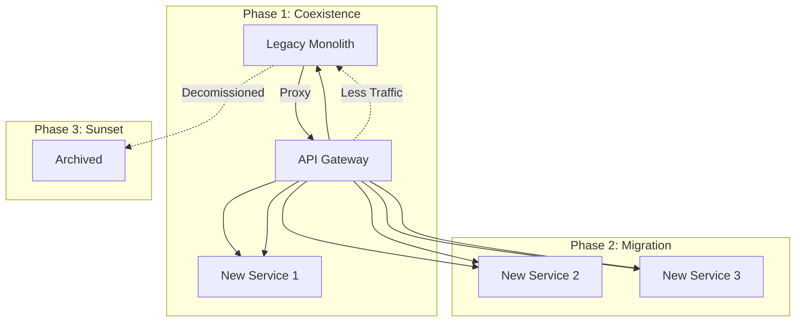
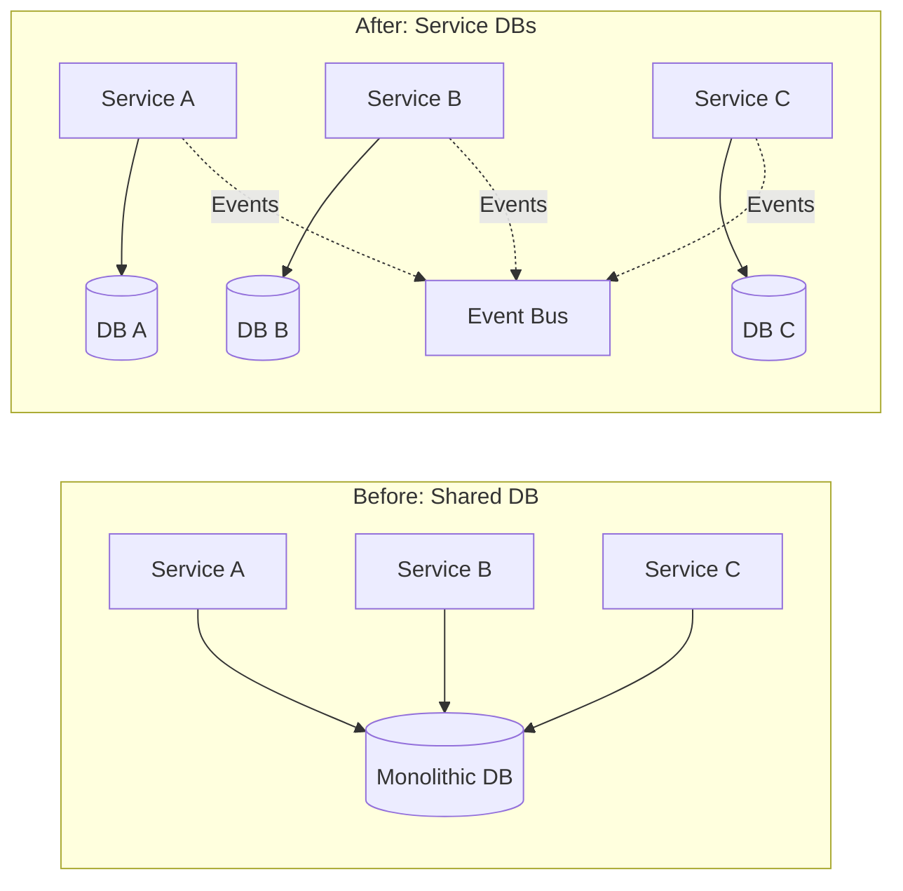

# Migration Patterns & Strategies

## Overview

This guide provides battle-tested patterns for using SpecWeave to migrate, modernize, and transform large-scale systems.

## Pattern 1: Strangler Fig Migration

### When to Use
- Gradual migration from legacy system
- Zero-downtime requirement
- Risk-averse organizations

### Implementation with SpecWeave



```bash
# Step 1: Extract specs from highest-value module
specweave analyze legacy-app/modules/payments/
specweave extract-specs --module payments --output specs/payments/

# Step 2: Implement new service alongside legacy
specweave implement specs/payments/ --target services/payments-v2/
# New service runs parallel to legacy

# Step 3: Gradual traffic shift
specweave generate-router --canary 10%  # Start with 10% traffic
specweave generate-router --canary 50%  # Increase as confidence grows
specweave generate-router --canary 100% # Full migration

# Step 4: Decommission legacy module
specweave archive legacy-app/modules/payments/
```

### Success Metrics
- **Migration Speed**: 1-2 modules per sprint
- **Risk Reduction**: 95% (gradual rollout)
- **Rollback Time**: < 1 minute (traffic shift)

## Pattern 2: Branch by Abstraction

### When to Use
- Replacing core system components
- Multiple teams working in parallel
- Complex interdependencies

### SpecWeave Approach

```yaml
# abstraction-layer.yaml
abstraction:
  interface: UserService
  implementations:
    - legacy: LegacyUserDB
    - new: MicroserviceUserAPI
  feature_flags:
    - read_from_new: false
    - write_to_both: true
    - validate_consistency: true
```

```typescript
// Generated abstraction layer
interface UserService {
  getUser(id: string): Promise<User>
  updateUser(id: string, data: UserData): Promise<void>
}

class UserServiceRouter implements UserService {
  async getUser(id: string): Promise<User> {
    if (featureFlags.read_from_new) {
      return await this.newService.getUser(id)
    }
    return await this.legacyService.getUser(id)
  }

  async updateUser(id: string, data: UserData): Promise<void> {
    if (featureFlags.write_to_both) {
      await Promise.all([
        this.legacyService.updateUser(id, data),
        this.newService.updateUser(id, data)
      ])
      if (featureFlags.validate_consistency) {
        await this.validateConsistency(id)
      }
    }
  }
}
```

## Pattern 3: Event-Driven Decoupling

### When to Use
- Tight coupling between services
- Need for async processing
- Building event-sourced systems

### Migration Strategy

```yaml
# event-spec.yaml
events:
  UserCreated:
    source: UserService
    schema:
      userId: string
      email: string
      timestamp: datetime
    consumers:
      - EmailService
      - AnalyticsService
      - BillingService

  OrderPlaced:
    source: OrderService
    schema:
      orderId: string
      userId: string
      items: array
      total: decimal
    consumers:
      - InventoryService
      - PaymentService
      - ShippingService
```

```bash
# Generate event infrastructure
specweave generate-events event-spec.yaml --broker kafka
# Creates: Event schemas, producers, consumers, topics

# Implement event handlers
specweave implement-handlers EmailService --events UserCreated
specweave implement-handlers BillingService --events UserCreated,OrderPlaced
```

## Pattern 4: Database Decomposition

### The Challenge
Shared database between services creates coupling

### SpecWeave Solution



```bash
# Step 1: Analyze data ownership
specweave analyze-data legacy-db/ --detect-boundaries
# Output: Data ownership map

# Step 2: Generate migration plan
specweave plan-db-split --source legacy-db/ --targets 3
# Creates: Migration scripts, data sync strategy

# Step 3: Implement dual-write period
specweave generate-dual-write --tables users,orders,products
# Both old and new DBs stay in sync

# Step 4: Switch reads to new DBs
specweave switch-reads --service user-service --target new-db
```

## Pattern 5: API Gateway Introduction

### Consolidate Multiple APIs

```yaml
# gateway-spec.yaml
gateway:
  endpoints:
    /api/users:
      target: user-service:3001
      auth: required
      rate_limit: 1000/hour

    /api/orders:
      target: order-service:3002
      auth: required
      cache: 5m

    /api/products:
      target: product-service:3003
      auth: optional
      cache: 1h

  policies:
    - cors: enabled
    - compression: gzip
    - logging: structured
    - tracing: opentelemetry
```

```bash
# Generate gateway configuration
specweave generate-gateway gateway-spec.yaml --type kong
# Or: --type nginx, --type envoy, --type aws-api-gateway
```

## Pattern 6: Incremental Rewrite

### For Complete Technology Stack Changes

```bash
# Phase 1: Identify modules by business value
specweave analyze-value legacy-app/ --metrics "revenue,usage,maintenance-cost"
# Output: Prioritized module list

# Phase 2: Extract and enhance specs
for module in $(cat high-value-modules.txt); do
  specweave extract-specs legacy-app/$module/ --enhance-with-ai
  specweave add-modern-patterns specs/$module/ --patterns "rest,graphql,grpc"
done

# Phase 3: Parallel implementation
specweave implement-parallel specs/ --teams 4 --coordination github
# Creates: 4 parallel workstreams with clear interfaces

# Phase 4: Integration testing
specweave generate-integration-tests --from-specs specs/
specweave run-contract-tests --between-services all
```

## Pattern 7: Blue-Green Deployment

### Zero-Downtime Migration

```yaml
# blue-green-config.yaml
environments:
  blue:
    version: legacy
    database: prod-db
    traffic: 100%

  green:
    version: new-microservices
    database: prod-db-copy
    traffic: 0%

migration:
  - step: deploy-green
    action: deploy new version to green

  - step: sync-data
    action: real-time sync blue->green DBs

  - step: smoke-test
    action: run tests against green

  - step: canary
    action: shift 10% traffic to green

  - step: monitor
    action: watch metrics for 1h

  - step: full-switch
    action: shift 100% traffic to green

  - step: keep-blue
    action: maintain blue for instant rollback
```

## Anti-Patterns to Avoid

### ❌ Big Bang Rewrite
- **Problem**: Attempting to rewrite everything at once
- **Why it fails**: Too risky, too long, too expensive
- **SpecWeave alternative**: Incremental extraction and implementation

### ❌ Shared Database
- **Problem**: Multiple services sharing one database
- **Why it fails**: Creates hidden coupling
- **SpecWeave alternative**: Database-per-service with event sync

### ❌ Distributed Monolith
- **Problem**: Microservices that must deploy together
- **Why it fails**: Complexity without benefits
- **SpecWeave alternative**: Proper boundary detection before splitting

## Migration Readiness Checklist

### Technical Readiness
- [ ] Current system documented or analyzable
- [ ] Test coverage > 60% (or will be added)
- [ ] CI/CD pipeline exists
- [ ] Team familiar with target architecture
- [ ] Monitoring and observability in place

### Organizational Readiness
- [ ] Executive sponsorship secured
- [ ] Teams aligned on migration strategy
- [ ] Budget allocated for parallel run period
- [ ] Success metrics defined
- [ ] Rollback plan approved

### SpecWeave Readiness
- [ ] SpecWeave installed and configured
- [ ] Pilot module selected
- [ ] Team trained on spec-driven development
- [ ] Integration points identified
- [ ] External dependencies mapped

## Cost-Benefit Analysis

### Migration Costs
- **Team Time**: 2-6 developers for 3-12 months
- **Infrastructure**: 2x during parallel run
- **Training**: 2 weeks for team onboarding
- **Risk Buffer**: 20% contingency

### Expected Benefits
- **Performance**: 3-10x improvement
- **Scalability**: Horizontal scaling enabled
- **Deployment**: From monthly to hourly
- **Maintenance**: 50% reduction in costs
- **Innovation**: 5x faster feature delivery

### ROI Calculation
```
ROI = (Benefits - Costs) / Costs × 100%
Typical ROI: 200-400% within 18 months
Break-even: 6-9 months
```

## Getting Expert Help

### When to Engage Consultants
- System > 500k lines of code
- Mission-critical with zero downtime requirement
- Regulatory compliance requirements
- Team lacks migration experience

### SpecWeave Professional Services
- **Assessment**: 2-week system analysis
- **Strategy**: Custom migration roadmap
- **Training**: Team enablement program
- **Support**: Dedicated migration architect

## Next Steps

1. **Assess Current State**
   ```bash
   specweave analyze your-app/ --comprehensive
   ```

2. **Choose Pattern**
   - Review patterns above
   - Match to your constraints
   - Consider hybrid approaches

3. **Pilot Project**
   - Select low-risk, high-value module
   - Complete end-to-end migration
   - Measure and learn

4. **Scale Up**
   - Apply lessons learned
   - Parallelize where possible
   - Monitor continuously

---

*Need help with your migration? Contact our [migration experts](https://spec-weave.com/enterprise) for a consultation.*