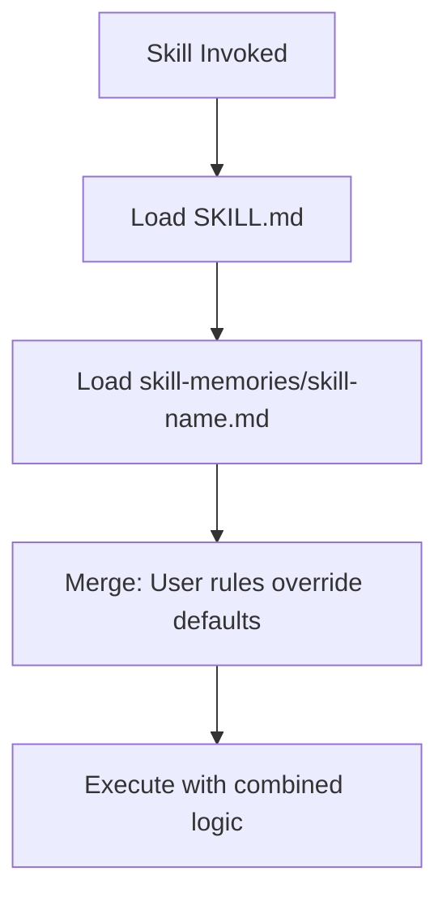
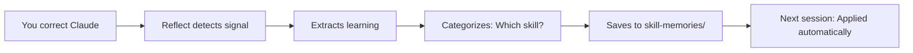

# Programmable Skills: The Open/Closed Principle for AI

**Making AI tools transparent, customizable, and extensible**

*Published: February 12, 2026*

---

## Executive Summary

Most AI coding assistants (GitHub Copilot, Cursor, etc.) are **black boxes** — you cannot see their logic or customize their behavior. SpecWeave introduces **Programmable Skills**, applying the **Open/Closed Principle** from SOLID design to AI:

- **Closed for modification**: Core skill logic in `SKILL.md` (stable, tested)
- **Open for extension**: User customizations in `.specweave/skill-memories/*.md`

This architecture delivers:
- ✅ **Transparency** — See exactly what skills do
- ✅ **Customization** — Add your rules without forking
- ✅ **Persistence** — Corrections become permanent knowledge
- ✅ **No vendor lock-in** — You control the behavior

**Result**: AI that adapts to YOUR patterns, YOUR conventions, YOUR requirements. Correct once, applied forever.

---

## Table of Contents

- [The Problem: AI Amnesia](#the-problem-ai-amnesia)
- [Why Traditional AI Tools Can't Be Customized](#why-traditional-ai-tools-cant-be-customized)
- [The Solution: Open/Closed Principle for AI](#the-solution-openclosed-principle-for-ai)
- [Architecture: How It Works](#architecture-how-it-works)
- [Real-World Example](#real-world-example)
- [Advanced: Custom Logic](#advanced-custom-logic)
- [Technical Specification](#technical-specification)
- [For Skill Developers](#for-skill-developers)
- [Comparison with Other Tools](#comparison-with-other-tools)
- [Use Cases](#use-cases)
- [Getting Started](#getting-started)
- [FAQ](#faq)

---

## The Problem: AI Amnesia

Every AI coding session starts from zero. No memory. No learning. No customization.

**Typical experience:**

| Day | What Happens |
|-----|-------------|
| **Monday** | You: "Use our design system from `@/components/ui`"<br>AI: *regenerates with design system* |
| **Tuesday** | AI: *suggests inline styles*<br>You: "I told you yesterday — use `@/components/ui`!" |
| **Wednesday** | AI: *suggests inline styles again*<br>You: *considers rage-quitting* |

This isn't a flaw in one tool. **Every AI assistant has this problem**:
- GitHub Copilot: Resets each session
- Cursor: Limited context memory
- Claude Code: Stateless by default

You're stuck in an infinite loop of corrections.

---

## Why Traditional AI Tools Can't Be Customized

Because they're designed like **traditional compiled software**:

```
┌─────────────────────────┐
│   Compiled Binary       │
│   (Obfuscated)          │  ← Can't see inside
│   Proprietary           │  ← Can't modify
│   Vendor Lock-in        │  ← Take it or leave it
└─────────────────────────┘
```

**GitHub Copilot**: Black box. You get suggestions. Can't customize how it reasons.

**Cursor**: Proprietary. Great UX, but locked into their decisions.

**Every other AI tool**: Same problem. No transparency. No extensibility.

**Want different behavior?**
- ❌ Fork the code? (If even open source)
- ❌ Maintain your own version? (Good luck)
- ❌ Request a feature? (Wait months or never)

This is **vendor lock-in** in AI clothing.

---

## The Solution: Open/Closed Principle for AI

SpecWeave applies the **Open/Closed Principle** (SOLID) to AI skills:

> **Software entities should be open for extension, but closed for modification.**
> — Bertrand Meyer, 1988

### Architecture

```
┌──────────────────┐     ┌─────────────────────┐
│    SKILL.md      │  +  │ skill-memories/     │
│  (Core Logic)    │     │ (Your Extensions)   │
│                  │     │                     │
│  CLOSED ⛔       │     │    OPEN ✅          │
│  - Stable        │     │  - Your rules       │
│  - Tested        │     │  - Your preferences │
│  - Predictable   │     │  - Custom logic     │
└──────────────────┘     └─────────────────────┘
         │                         │
         └──────────┬──────────────┘
                    ↓
         ┌─────────────────────┐
         │  Claude reads both  │
         │  = Customized AI    │
         └─────────────────────┘
```

### Key Principles

**SKILL.md (Closed for Modification)**
- Contains core skill logic
- Developed and tested by skill authors
- Stable, predictable behavior
- Version controlled in the plugin

**skill-memories/*.md (Open for Extension)**
- Your customizations
- Your project preferences
- Your custom logic
- Under YOUR control, in YOUR repo

**Claude reads both** and applies your overrides.

---

## Architecture: How It Works

### 1. Skill Invocation

When Claude invokes a skill (e.g., `/sw-frontend:frontend` or auto-detected):



### 2. Runtime Behavior

```typescript
// Pseudo-code
const coreLogic = readSkillMD('frontend');
const userCustomizations = readSkillMemories('frontend');

// Merge with user overrides taking precedence
const finalBehavior = {
  ...coreLogic.defaults,
  ...userCustomizations,
};

// Execute skill with customized behavior
executeSkill(finalBehavior);
```

### 3. Auto-Learning (Reflect System)

Enable auto-learning:
```bash
/sw:reflect-on
```

**Workflow**:



---

## Real-World Example

### Scenario: React Application with Specific Stack

You're building a React app with these standards:
- Forms: React Hook Form + Zod validation
- Styling: Tailwind CSS (no inline styles)
- Components: Design system in `@/components/ui`

### First Interaction

```bash
You: "Generate a login form"
```

Claude generates (default behavior):
```jsx
function LoginForm() {
  const [email, setEmail] = useState('');
  const [password, setPassword] = useState('');

  return (
    <form style={{ padding: '20px' }}> {/* inline styles */}
      <input
        value={email}
        onChange={(e) => setEmail(e.target.value)}
      />
      {/* ... */}
    </form>
  );
}
```

### You Correct It

```bash
You: "No, use React Hook Form with Zod validation, and never use inline styles"
```

Claude regenerates:
```jsx
import { useForm } from 'react-hook-form';
import { zodResolver } from '@hookform/resolvers/zod';
import { z } from 'zod';

const loginSchema = z.object({
  email: z.string().email(),
  password: z.string().min(8),
});

function LoginForm() {
  const { register, handleSubmit, formState: { errors } } = useForm({
    resolver: zodResolver(loginSchema),
  });

  return (
    <form className="p-5"> {/* Tailwind */}
      <input {...register('email')} className="..." />
      {errors.email && <span>{errors.email.message}</span>}
      {/* ... */}
    </form>
  );
}
```

### Behind the Scenes

SpecWeave's Reflect system detects the correction and saves it:

**.specweave/skill-memories/frontend.md**:
```markdown
### Form Handling
- Use React Hook Form for all forms
- Combine with Zod validation schemas
- Never use plain useState for form state

### Styling Preferences
- Use Tailwind CSS utility classes
- Never use inline styles
- Never use CSS-in-JS libraries

### Error Display
- Show validation errors inline below fields
- Use red text for error messages
```

### Next Session (Days Later)

```bash
You: "Generate a signup form"
```

Claude automatically generates:
```jsx
import { useForm } from 'react-hook-form';
import { zodResolver } from '@hookform/resolvers/zod';
import { z } from 'zod';

const signupSchema = z.object({
  email: z.string().email(),
  password: z.string().min(8),
  confirmPassword: z.string(),
}).refine(/* ... */);

function SignupForm() {
  const { register, handleSubmit, formState: { errors } } = useForm({
    resolver: zodResolver(signupSchema),
  });

  return (
    <form className="p-5"> {/* Already using Tailwind */}
      {/* Already using React Hook Form */}
    </form>
  );
}
```

✅ **No reminder needed. You programmed the skill.**

---

## Advanced: Custom Logic

You're not limited to preferences. Add **custom logic** that the skill developer never imagined.

### Example: Complex Component Generation Rules

**.specweave/skill-memories/frontend.md**:
```markdown
### Custom Component Generation Logic

When generating React components:

1. **Check design system first**
   - Scan `src/components/ui/` for existing components
   - If component exists, import it instead of creating
   - Only create if not found in design system

2. **Complexity threshold**
   - If component logic exceeds 50 lines:
     - Extract business logic to custom hooks
     - Keep component focused on UI rendering
   - Example: `useFormValidation()`, `useDataFetching()`

3. **Composition over configuration**
   - Use component composition instead of prop drilling
   - Max 5 props per component
   - Use compound component pattern for complex components

4. **Auto-generated files**
   - Create Storybook story: `ComponentName.stories.tsx`
   - Create test file: `ComponentName.test.tsx`
   - Create type file: `ComponentName.types.ts` (if >3 types)

### Context-Aware Behavior

When user mentions "admin" or "dashboard":
- Add role-based access control checks (`useAuth()` hook)
- Include audit logging for user actions
- Use stricter validation schemas (Zod `.strict()`)
- Add loading states and error boundaries

When user mentions "public" or "landing":
- Optimize for SEO (meta tags, semantic HTML)
- Add analytics tracking
- Implement lazy loading for images
- Use lighter validation (client-side only)

### Error Handling Pattern

- Never use try/catch without logging
- Log errors to Sentry in production
- Display user-friendly error messages via toast notifications
- Never show stack traces to end users
- Add error boundary for component-level failures

### Accessibility Requirements

All interactive components must include:
- ARIA labels (`aria-label`, `aria-describedby`)
- Keyboard navigation support (Tab, Enter, Escape)
- Focus management (auto-focus on modal open)
- Screen reader announcements for dynamic content
- Color contrast ratio ≥ 4.5:1
```

### What This Achieves

When you ask: `"Generate an admin user management table"`

Claude will:
1. ✅ Check if Table component exists in design system
2. ✅ Add role-based access control
3. ✅ Include audit logging
4. ✅ Use strict Zod validation
5. ✅ Extract complex logic to `useUserManagement()` hook
6. ✅ Generate Storybook story
7. ✅ Generate test file with accessibility checks
8. ✅ Add error boundary
9. ✅ Include ARIA labels and keyboard nav

**All automatically. Because you programmed the skill to do this.**

---

## Technical Specification

### File Locations

**Core Skills** (closed for modification):
```
~/.claude/plugins/cache/specweave/{plugin-name}/{version}/
└── skills/
    └── {skill-name}/
        ├── SKILL.md           # Core logic
        ├── examples/          # Usage examples
        └── tests/             # Skill tests
```

**User Customizations** (open for extension):
```
.specweave/skill-memories/
├── frontend.md       # Frontend skill customizations
├── backend.md        # Backend skill customizations
├── testing.md        # Testing skill customizations
├── security.md       # Security skill customizations
└── general.md        # Cross-cutting customizations
```

### Skill Memory Format

Skill memories use **structured Markdown** with semantic sections:

```markdown
# {skill-name} Skill Memory

### {Category Name}
{Description of rules in this category}

Bullets:
- Rule 1
- Rule 2

Numbered lists:
1. Step 1
2. Step 2

### {Another Category}
When {condition}:
- Action 1
- Action 2
```

**Categories are free-form** — you define what makes sense for your project.

### Auto-Learning Configuration

Enable/disable in `.specweave/config.json`:

```json
{
  "reflect": {
    "enabled": true,
    "autoLearn": true,
    "categories": [
      "component-usage",
      "api-patterns",
      "testing",
      "deployment",
      "security",
      "database",
      "naming",
      "architecture"
    ]
  }
}
```

### Git Integration

Skill memories are **plain Markdown** in your repo:

```bash
# See learning history
git log --oneline .specweave/skill-memories/frontend.md

# View what changed
git diff HEAD~1 .specweave/skill-memories/frontend.md

# Rollback a wrong learning
git checkout HEAD~1 -- .specweave/skill-memories/frontend.md

# Share with team
git push  # Everyone gets the learnings
```

### API (for Skill Developers)

Skills can read user customizations programmatically:

```typescript
import { readSkillMemories } from '@specweave/core';

export async function executeSkill(context: SkillContext) {
  // Load core logic
  const defaults = loadDefaults();

  // Load user customizations
  const userPrefs = await readSkillMemories('frontend');

  // Merge with user overrides taking precedence
  const config = {
    ...defaults,
    ...userPrefs,
  };

  // Execute with customized behavior
  return generateComponent(config);
}
```

---

## For Skill Developers

If you're building SpecWeave skills, design them for extensibility:

### 1. Define Extension Points

**SKILL.md**:
```markdown
## Component Generation

**Default Behavior:**
- Framework: React
- Export style: default export
- Styling: CSS Modules
- Test framework: Vitest

**Extension Points:**

Users can customize via `.specweave/skill-memories/{skill-name}.md`:

- `component.framework` → React | Vue | Angular | Svelte
- `component.exportStyle` → default | named
- `styling.approach` → Tailwind | CSS Modules | Styled Components | Emotion
- `testFramework` → Vitest | Jest | Testing Library
- `accessibility.level` → AA | AAA (WCAG compliance)

**Custom Logic:**

Users can add conditional behavior:
- Context-aware generation (admin vs public)
- Auto-generated files (stories, tests, types)
- Complexity thresholds (extract hooks at N lines)
```

### 2. Read Skill Memories at Runtime

```typescript
export async function generateComponent(options: GenerateOptions) {
  // Load user preferences
  const userPrefs = await readSkillMemories('frontend');

  // Apply overrides
  const framework = userPrefs?.component?.framework || 'React';
  const styling = userPrefs?.styling?.approach || 'CSS Modules';

  // Check for custom logic
  if (userPrefs?.customLogic?.checkDesignSystem) {
    const existingComponent = await checkDesignSystem(options.name);
    if (existingComponent) {
      return importExisting(existingComponent);
    }
  }

  // Generate with customizations
  return createNewComponent({ framework, styling, ...options });
}
```

### 3. Document Limitations

Be clear about what CAN'T be customized:

```markdown
## Non-Customizable Behavior

The following are locked for security/correctness:

- ❌ Security validation rules (XSS, SQL injection checks)
- ❌ OWASP Top 10 protections
- ❌ Output format contracts (JSON schema for APIs)
- ❌ Critical error handling (prevents silent failures)

Rationale: These ensure correctness and safety regardless of project preferences.
```

### 4. Provide Skill Memory Templates

Create `.specweave/skill-memories/.templates/{skill-name}.md`:

```markdown
# {skill-name} Skill Memory Template

### Component Preferences
- framework: React | Vue | Angular | Svelte
- exportStyle: default | named
- styling: Tailwind | CSS Modules | Styled Components

### Form Handling
- formLibrary: React Hook Form | Formik | Custom
- validationLibrary: Zod | Yup | Joi | Custom

### Custom Logic

When generating components:
1. [Your custom step]
2. [Your custom step]

When context includes "admin":
- [Your rule]
```

### 5. Test with Customizations

```typescript
describe('Frontend Skill', () => {
  test('uses defaults when no customizations', async () => {
    const result = await generateComponent({ name: 'Button' });
    expect(result.framework).toBe('React');
    expect(result.styling).toBe('CSS Modules');
  });

  test('respects user customizations', async () => {
    const userPrefs = {
      component: { framework: 'Vue' },
      styling: { approach: 'Tailwind' },
    };

    mockReadSkillMemories('frontend', userPrefs);

    const result = await generateComponent({ name: 'Button' });
    expect(result.framework).toBe('Vue');
    expect(result.styling).toBe('Tailwind');
  });

  test('applies custom logic when defined', async () => {
    const userPrefs = {
      customLogic: {
        checkDesignSystem: true,
      },
    };

    mockDesignSystemHas('Button');
    mockReadSkillMemories('frontend', userPrefs);

    const result = await generateComponent({ name: 'Button' });
    expect(result.type).toBe('import'); // Imported, not created
  });
});
```

---

## Comparison with Other Tools

| Feature | GitHub Copilot | Cursor | SpecWeave |
|---------|---------------|--------|-----------|
| **Transparency** | ❌ Black box | ❌ Proprietary | ✅ SKILL.md shows logic |
| **Customization** | ❌ None | ⚠️ Limited settings | ✅ Full (skill-memories) |
| **Memory** | ❌ Resets each session | ⚠️ Limited context | ✅ Permanent learnings |
| **Team Sharing** | ❌ N/A | ⚠️ Manual export/import | ✅ Git-versioned |
| **Extensibility** | ❌ Locked | ❌ Locked | ✅ Open/Closed Principle |
| **Version Control** | ❌ N/A | ❌ N/A | ✅ Git integration |
| **Rollback Learnings** | ❌ N/A | ❌ N/A | ✅ `git checkout` |
| **Open Source** | ❌ No | ❌ No | ✅ Yes (MIT) |
| **Custom Logic** | ❌ Impossible | ❌ Impossible | ✅ Markdown rules |
| **SOLID Principles** | ❌ N/A | ❌ N/A | ✅ Open/Closed |

---

## Use Cases

### Solo Developer

**Before (without programmable skills):**
- Repeat same corrections daily
- Inconsistent code patterns across codebase
- Waste time re-explaining preferences

**After (with programmable skills):**
- Correct once → applied forever
- Consistent patterns automatically
- AI adapts to YOUR style

**Example**: You prefer Zustand over Redux. Correct once in skill-memories, every future state management suggestion uses Zustand.

---

### Team of 10 Developers

**Before:**
- Each developer corrects AI separately
- Knowledge siloed in individual sessions
- Onboarding = manually explaining conventions
- Inconsistent code across team

**After:**
- Team shares skill-memories via Git
- New developers get team conventions automatically
- AI follows team standards from day one
- Consistent codebase

**Example**: Team uses Material-UI. Add to skill-memories, commit to main. All team members get this preference automatically.

---

### Enterprise (100+ Developers)

**Before:**
- Inconsistent AI suggestions across teams
- No way to enforce company patterns
- Compliance rules manually enforced
- Onboarding takes weeks

**After:**
- Company-wide skill-memories repository
- AI suggests compliant code automatically
- Regulatory requirements baked into skills
- Onboarding: clone repo, run once

**Example**: Financial services company requires PCI-DSS compliance. Encode credit card handling rules in `security.md`. Every developer gets compliant suggestions automatically.

---

### Multi-Project Consultancy

**Before:**
- Switch contexts between clients manually
- Different conventions per project
- AI gives generic suggestions
- High cognitive load

**After:**
- skill-memories per project repo
- AI adapts to each client's stack
- Context switching: `cd project && /sw:increment`
- Low cognitive load

**Example**: Client A uses Vue + Pinia, Client B uses React + Zustand. skill-memories in each repo → AI adapts automatically.

---

## Getting Started

### 1. Install SpecWeave

```bash
npm install -g specweave
cd your-project
specweave init .
```

### 2. Enable Auto-Learning

```bash
/sw:reflect-on
```

This enables automatic capture of corrections.

### 3. Make Corrections

```bash
/sw:increment "user authentication"

# During implementation
You: "Generate login form"
Claude: *creates form*
You: "No, use React Hook Form with Zod validation"
```

### 4. Check Learnings

```bash
/sw:reflect-status

# View skill memories
cat .specweave/skill-memories/frontend.md
```

### 5. Customize Manually (Optional)

Edit skill memories directly:

```bash
# Edit frontend skill memory
code .specweave/skill-memories/frontend.md
```

Add your rules:
```markdown
### Component Structure
- Max 200 lines per component
- Extract to hooks if logic >50 lines
- Use compound components for complex UI

### Testing Requirements
- Unit test coverage: 80% minimum
- One test file per component
- Use Testing Library, not Enzyme
```

### 6. Share with Team

```bash
git add .specweave/skill-memories/
git commit -m "Add frontend skill customizations"
git push
```

Team members pull and automatically get your learnings.

---

## FAQ

### Q: What if I make a wrong correction?

**A**: Skill memories are Git-versioned. Roll back:

```bash
git log .specweave/skill-memories/frontend.md
git checkout <commit-hash> -- .specweave/skill-memories/frontend.md
```

Or edit manually and remove the incorrect rule.

---

### Q: Can I disable auto-learning?

**A**: Yes:

```bash
/sw:reflect-off
```

Or in `.specweave/config.json`:
```json
{
  "reflect": {
    "enabled": false
  }
}
```

---

### Q: What if two rules conflict?

**A**: More specific rules take precedence. Example:

```markdown
### General Rule
- Use CSS Modules for styling

### Context-Specific Rule
When component is in `src/components/marketing/`:
- Use Tailwind CSS
```

Claude applies Tailwind for marketing components, CSS Modules elsewhere.

---

### Q: Can I customize built-in Claude Code skills?

**A**: Yes! ANY skill can be customized through skill-memories, including:
- Core SpecWeave skills (`pm`, `architect`, `grill`)
- Plugin skills (`sw-frontend:*`, `sw-backend:*`)
- Third-party plugin skills

---

### Q: How do I know what's customizable?

**A**: Read the skill's SKILL.md:

```bash
# Find skill location
claude plugin list

# Read SKILL.md
cat ~/.claude/plugins/cache/specweave/sw-frontend/*/skills/frontend/SKILL.md
```

Look for "Extension Points" section.

---

### Q: Can I share skill memories across projects?

**A**: Yes! Create a shared repo:

```bash
# In your projects
ln -s ~/shared-skill-memories .specweave/skill-memories

# Or use Git submodules
git submodule add <shared-repo-url> .specweave/skill-memories
```

---

### Q: What's the performance impact?

**A**: Minimal. Skill memories are read once when skill loads:
- ~10-50ms to read and parse
- Cached for session duration
- No impact on generation speed

---

### Q: Can I use this with Copilot/Cursor?

**A**: No. Programmable skills require:
1. Access to skill source (SKILL.md)
2. Ability to read skill-memories at runtime
3. Open architecture for extensions

Copilot and Cursor are closed systems.

---

### Q: What if I don't want to use Git?

**A**: Skill memories are plain Markdown. Store them however you want:
- File sync (Dropbox, OneDrive)
- Company intranet
- Shared network drive

But Git provides versioning, rollback, and team collaboration.

---

## Conclusion

**Programmable Skills** represent a fundamental shift in AI tool design:

**From**: AI as a service (you consume)
**To**: AI as a platform (you program)

By applying the **Open/Closed Principle** from SOLID design, SpecWeave delivers:
- **Transparency** — See exactly what skills do (SKILL.md)
- **Customization** — Add your rules (skill-memories)
- **Persistence** — Corrections become permanent knowledge
- **No vendor lock-in** — You control the behavior

**This is the future**: AI tools that are transparent, extensible, and fully under your control.

**Skills aren't black boxes. They're programs. And you can program them.**

---

## Resources

- **Documentation**: https://spec-weave.com
- **GitHub**: https://github.com/anton-abyzov/specweave
- **Discord**: https://discord.gg/UYg4BGJ65V
- **Twitter**: [@antonabyzov](https://twitter.com/antonabyzov)

---

## Appendix: SOLID Principles Applied to AI

### Single Responsibility Principle

Each skill has ONE job:
- `frontend` → Frontend development
- `backend` → Backend development
- `testing` → Test generation

**Don't**: Create a "full-stack" skill that does everything.
**Do**: Compose multiple focused skills.

---

### Open/Closed Principle ✅

**Core insight of Programmable Skills.**

Skills are:
- **Closed** for modification (SKILL.md is stable)
- **Open** for extension (skill-memories add behavior)

---

### Liskov Substitution Principle

Customizations shouldn't break skill contracts.

**Contract**: "Frontend skill generates valid React components"

**Bad customization**:
```markdown
### Output Format
- Return Python code instead of JavaScript
```
❌ Breaks contract

**Good customization**:
```markdown
### Component Structure
- Use functional components
- TypeScript with strict mode
```
✅ Respects contract

---

### Interface Segregation Principle

Skills expose clear, focused extension points.

**Don't**:
```markdown
### Everything
- Configure all behavior here
```

**Do**:
```markdown
### Component Preferences
- framework, exportStyle, styling

### Form Handling
- formLibrary, validationLibrary

### Custom Logic
- checkDesignSystem, complexityThreshold
```

Users override only what they need.

---

### Dependency Inversion Principle

Skills depend on **abstractions** (patterns), not concrete implementations.

**SKILL.md** defines:
```markdown
## Form Handling Pattern

Abstract:
1. Define validation schema
2. Create form handler
3. Display errors

Concrete implementation → skill-memories
```

**skill-memories/frontend.md** provides concrete:
```markdown
### Form Handling
- Schema: Zod (not Yup, not Joi)
- Handler: React Hook Form (not Formik)
- Errors: Toast notifications (not inline)
```

---

*This document was published on February 12, 2026 as the canonical reference for Programmable Skills in SpecWeave.*

---

**Version**: 1.0.0
**Authors**: Anton Abyzov
**License**: MIT
**Status**: Published

