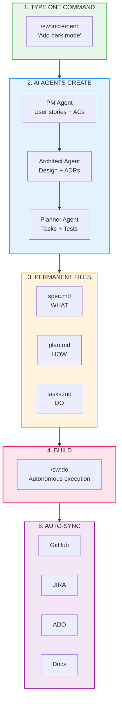

# SpecWeave

**The AI Development Framework That Can Run for Hours Autonomously**

*Ship features while you sleep. Mobile apps, microservices, multi-repo architectures — one framework handles it all.*

[](https://www.npmjs.com/package/specweave)
[](https://opensource.org/licenses/MIT)
[](https://discord.gg/UYg4BGJ65V)
[](https://www.youtube.com/@antonabyzov)

::::tip New in v2.9 — Now You Can SEE Auto Mode Working!
`/sw:auto` runs for **hours** autonomously, and now you get **real-time visual labels** showing exactly what's happening! See iteration counts, test status, and stop criteria as your features build themselves.

[Learn about Label Visibility →](/docs/commands/auto#new-in-v29-label-visibility)
:::

---

## Engineering Metrics (DORA)

[](https://github.com/anton-abyzov/specweave/blob/develop/.specweave/docs/internal/delivery/dora-metrics.md)
[](https://github.com/anton-abyzov/specweave/blob/develop/.specweave/docs/internal/delivery/dora-metrics.md)
[](https://github.com/anton-abyzov/specweave/blob/develop/.specweave/docs/internal/delivery/dora-metrics.md)
[](https://github.com/anton-abyzov/specweave/blob/develop/.specweave/docs/internal/delivery/dora-metrics.md)

**SpecWeave builds SpecWeave using SpecWeave.** These are real metrics from our own development.

**[Live Dashboard](https://spec-weave.com/docs/metrics)** | **[Detailed Report](https://github.com/anton-abyzov/specweave/blob/develop/.specweave/metrics/dora-report.md)**

---

## What Makes SpecWeave Different

Every AI coding tool promises productivity. But after the chat ends:

- **Your specs disappear** into chat history
- **Your architecture decisions are forgotten**
- **Your tests are never written**
- **Your GitHub/JIRA stays outdated**
- **New team members start from zero**

**SpecWeave is the only framework where AI decisions become permanent, searchable documentation.**

### See Auto Mode in Action (v2.9)

When `/sw:auto` runs autonomously, you now see **real-time progress labels** in your conversation:

```
╔══════════════════════════════════════════════════════════════╗
║  🔄 AUTO SESSION CONTINUING                                  ║
║  🤖 Main Orchestrator                                        ║
╠══════════════════════════════════════════════════════════════╣
║  Why: Work incomplete, continuing...                         ║
║  Iteration: 42/2500                                         ║
║  Increment: 0001-user-auth                                  ║
║  Subagents used: 3                                          ║
╠══════════════════════════════════════════════════════════════╣
║  🎯 WHEN WILL SESSION STOP?                                  ║
║  ├─ Mode: STANDARD MODE                                     ║
║  └─ Criteria: ALL tasks [x] completed + tests passing       ║
║  ✅ Tests: 42 passed, 0 failed                              ║
╚══════════════════════════════════════════════════════════════╝
```

No more wondering "is it still working?" — you see **exactly** what's happening, iteration counts, test status, and stop criteria in real-time.

**[Learn about autonomous execution →](./commands/auto)**


**Permanent** = survives chat sessions | **Auto-sync** = updates automatically after each task

---

## Quick Start (30 Seconds)

```bash
npm install -g specweave
cd your-project
specweave init .
```

Then in Claude Code:
```bash
/sw:increment "Add dark mode toggle"  # AI creates spec + plan + tasks
/sw:auto                              # 🚀 Ship while you sleep (hours of autonomous work)
```

**Or step-by-step control:**
```bash
/sw:do                                # Execute one task at a time
/sw:done 0001                         # Quality-validated completion
```

**Pro tip**: Use `/sw:next` to flow through the entire cycle. One command auto-closes completed work and suggests what's next — review specs/tasks when needed, otherwise just keep clicking "next".

:::tip Keep Increments Small — 2-3x Faster with Opus 4.5!
**5-15 tasks, 1-3 user stories, completable in 1-3 days.** With **Claude Opus 4.5**, development speed increases **2-3x** (some report **5-10x**!). Small increments + Opus 4.5 = almost **no manual interaction**. Just define requirements, run `/sw:auto`, and review what's done.
:::

:::info Troubleshooting
If commands/skills stop working after a Claude Code update:
```bash
specweave refresh-marketplace   # Reinstall all plugins from GitHub
specweave update-instructions   # Regenerate CLAUDE.md
```
:::

:::caution Prevent Claude Code Crashes
**Keep files small**: Target **600-800 lines max**. Files over 1K lines = crash risk. Split large files into modules before adding code.
:::

**[Full Quickstart Guide →](./quick-start)** | **[Real Examples →](./examples/)**

:::info 🎯 Claude Code's Game-Changing Updates
**Compact Command** — VSCode users can now use `compact` mode to keep Claude Code inside your editor window. Work continuously for **hours** in the same session without context switching. No more jumping between terminal and editor!

**STOP Hooks with Subagents** — Stop hooks now work with spawned subagents, enabling autonomous quality gates at every level. SpecWeave's `/sw:auto` uses this to validate tests and completion criteria automatically.

Learn more: [Boris Cherny's autonomous coding demo](https://x.com/bcherny/status/2004916410687050167) — 259 PRs, 497 commits, 40,000 lines added in one month without opening an IDE.
:::

---

## The Workflow



---

## What You Get

| Before | After SpecWeave |
|--------|-----------------|
| Specs in chat history | **Permanent, searchable specs** |
| Manual JIRA/GitHub updates | **Auto-sync on every task** |
| Tests? Maybe later... | **Tests embedded in tasks (60%+ enforced)** |
| Architecture in your head | **ADRs captured automatically** |
| "Ask John, he knows" | **Living docs, always current** |
| Onboarding: 2 weeks | **Onboarding: 1 day** |

---

## Key Strengths

### 🚀 Autonomous Execution (NEW v2.9!)
Run `/sw:auto` and watch **real-time labels** show progress, test results, and stop criteria. Can run for **hours** autonomously with self-healing when tests fail.

**[See auto mode in action →](./commands/auto)**

### 📚 Permanent Knowledge
- **[Brownfield](/docs/glossary/terms/brownfield) + [Greenfield](/docs/glossary/terms/greenfield)** — Works with existing codebases, not just new projects
- **Living Documentation** — Specs auto-update after every task via hooks
- **🧠 Self-Improving Skills** — [Claude learns from corrections](/docs/guides/self-improving-skills), applies patterns automatically in future sessions

### ⚡ Performance & Scale
- **70%+ Token Reduction** — Progressive loading, context optimizer, sub-agent isolation
- **Multi-Project Mode** — Manage multiple repos with shared specs and cross-project sync
- **15+ Specialized Agents** — PM, Architect, Tech Lead, QA, Security, DevOps work autonomously

### 🔄 External Integration
- **Auto-Sync** — Push specs to GitHub/JIRA/ADO, read status back automatically
- **3-Gate Quality Validation** — Tasks, tests (60%+), and docs verified before closing

---

## The Three-File Foundation

Every feature generates three permanent files:

```
.specweave/increments/0001-dark-mode/
├── spec.md    <- WHAT: User stories, acceptance criteria, requirements
├── plan.md    <- HOW: Architecture, tech decisions, ADRs
└── tasks.md   <- DO: Implementation tasks with embedded tests
```

### spec.md (WHAT)
```markdown
## User Stories

### US-001: Dark Mode Toggle
As a user, I want to toggle dark mode so that I can reduce eye strain at night.

**Acceptance Criteria:**
- [x] AC-US1-01: Toggle switch in settings persists preference
- [x] AC-US1-02: Theme applies to all components instantly
- [ ] AC-US1-03: System preference detected on first visit
```

### tasks.md (DO)
```markdown
### T-001: Implement Theme Provider
**User Story**: US-001
**Satisfies ACs**: AC-US1-01, AC-US1-02
**Status**: [x] completed

**Embedded Tests** (AC-US1-01):
- test_theme_toggle_persists_to_localstorage
- test_theme_applies_to_all_components
- test_toggle_updates_ui_instantly
```

---

## Key Features

### Autonomous Multi-Agent Orchestration

- **[PM Agent](/docs/glossary/terms/pm-agent)**: [User stories](/docs/glossary/terms/user-stories), [acceptance criteria](/docs/glossary/terms/acceptance-criteria), market analysis
- **[Architect Agent](/docs/glossary/terms/architect-agent)**: System design, [ADRs](/docs/glossary/terms/adr), tech stack decisions
- **[Tech Lead Agent](/docs/glossary/terms/tech-lead-agent)**: Implementation, code review, best practices
- **[QA Lead Agent](/docs/glossary/terms/qa-lead-agent)**: Test strategy, [E2E](/docs/glossary/terms/e2e) tests, [coverage](/docs/glossary/terms/test-coverage) validation
- **Security Agent**: Threat modeling, OWASP, vulnerability assessment
- **DevOps Agent**: [IaC](/docs/glossary/terms/iac), [Kubernetes](/docs/glossary/terms/kubernetes), [CI/CD](/docs/glossary/terms/ci-cd) pipelines

### Living Documentation

Documentation updates **after every task** via hooks:
- Strategic specs sync to `.specweave/docs/`
- ADRs captured automatically
- Runbooks and SLOs generated
- No manual doc updates ever

### [Quality Gates](/docs/glossary/terms/quality-gate)

Three gates before any [increment](/docs/glossary/terms/increments) closes:
1. **Tasks**: All tasks marked complete
2. **Tests**: 60%+ coverage minimum (configurable)
3. **Documentation**: Living docs updated

### Token Efficiency

70%+ context reduction through:
- Progressive plugin loading (load only what you need)
- Skills auto-activate based on keywords
- Context optimizer removes irrelevant specs
- Sub-agent parallelization isolates context

---

## External Tool Integration

SpecWeave keeps your project management tools in sync **automatically**:

| Platform | Capabilities |
|----------|--------------|
| **GitHub Issues** | Create, update, close, progress sync, checkbox tracking |
| **JIRA** | Epic/Story hierarchy, status sync, custom fields |
| **Azure DevOps** | Work items, area paths, status sync |
| **Linear** | Coming Q1 2026 |

---

## Brownfield & Greenfield

**New Projects**: Start spec-driven from day one.

**Existing Projects**:
```bash
specweave init .
/sw:import-docs ~/exports/notion --source=notion
```

Import from Notion, Confluence, GitHub Wiki. AI classifies docs automatically and creates retroactive specifications.

---

## Commands Reference

| Command | Purpose |
|---------|---------|
| `/sw:increment "feature"` | Plan new increment (PM -> Architect -> Tasks) |
| `/sw:auto` | 🚀 **Ship while you sleep** - hours of autonomous work |
| `/sw:do` | Execute one task at a time |
| `/sw:done 0001` | Complete with quality gate validation |
| `/sw:progress` | Show real-time status |
| `/sw:validate 0001` | Run quality checks |
| `/sw:sync-progress` | Sync to GitHub/JIRA/ADO |
| `/sw:auto-status` | Check autonomous session progress |
| `/sw:cancel-auto` | Stop autonomous session |
| `/sw:tdd-cycle` | Full red-green-refactor workflow |

**[Full Command Reference](./reference/commands/overview)**

---

## Requirements

- **Node.js 20.12.0+** (we recommend Node.js 22 LTS) — [upgrade guide](/docs/guides/troubleshooting/common-errors#node-version-error)
- Claude Code with **Claude Opus 4.5** (recommended) — [released Nov 2026](https://www.anthropic.com/news/claude-opus-4-5)
- Git repository

:::caution Node.js Version
If you see `SyntaxError: Unexpected token 'with'`, your Node.js is too old. Run `node --version` — you need **20.12.0 or higher**. See [upgrade instructions](/docs/guides/troubleshooting/common-errors#node-version-error).
:::

---

## Community

- **[Documentation](https://spec-weave.com)** - Full guides and tutorials
- **[Discord](https://discord.gg/UYg4BGJ65V)** - Get help, share tips
- **[YouTube](https://www.youtube.com/@antonabyzov)** - Video tutorials
- **[GitHub Issues](https://github.com/anton-abyzov/specweave/issues)** - Bug reports and features

---

## Learn Software Engineering with SpecWeave

**New to software engineering?** The [Software Engineering Academy](./academy/) takes you from complete beginner to Fortune 500 enterprise developer:

| Path | Duration | For |
|------|----------|-----|
| **[Quick Start](./academy/#path-1-quick-start-2-hours)** | 2 hours | Experienced devs wanting SpecWeave |
| **[Beginner](./academy/#path-2-beginner-developer-4-weeks)** | 4 weeks | New to software engineering |
| **[Full-Stack](./academy/#path-3-full-stack-developer-10-weeks)** | 10 weeks | Building complete web apps |
| **[Enterprise](./academy/#path-5-enterprise-developer-16-weeks)** | 16 weeks | Fortune 500-ready skills |

**14 parts, 44 modules** — from single-file scripts to microservices with CI/CD.

---

## Real-World Proof

SpecWeave isn't theory — it's **production-tested** across multiple use cases:

| Use Case | Duration | Result |
|----------|----------|--------|
| **Mobile App (React Native)** | 2.5 hours | 3,200 LOC, 42 tests, full offline sync |
| **Microservices (3 repos)** | 1.2 hours | Payment webhooks, 67 tests, 3 PRs created |
| **Brownfield Docs** | 3 hours | 450k LOC analyzed, 127 pages generated |
| **Large Refactor** | 1.8 hours | 52 files migrated, 186 tests maintained |

**[See detailed examples →](./examples/)**

---

## Next Steps

### 🎯 Get Started (5 minutes)
**[Quick Start Guide →](./quick-start)** - Install, init, run your first increment

### 📖 Learn the Fundamentals
- **[Core Concepts](./guides/core-concepts/specifications)** - Understand specs, plans, and tasks
- **[Autonomous Execution](./commands/auto)** - Ship while you sleep with `/sw:auto`
- **[External Sync](./guides/external-sync/github)** - Keep GitHub/JIRA/ADO updated

### 🚀 Advanced Usage
- **[Multi-Repo Projects](./guides/multi-repo)** - Coordinate across microservices
- **[Self-Improving Skills](./guides/self-improving-skills)** - Claude learns from your corrections
- **[API Documentation](./guides/api-docs)** - OpenAPI + Postman auto-generation

### 🎓 Complete Curriculum
**[Software Engineering Academy](./academy/)** - From beginner to Fortune 500 enterprise developer (14 parts, 44 modules)

---

**Ready to ship features while you sleep?**

```bash
npm install -g specweave
cd your-project
specweave init .
# Then in Claude Code: /sw:increment "your feature"
```

**Join the community:**
- **[Discord](https://discord.gg/UYg4BGJ65V)** - Get help, share success stories
- **[YouTube](https://www.youtube.com/@antonabyzov)** - Video tutorials
- **[GitHub](https://github.com/anton-abyzov/specweave)** - Star the repo, contribute
