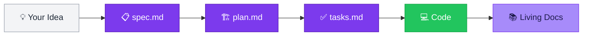

<div className="homepage-hero">

<div className="hero-content">

# Ship Features While You Sleep

<span className="hero-subtitle">
Autonomous AI agents with <strong>permanent memory</strong>. Your specs, decisions, and docs persist forever — not just until the chat ends.
</span>

<div className="hero-cta-row">
<a href="./quick-start" className="hero-btn hero-btn-primary">Get Started Free</a>
<a href="https://youtube.com/@antonabyzov" className="hero-btn hero-btn-secondary">Watch Demo</a>
</div>

<div className="hero-badges">

[](https://www.npmjs.com/package/specweave)
[](https://www.npmjs.com/package/specweave)
[](https://discord.gg/UYg4BGJ65V)

</div>

</div>

<div className="hero-visual">

</div>

</div>

---

<div className="features-section">

## The Problem with AI Coding Today

<div className="problem-cards">
<div className="problem-card">
<span className="problem-icon">💨</span>
<h3>Context Vanishes</h3>
<p>Chat ends, specs disappear. You lose everything.</p>
</div>
<div className="problem-card">
<span className="problem-icon">🔄</span>
<h3>Repeat Yourself</h3>
<p>Re-explain architecture every single session.</p>
</div>
<div className="problem-card">
<span className="problem-icon">📝</span>
<h3>Docs Rot</h3>
<p>JIRA outdated. README lies. Tests missing.</p>
</div>
</div>

<div className="solution-highlight">

### SpecWeave Solves This

AI that **remembers everything** — your decisions, patterns, and preferences compound across sessions. Docs update automatically. Nothing gets lost.

</div>

</div>

---

<div className="how-it-works-section">

## How It Works

<div className="workflow-visual">



</div>

<div className="workflow-steps">
<div className="workflow-step">
<div className="step-number">1</div>
<h3>Describe Your Feature</h3>
<code>/sw:increment "Add user authentication"</code>
<p>AI creates detailed spec with user stories and acceptance criteria</p>
</div>
<div className="workflow-step">
<div className="step-number">2</div>
<h3>Let AI Work</h3>
<code>/sw:auto</code>
<p>Autonomous execution for hours. Self-healing. Quality gates built in.</p>
</div>
<div className="workflow-step">
<div className="step-number">3</div>
<h3>Ship It</h3>
<code>/sw:done</code>
<p>Validated code with tests, docs updated, and external tools synced.</p>
</div>
</div>

</div>

---

<div className="auto-mode-section">

## Autonomous Mode

<div className="auto-mode-container">
<div className="auto-mode-content">

Run `/sw:auto` and watch AI work for **hours** without intervention:

- **Self-healing** — Test fails? AI analyzes, fixes, retries
- **Quality gates** — Won't ship until all checks pass
- **Real-time visibility** — See exactly what's happening
- **15+ specialized agents** — PM, Architect, QA, Security, DevOps

</div>
<div className="auto-mode-terminal">

```
╔══════════════════════════════════════════════════════════╗
║  🚀 AUTO SESSION ACTIVE                                  ║
╠══════════════════════════════════════════════════════════╣
║  Iteration: 47/2500                                      ║
║  Increment: 0001-user-auth                               ║
║  Progress: ████████████░░░░ 12/15 tasks                  ║
║  Tests: ✅ 42 passed · 0 failed                          ║
╠══════════════════════════════════════════════════════════╣
║  Stop when: All tasks complete + tests passing           ║
╚══════════════════════════════════════════════════════════╝
```

</div>
</div>

**[Learn about Auto Mode →](./commands/auto)**

</div>

---

<div className="features-grid-section">

## Everything You Need

<div className="feature-grid">

<div className="feature-card">
<div className="feature-icon">🤖</div>
<h3>15+ AI Agents</h3>
<p>PM, Architect, Tech Lead, QA, Security, DevOps — all working together on your feature.</p>
</div>

<div className="feature-card">
<div className="feature-icon">📚</div>
<h3>Living Documentation</h3>
<p>Specs, ADRs, and runbooks update automatically after every task. Zero manual work.</p>
</div>

<div className="feature-card">
<div className="feature-icon">🧠</div>
<h3>Self-Improving AI</h3>
<p>Claude learns from your corrections. Fix something once — it remembers forever.</p>
</div>

<div className="feature-card">
<div className="feature-icon">🔗</div>
<h3>External Sync</h3>
<p>GitHub Issues, JIRA, Azure DevOps — all stay in sync automatically.</p>
</div>

<div className="feature-card">
<div className="feature-icon">✅</div>
<h3>Quality Gates</h3>
<p>Can't ship until tests pass, docs are updated, and all acceptance criteria are met.</p>
</div>

<div className="feature-card">
<div className="feature-icon">⚡</div>
<h3>Instant Setup</h3>
<p>One command to install. Works with any project. No configuration needed.</p>
</div>

</div>

</div>

---

<div className="social-proof-section">

## Battle Tested

<div className="stats-row">
<div className="stat-item">
<div className="stat-number">200+</div>
<div className="stat-label">Features Shipped</div>
</div>
<div className="stat-item">
<div className="stat-number">10k+</div>
<div className="stat-label">Downloads</div>
</div>
<div className="stat-item">
<div className="stat-number">500+</div>
<div className="stat-label">Discord Members</div>
</div>
</div>

<div className="results-grid">
<div className="result-card">
<div className="result-project">React Native App</div>
<div className="result-time">2.5 hours</div>
<div className="result-detail">3,200 LOC, 42 tests, offline sync</div>
</div>
<div className="result-card">
<div className="result-project">Microservices (3 repos)</div>
<div className="result-time">1.2 hours</div>
<div className="result-detail">Payment webhooks, 67 tests</div>
</div>
<div className="result-card">
<div className="result-project">Brownfield Docs</div>
<div className="result-time">3 hours</div>
<div className="result-detail">450k LOC analyzed, 127 pages</div>
</div>
</div>

</div>

---

<div className="quick-start-section">

## Start in 30 Seconds

<div className="install-box">

```bash
# Install globally
npm install -g specweave

# Initialize in your project
cd your-project
specweave init .

# In Claude Code, start building
/sw:increment "Add user authentication"
/sw:auto  # Let AI work autonomously
```

</div>

<div className="requirements-box">

**Requirements:** Node.js 20.12+ · Claude Code (VSCode or CLI) · Git

:::tip Best Experience
**Claude Code + Claude Opus 4.5** — native hooks, multi-hour sessions, quality gates work out of the box.
:::

</div>

</div>

---

<div className="final-cta">

<h2>Ready to Ship While You Sleep?</h2>

<p>Join thousands of developers building production features with AI that actually remembers.</p>

<div className="cta-buttons">
<a href="./quick-start" className="cta-primary">Get Started Free →</a>
<a href="https://github.com/anton-abyzov/specweave" className="cta-secondary">Star on GitHub ⭐</a>
</div>

<div className="cta-links">
<a href="https://discord.gg/UYg4BGJ65V">Discord Community</a> ·
<a href="https://youtube.com/@antonabyzov">YouTube Tutorials</a> ·
<a href="./commands/overview">All Commands</a>
</div>

</div>
