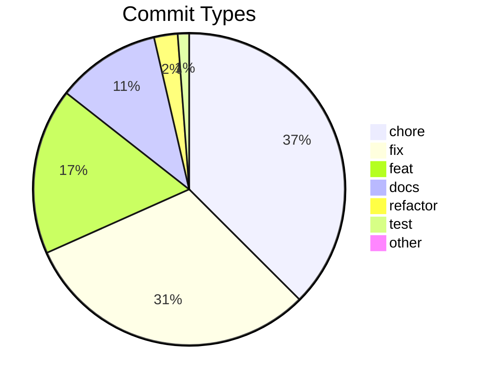
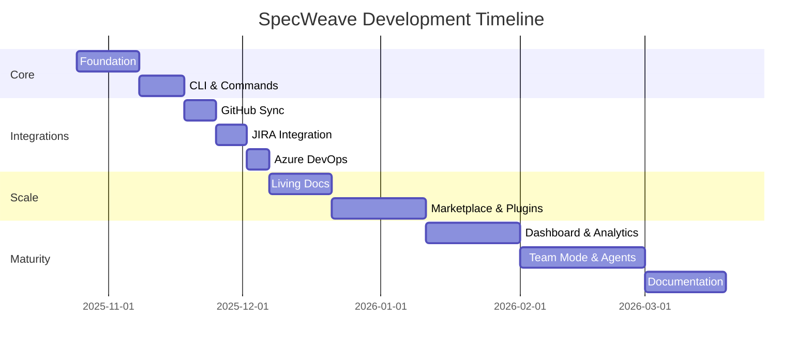
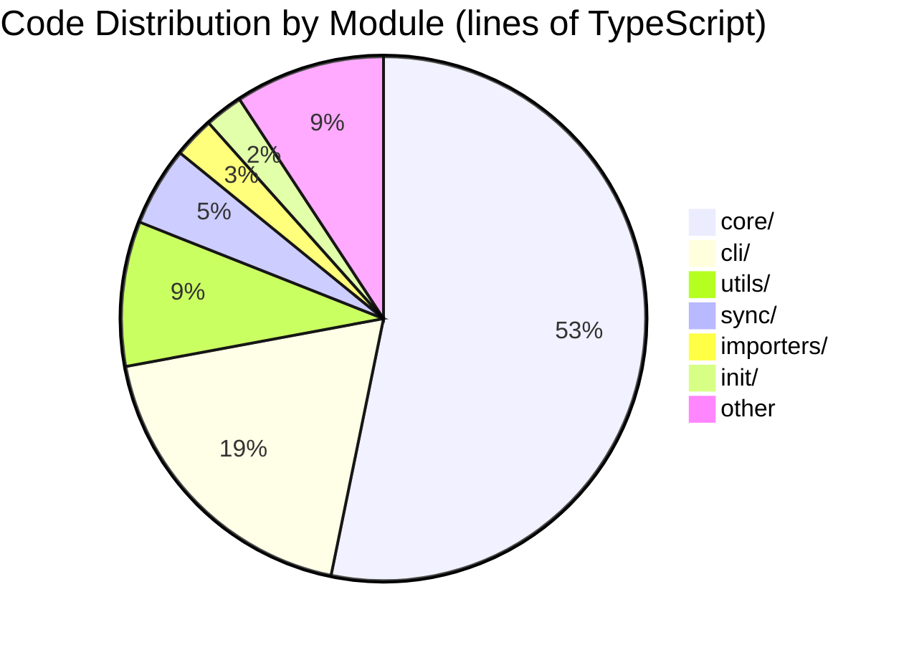

# Dogfooding: SpecWeave Builds SpecWeave

**This isn't a demo. This is production.**

SpecWeave was built using SpecWeave. Every feature, every bug fix, every architectural decision went through the spec-driven workflow you're reading about. The statistics below are real — pulled directly from our git history and codebase.

---

## The Numbers

### Codebase Scale

| Metric | Value |
|--------|-------|
| **Lines of Code** | 255,000+ |
| **TypeScript Files** | 839 |
| **Test Files** | 910 |
| **Documentation Pages** | 2,435 |
| **CLI Commands** | 66 |
| **Hook Scripts** | 8 |
| **Public Exports** | 4,223 |

### Development Activity

| Metric | Value |
|--------|-------|
| **Total Commits** | 2,703 |
| **Development Period** | 145 days |
| **Average Commits/Day** | ~19 |
| **Peak Day** | 100 commits (Nov 4, 2025) |
| **Unique Contributors** | 2 humans + CI bots |

### Commit Distribution



---

## DORA Metrics (Elite Performance)

SpecWeave tracks its own DORA metrics in real-time:

| Metric | Value | Tier |
|--------|-------|------|
| **Deployment Frequency** | 120+/month | Elite |
| **Lead Time** | 3.4 hours | High |
| **Change Failure Rate** | 0% | Elite |
| **MTTR** | 0 min | N/A (no failures) |

> **621 releases with 0 failures.** That's what spec-driven development delivers.

[Live DORA Dashboard →](/docs/metrics)

---

## Real Projects Built With SpecWeave

SpecWeave has been used across **80+ projects** — from CLI tools to mobile apps to enterprise platforms. Here are 10 production highlights:

### 1. [SpecWeave](https://github.com/anton-abyzov/specweave) (Built With Itself)
- **255K+ lines** of TypeScript across **839 files**
- **2,703 commits** over 145 days — **621 releases** with zero failures
- **910 test files**, **550+ increments**, **66 CLI commands**
- Self-documenting: every feature has a spec

### 2. [VerifiedSkill](https://verified-skill.com) — AI Skill Registry & Marketplace
- The web platform + CLI powering [verified-skill.com](https://verified-skill.com) — Next.js 15, Cloudflare Workers, Prisma
- Skill discovery, publisher pages, trending algorithms, trust scoring — all spec-driven
- vskill CLI: scan, verify, and install skills across **49 agent platforms**
- **100% built with SpecWeave** — just like Claude Code is written by Claude Code

### 3. [EasyChamp](https://easychamp.com) — Sports League Platform
- **18+ microservices** with ArgoCD GitOps — 4 years in production
- .NET, React, Python, Terraform — full enterprise stack
- **9+ increments** tracking platform redesign, auth migration, and advanced statistics
- AI chatbot with 70+ MCP tools, FotMob/SofaScore-inspired redesign

### 4. [WC26](https://wc-26.net/) — World Cup 2026 Travel Companion
- Travel & ticket companion app — **5 services**, **35 increments**
- React Router, React Native/Expo, Cloudflare Workers
- Cross-platform: web + mobile with shared backend infrastructure

### 5. [Lulla](https://lulla-app.pages.dev/) — Baby Cry Classifier
- iOS + Apple Watch app with Core ML on-device inference — **28 increments**
- Swift, Core ML, Cloudflare Workers backend
- Real-time audio classification with offline support

### 6. [JobWeave](https://jobweave.ai) — AI Career Platform
- AI job search with resume builder, interview prep, Gmail smart reply
- Next.js 15, Prisma, Supabase, Multi-AI provider architecture
- Full-stack SaaS with auth, payments, and AI-powered workflows

### 7. [SkillUp](https://skillup-football.com/) — Football Coaching Platform
- Football coaching with Stripe monetization and subscription management
- React Native, Cloudflare Workers
- Mobile-first design with video content delivery

### 8. [BizZone](https://apps.apple.com/us/app/business-zone/id6756091030) — Business Events
- Student & business events platform with AI news generation
- React Native, AI-powered content curation
- Published on the App Store

### 9. [SketchMate](https://sketchmate.net/) — AI Drawing Party Game
- Multiplayer drawing game with AI vision judging
- Web-based with real-time gameplay
- AI evaluates drawings for accuracy and creativity

### 10. [EduFeed](https://edufeed-jet.vercel.app/) — AI Learning Platform
- NotebookLM-style AI learning platform
- Next.js, Supabase, LLM integration
- Personalized learning feeds with AI-generated content

> **Beyond these 10**, SpecWeave has been used across 80+ projects spanning AI/ML, fintech, fitness, recipe planning, expense tracking, mood tracking, and more — from single-file utilities to multi-repo enterprise architectures.

---

## Development Intensity

Building SpecWeave required:

- **145 days** of focused development (Oct 2025 — Mar 2026)
- **Every weekend** dedicated to the project
- **Many sleepless nights** debugging edge cases
- **~19 commits per day** average intensity
- **100 commits in a single day** at peak

### The Timeline



---

## Why Dogfooding Matters

### Eating Our Own Dog Food

Every crash, every bug, every friction point — we experienced it ourselves:

1. **Context crashes** led to the 1500-line file limit
2. **Lost work** led to the three-file foundation
3. **Sync failures** led to circuit breaker patterns
4. **Zombie processes** led to automatic cleanup hooks

**We didn't just build a Skill Fabric. We used it to build itself.**

The same goes for every product in the ecosystem: **VerifiedSkill** (the skill marketplace) is 100% built with SpecWeave. Not retrofitted, not partially — every feature, every bug fix, every deploy went through the spec-driven workflow. Boris Cherny said "Claude Code is 100% written by Claude Code." The same is true here: SpecWeave builds SpecWeave, SpecWeave builds the marketplace, and SpecWeave builds everything from sports platforms to mobile apps to AI career tools. It's turtles all the way down.

### Real Lessons Learned

| Problem We Hit | Solution We Built |
|----------------|-------------------|
| Claude context crashes | Emergency mode + file size limits |
| Lost architecture decisions | Automatic ADR capture |
| Manual JIRA updates | Real-time bidirectional sync |
| Forgotten test coverage | Embedded tests in tasks |
| Onboarding new contributors | Living documentation |

---

## Repository Statistics

### Largest Files (Complexity Indicators)

| File | Lines | Purpose |
|------|-------|---------|
| living-docs-sync.ts | 2,227 | Core synchronization engine |
| repository-setup.ts | 1,921 | Repository initialization |
| item-converter.ts | 1,735 | External tool mapping |
| feature-archiver.ts | 1,501 | Archive management |
| dashboard-server.ts | 1,449 | Dashboard web server |

### Module Distribution



---

## The Proof

**Don't take our word for it. Look at the evidence:**

1. **[GitHub Repository](https://github.com/anton-abyzov/specweave)** — Every commit visible
2. **[DORA Metrics](/docs/metrics)** — Real-time dashboard
3. **[Changelog](https://github.com/anton-abyzov/specweave/blob/develop/CHANGELOG.md)** — 621 releases documented
4. **[Increments Archive](https://github.com/anton-abyzov/specweave/tree/develop/.specweave/increments)** — 550+ features built with SpecWeave

---

## Start Your Own Journey

Ready to build with the same discipline?

```bash
npm install -g specweave
cd your-project
specweave init .
```

**Your first increment is 30 seconds away.**

[Quick Start Guide →](/docs/guides/getting-started/quickstart)

---

## Summary

| What We Claimed | What We Delivered |
|-----------------|-------------------|
| "AI decisions become permanent" | 2,435 documentation pages |
| "Autonomous implementation" | 2,703 commits, ~19/day average |
| "Elite DORA metrics" | 120+ deploys/month, 0% failure rate |
| "Works at scale" | 255,000+ lines of code |
| "Real production use" | 80+ projects across 10+ domains |

**SpecWeave isn't theoretical. It's proven in production — on itself, on the marketplace, on sports platforms, on mobile apps, on AI tools, on career platforms, and on 80+ more projects.**
