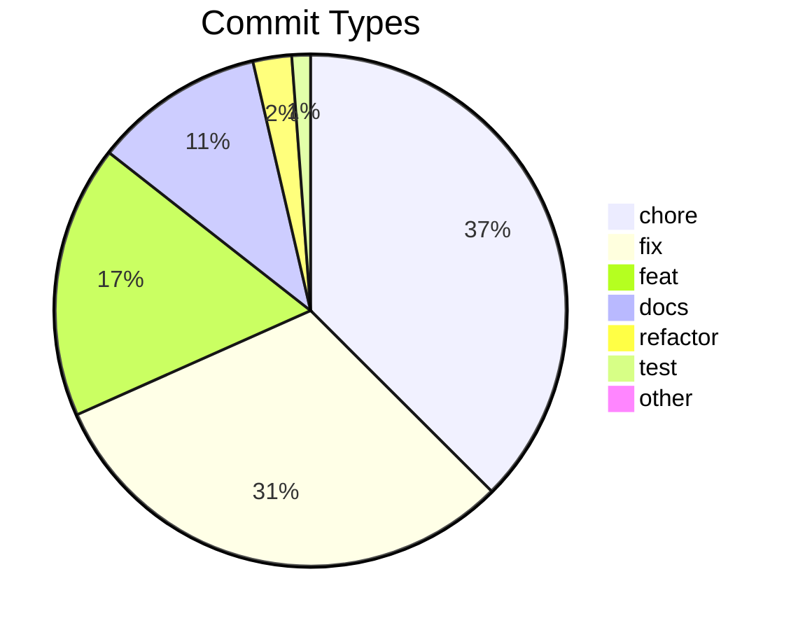
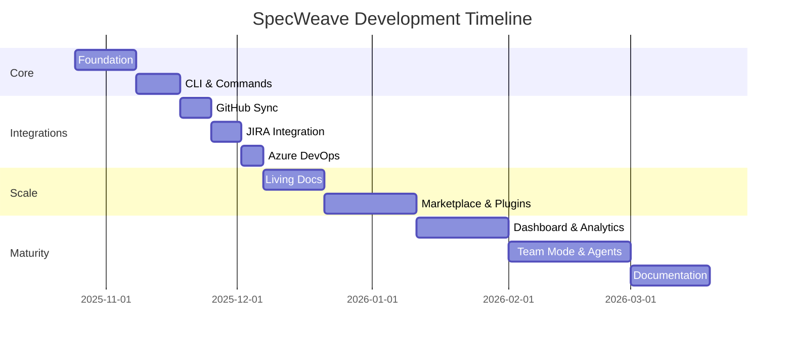
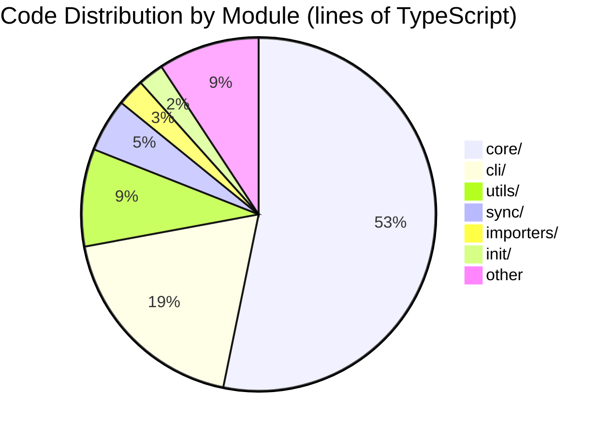

# Dogfooding: SpecWeave Builds SpecWeave

**This isn't a demo. This is production.**

SpecWeave was built using SpecWeave. Every feature, every bug fix, every architectural decision went through the spec-driven workflow you're reading about. The statistics below are real — pulled directly from our git history and codebase.

---

## The Numbers

### Codebase Scale

| Metric | Value |
|--------|-------|
| **Lines of Code** | 255,000+ |
| **TypeScript Files** | 839 |
| **Test Files** | 910 |
| **Documentation Pages** | 2,435 |
| **CLI Commands** | 66 |
| **Hook Scripts** | 8 |
| **Public Exports** | 4,223 |

### Development Activity

| Metric | Value |
|--------|-------|
| **Total Commits** | 2,703 |
| **Development Period** | 145 days |
| **Average Commits/Day** | ~19 |
| **Peak Day** | 100 commits (Nov 4, 2025) |
| **Unique Contributors** | 2 humans + CI bots |

### Commit Distribution



---

## DORA Metrics (Elite Performance)

SpecWeave tracks its own DORA metrics in real-time:

| Metric | Value | Tier |
|--------|-------|------|
| **Deployment Frequency** | 120+/month | Elite |
| **Lead Time** | 3.4 hours | High |
| **Change Failure Rate** | 0% | Elite |
| **MTTR** | 0 min | N/A (no failures) |

> **621 releases with 0 failures.** That's what spec-driven development delivers.

[Live DORA Dashboard →](/docs/metrics)

---

## Real Projects Built With SpecWeave

SpecWeave has been used across **80+ projects** — from CLI tools to mobile apps to games. Here are 10 highlights:

### 1. SpecWeave (Built With Itself)
- **255K+ lines** of TypeScript across **839 files**
- **2,703 commits** over 145 days — **621 releases** with zero failures
- **910 test files**, **550+ increments**, **66 CLI commands**
- Self-documenting: every feature has a spec

### 2. vskill CLI (Built With SpecWeave)
- The AI skill marketplace CLI — scan, verify, and install skills across **49 agent platforms**
- Node.js ESM, TypeScript, Vitest — version 0.5.31 with continuous releases
- Every feature spec'd, planned, and implemented through SpecWeave increments
- **vskill is 100% built with SpecWeave** — just like Claude Code is written by Claude Code

### 3. vskill-platform (Built With SpecWeave)
- The web platform powering [verified-skill.com](https://verified-skill.com) — Next.js 15, Cloudflare Workers, Prisma
- Skill discovery, publisher pages, trending algorithms, trust scoring — all spec-driven
- Remotion video generation, SendGrid email, Cloudflare Workers AI integration
- Every API endpoint, UI page, and database migration went through the increment workflow

### 4. EasyChamp — Sports Management Platform
- Comprehensive sports analytics supporting **108+ event types** and **70+ stat keywords**
- MUI v7, TanStack Query, Keycloak auth, AI chatbot with 70+ MCP tools
- **9+ increments** tracking platform redesign, auth migration, and advanced statistics
- Currently migrating from IdentityServer4 to Keycloak with FotMob/SofaScore-inspired redesign

### 5. Postiz — AI Social Media Scheduling
- Open-source alternative to Buffer/Hypefury (AGPL-licensed)
- Multi-service monorepo: frontend, backend, workers, cron, browser extension, SDK
- Supports Twitter, LinkedIn, Instagram, TikTok with AI-powered scheduling
- Comprehensive code quality refactoring managed through SpecWeave increments

### 6. Content Repurposer — Multi-Service SaaS
- Takes YouTube/podcast URLs, generates Twitter threads, LinkedIn posts, blog summaries
- Three-service architecture: Python FastAPI worker, NestJS API, Next.js frontend
- Three-tier subscription ($0/10/30 per month) — complete from PRD to deployment

### 7. E-Commerce Whitelabel Platform
- Multi-tenant architecture with **7 microservices**: catalog, ordering, fulfillment, mobile app
- Each service as an independent repository with shared domain models
- GitHub bidirectional sync for enterprise development workflow

### 8. Voice Journal — Cross-Platform Monorepo
- React Native/Expo mobile app + Hono API on Cloudflare Workers
- pnpm monorepo with D1 database, R2 audio storage, async transcription queue
- 3 increments completed: project setup, database/API layer, mobile app

### 9. Mini Doom — 3D WebGL Shooter
- Complete browser-based FPS built with **Three.js** and TypeScript
- First-person controls, projectile combat, enemy AI state machines, full game loop
- Proves spec-driven development works for **any domain** — even games

### 10. QR Menu — Restaurant Tech Platform
- Contactless digital menu platform for restaurants with QR-based access
- Three-repo architecture: Next.js frontend, Node.js API, shared TypeScript library
- Targeting post-COVID restaurant modernization with $29-99/mo subscription model

> **Beyond these 10**, SpecWeave has been used across 80+ projects spanning AI/ML, fintech, fitness, recipe planning, expense tracking, mood tracking, and more — from single-file utilities to multi-repo enterprise architectures.

---

## Development Intensity

Building SpecWeave required:

- **145 days** of focused development (Oct 2025 — Mar 2026)
- **Every weekend** dedicated to the project
- **Many sleepless nights** debugging edge cases
- **~19 commits per day** average intensity
- **100 commits in a single day** at peak

### The Timeline



---

## Why Dogfooding Matters

### Eating Our Own Dog Food

Every crash, every bug, every friction point — we experienced it ourselves:

1. **Context crashes** led to the 1500-line file limit
2. **Lost work** led to the three-file foundation
3. **Sync failures** led to circuit breaker patterns
4. **Zombie processes** led to automatic cleanup hooks

**We didn't just build a Skill Fabric. We used it to build itself.**

The same goes for every product in the ecosystem: **vskill** (the skill marketplace CLI) and **vskill-platform** (the web marketplace) are both 100% built with SpecWeave. Not retrofitted, not partially — every feature, every bug fix, every deploy went through the spec-driven workflow. Boris Cherny said "Claude Code is 100% written by Claude Code." The same is true here: SpecWeave builds SpecWeave, SpecWeave builds vskill, SpecWeave builds the platform, and SpecWeave builds everything from sports platforms to 3D shooters to restaurant tech. It's turtles all the way down.

### Real Lessons Learned

| Problem We Hit | Solution We Built |
|----------------|-------------------|
| Claude context crashes | Emergency mode + file size limits |
| Lost architecture decisions | Automatic ADR capture |
| Manual JIRA updates | Real-time bidirectional sync |
| Forgotten test coverage | Embedded tests in tasks |
| Onboarding new contributors | Living documentation |

---

## Repository Statistics

### Largest Files (Complexity Indicators)

| File | Lines | Purpose |
|------|-------|---------|
| living-docs-sync.ts | 2,227 | Core synchronization engine |
| repository-setup.ts | 1,921 | Repository initialization |
| item-converter.ts | 1,735 | External tool mapping |
| feature-archiver.ts | 1,501 | Archive management |
| dashboard-server.ts | 1,449 | Dashboard web server |

### Module Distribution



---

## The Proof

**Don't take our word for it. Look at the evidence:**

1. **[GitHub Repository](https://github.com/anton-abyzov/specweave)** — Every commit visible
2. **[DORA Metrics](/docs/metrics)** — Real-time dashboard
3. **[Changelog](https://github.com/anton-abyzov/specweave/blob/develop/CHANGELOG.md)** — 621 releases documented
4. **[Increments Archive](https://github.com/anton-abyzov/specweave/tree/develop/.specweave/increments)** — 550+ features built with SpecWeave

---

## Start Your Own Journey

Ready to build with the same discipline?

```bash
npm install -g specweave
cd your-project
specweave init .
```

**Your first increment is 30 seconds away.**

[Quick Start Guide →](/docs/guides/getting-started/quickstart)

---

## Summary

| What We Claimed | What We Delivered |
|-----------------|-------------------|
| "AI decisions become permanent" | 2,435 documentation pages |
| "Autonomous implementation" | 2,703 commits, ~19/day average |
| "Elite DORA metrics" | 120+ deploys/month, 0% failure rate |
| "Works at scale" | 255,000+ lines of code |
| "Real production use" | 80+ projects across 10+ domains |

**SpecWeave isn't theoretical. It's proven in production — on itself, on vskill, on the platform, on sports analytics, on social media tools, on e-commerce, on games, and on 80+ more projects.**
