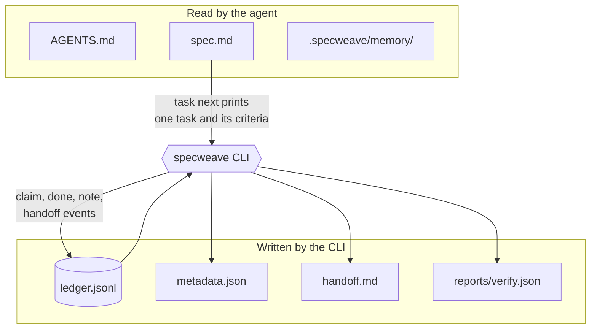
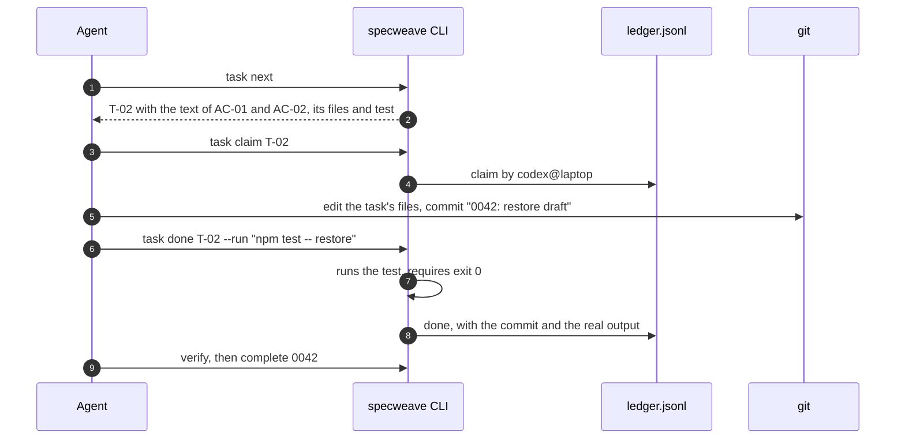
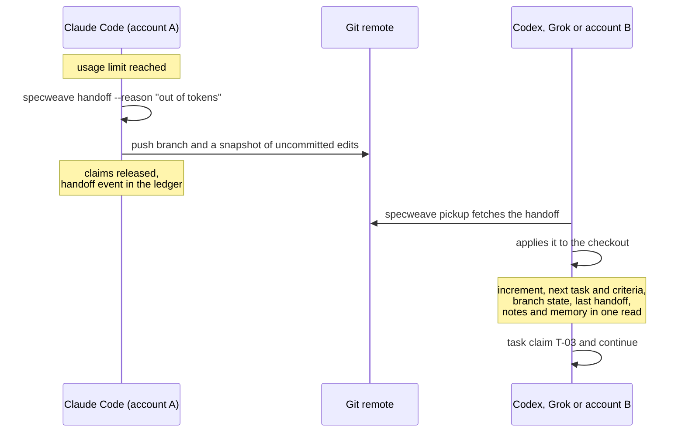
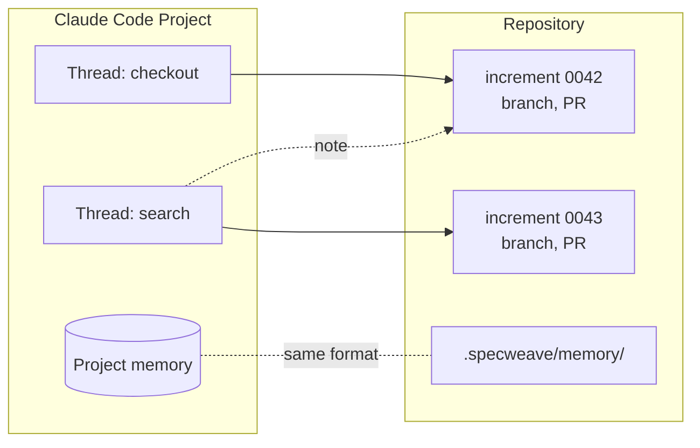

# How it works

SpecWeave is a set of files in your repository plus a CLI that reads and appends to them. Nothing lives in a service, a database or one tool's private session, which is why any tool can continue the work.

## The files

```text
AGENTS.md                         # the one instruction file every tool reads
CLAUDE.md                         # "@AGENTS.md" plus anything Claude-only
.specweave/
├── config.json                   # project settings
├── memory/
│   ├── MEMORY.md                 # index: one line per fact
│   └── checkout-drafts.md        # one decision that must outlive a session
└── increments/
    └── 0042-resumable-checkout/
        ├── spec.md               # the only file you and the agent edit
        ├── ledger.jsonl          # append-only: claims, done, notes, handoffs
        ├── metadata.json         # status and tracker links (machine state)
        ├── handoff.md            # written by specweave handoff
        └── reports/verify.json   # written by specweave verify
```



The split matters. An agent only ever reads a few short files and edits one. Everything that records state is appended by the CLI, so the record cannot be quietly tidied up afterwards, and the agent never spends tokens rereading bookkeeping.

## The spec

A new increment is one `spec.md`:

```markdown
# Resumable checkout

## Problem
A customer who leaves checkout loses the cart and shipping choice.

## Scope
In: cart and shipping choice. Out: payment details.

## Acceptance Criteria
- [ ] AC-01: Returning within 24 hours restores the cart and shipping choice
- [ ] AC-02: A paid order is never restored

## Approach
Store a draft keyed by customer; clear it when payment succeeds.

## Open questions
- none

## Tasks

### T-01 Save the checkout draft
- AC: AC-01 | Files: src/checkout/draft.ts, src/checkout/draft.test.ts | Test: npm test -- draft

### T-02 Restore the draft on return
- AC: AC-01, AC-02 | Files: src/checkout/restore.ts | Test: npm test -- restore
```

Each task names the criteria it covers, the files it owns and the command that proves it. An acceptance criterion counts as met when every task covering it is done, so nobody ticks boxes by hand.

## The task loop



The claim tells other agents the task is taken. The `done` event is only written when the test command really exits 0, and its output is stored as evidence. `specweave verify` runs the project's build, test and lint commands and writes a report; `specweave complete` closes the increment when that report and the ledger cover every criterion.

## Moving work to another tool or account



Nothing is copied between tools. The handoff is a commit and a ledger event, and pickup reads them. This is the real output of `specweave pickup` in a fresh clone running as Codex, after Claude Code handed off halfway through the example above. Pickup fetched the handoff and applied the uncommitted edits itself:

```text
$ specweave pickup
Picked up the handoff from claude@cloud 0m ago (out of tokens): applied 7 uncommitted files.
SpecWeave pickup · you are codex@laptop
Increment 0001-resumable-checkout "Resumable checkout" (active) · tasks 1/2 done · ACs 0/2 met
Next: T-02 Restore the draft on return
  AC-01: Returning within 24 hours restores the cart and shipping choice
  AC-02: A paid order is never restored
  Files: src/restore.js | Test: npm test
  claim: specweave task claim T-02 0001-resumable-checkout
Spec: .specweave/increments/0001-resumable-checkout/spec.md
Branch: main @ 76b1964 · in sync with origin/main · 3 uncommitted files
Last handoff: claude@cloud 0m ago: out of tokens · next: finish restore on return
Notes:
- claude@cloud 0m ago: Payment thread: drafts must never store card data
```

In any tool you can also just say "hand off" or "pick up where I left off"; `AGENTS.md` maps those words to the two commands. On your own machine, `specweave auto-handoff on` makes Claude Code and Codex hand off by themselves at 90% of the usage limit. See [Handoff and pickup](/docs/guides/cross-tool-handoff) for the details and the flags.

## Parallel threads

In a Claude Code Project, or any setup where several agents work at once, each thread works on its own increment, branch and pull request.



When one thread needs something from another's increment, it appends a note to that increment's ledger (`specweave note "..." 0042`) rather than editing its files, and the owning thread sees it at its next pickup. Decisions that must outlive a session go into `.specweave/memory/`, which is committed, so they reach another account or another tool. See [Claude Code Projects](/docs/guides/claude-code-projects).

## What each tool reads

| Tool | Instructions | Skills |
|---|---|---|
| Claude Code and Projects threads | `CLAUDE.md`, which imports `AGENTS.md` | `.claude/skills/` |
| Codex | `AGENTS.md` | `.agents/skills/` |
| Grok Build | `AGENTS.md` and `CLAUDE.md` | `.grok/skills/`, `.agents/skills/` and Claude Code skills |
| Cursor, GitHub Copilot, Gemini CLI, OpenCode | `AGENTS.md` | Their own skill folders, or the CLI directly |

The CLI is the same everywhere, so a tool without skills still runs the loop with the commands above. More in [Codex, Grok and others](/docs/integrations/generic-ai-tools).
