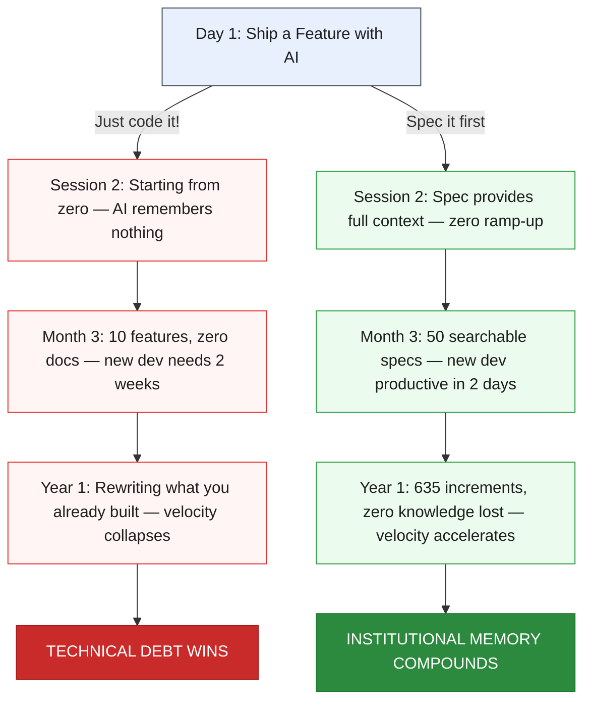

import CommandTabs from '@site/src/components/CommandTabs';

# What is SpecWeave?

**SpecWeave is a spec-first AI development tool** — a behavior layer that brings structure, persistence, and quality gates to any AI coding tool.

Describe what you want to build. SpecWeave handles planning, architecture, testing, and documentation — across any AI coding tool.

Where Claude Code, Cursor, Copilot, and Codex are stateless by default, SpecWeave adds the missing layer: standards that survive sessions, specs that never disappear, and quality that's enforced — not hoped for.

*Works with Claude Code, Cursor, Copilot, Codex, Antigravity, and any LLM-powered coding tool.*

## The Problem

AI coding tools are powerful. They're also **stateless, unstructured, and uncoordinated** by default. That gap between "powerful" and "production-ready" is where projects fail.

### Session Amnesia

Every AI session starts from zero. Session 47 has no idea what session 46 decided. You spend the first 10 minutes re-explaining your codebase, your constraints, your architecture — every single time. That context-building costs tokens, time, and mental energy. Multiply by every developer on your team, every day.

**What you need:** Persistent specs that carry full context across sessions, tools, and team members — so AI picks up exactly where you left off.

### The Standards Lottery

Without enforcement, code quality is a lottery. One developer's AI writes comprehensive tests. Another's skips them. One follows your architecture patterns. Another invents new ones. The AI is only as good as the prompt — and prompts aren't version-controlled, reviewed, or shared.

**What you need:** Verified skills that encode your team's standards into reusable, enforceable patterns — so every AI session follows the same rules, regardless of who's prompting.

### Coordination Failure

Running 3 AI agents in parallel sounds like 3x productivity. Without shared specs, it's 3 agents making conflicting decisions about the same codebase. More agents without coordination = more chaos, not more output.

**What you need:** A coordination layer where parallel agents share specs, plans, and task boundaries — turning independent agents into a synchronized team.

### Knowledge Evaporation

Chat history is where decisions go to die. *"Why did we choose this approach?" "What was the original requirement?" "What did we try that didn't work?"* — all buried in conversation threads no one will search. When a developer leaves, their prompting patterns leave too. Six months later, you're rewriting features you already built — because no one documented they existed.

**What you need:** Living documentation that evolves with your code, searchable specs that preserve every decision, and verified skills that capture institutional knowledge — so expertise survives team changes.

### The Brownfield Wall

AI tools shine on greenfield — blank canvases with no constraints. But real engineering is brownfield: dozens of repos, years of undocumented decisions, existing systems that must be extended without breaking. This is exactly where AI tools fail hardest — and where you need them most.

**What you need:** Brownfield analysis that maps existing code to specs, detects discrepancies between documentation and reality, and plans safe incremental changes — not naive rewrites.

### The Spec Divergence

These problems **compound over time**. Two teams start the same project with the same AI tools — one specs, one vibes:



**The proof:** SpecWeave itself was built with **635+ increments**. Every feature specified. Every decision traceable. Zero knowledge lost. Spec #1 felt like overhead — spec #635 felt like compound interest.

## The Solution: Configure AI, Don't Prompt It

SpecWeave encodes your standards into version-controlled configuration. Every developer, every AI tool, every session enforces them identically — automatically.

```json
// .specweave/config.json
{
  "testing": {
    "defaultTestMode": "TDD",       // AI always follows red-green-refactor
    "tddEnforcement": "strict"      // Tasks cannot close without passing tests
  },
  "quality": {
    "grillRequired": true,          // Code review gate before every close
    "judgeLlmRequired": true        // Independent AI validation gate
  },
  "sync": {
    "github": true,                 // Auto-sync to GitHub Issues / PRs
    "jira": true                    // Bidirectional JIRA sync on close
  }
}
```

This is the difference between **asking** an AI to follow a process and **configuring** it to. No prompting required. No hoping it remembers. The config is the contract.

SpecWeave enforces **Spec-Driven Development**:

<p align="center">
  
</p>

### Key Principles

1. **Plan > Code** - The plan is the source of truth; code is its derivative. Bad plans create orders of magnitude more rework than bad code — review the plan, not just the code ([learn more](/docs/overview/philosophy#1-plan-as-source-of-truth))
2. **Specification Before Implementation** - Define WHAT and WHY before HOW
3. **One Increment at a Time** - Each feature is a focused, reviewable unit of work — controllable through your sprint or external tools (GitHub, JIRA, ADO)
4. **Living Documentation** - Specs evolve with code, never diverge
5. **Context Precision** - Load only what's needed (70%+ token reduction)
6. **Test-Validated Features** - Every feature proven through automated tests
7. **Regression Prevention** - Document existing code before modification
8. **Framework Agnostic** - Works with ANY tech stack (TypeScript, Python, Go, Rust, Java, etc.)

## No Commands to Memorize

SpecWeave is not a workflow you switch into. It is a behavior layer that changes how your AI works — installed once, active in every conversation.

When you describe what you want, your AI routes internally to the right skill. You just work naturally:

| You say | What happens |
|---------|--------------|
| "Build me X" / "Let's add Y" | Spec + plan + tasks created automatically |
| "Brainstorm approaches for X" | Multi-perspective ideation (4-6 approaches) |
| "Go ahead" / "Build it" | Autonomous execution — hours of unattended work |
| "Ship it" / "We're done" | Quality gates run, increment closed |
| "Split this into teams" | Parallel agents (implement mode) |
| "Brainstorm with perspectives" | Parallel perspectives (brainstorm mode) |
| "Plan X in parallel" | PM + Architect agents (planning mode) |
| "Review the code" | 6 parallel reviewers |
| "Grill the code" | Critical audit before close |

For fine-grained control, invoke capabilities directly:

<CommandTabs
  natural="Let's build a checkout flow"
  claude='sw:increment "checkout flow"'
  other='increment "checkout flow"'
/>

<CommandTabs
  natural="Build it while I sleep"
  claude="sw:auto"
  other="auto"
/>

<CommandTabs
  natural="Brainstorm approaches for caching"
  claude='sw:brainstorm "caching"'
  other='brainstorm "caching"'
/>

<CommandTabs
  natural="Split this into agent teams"
  claude="sw:team-lead"
  other="team-lead"
/>

## The Workflow

Just describe what you want. Your AI handles the orchestration.

```
You: "Build me a checkout flow with Stripe"
  ↓
AI asks 5-10 clarifying questions
  (What payment methods? Guest checkout? Subscriptions? Which UI library?)
  ↓
Creates: spec.md → plan.md → tasks.md   ← you review the plan here
  ↓
You: "Go ahead and build it"
  → autonomous execution for hours
  (writes code, runs tests, fixes failures, syncs to GitHub/JIRA)
  ↓
You wake up. Review finished work.
  Tests cover technical correctness. You check the UI and UX.
  ↓
You: "Looks good, ship it"
  → validated, documented, closed.
```

**Solo developer:**
```
You: "I need user authentication with OAuth and magic links"
  → AI interviews you, creates spec + plan + tasks
You: "Build it"
  → AI works autonomously for hours
You: "Ship it"
  → reviewed, validated, done.
```

**Agent team (parallel):**
```
You: "Build an e-commerce MVP"
  → SpecWeave splits into auth, payments, catalog
  → 3 agents work in parallel across iTerm/tmux panes
```

**Brownfield project:**
```
You: "Migrate the checkout page to React"
  → SpecWeave analyzes existing code, plans strangler fig migration
  → TDD-first autonomous execution
```

For medium-complexity features, brainstorm first — the brainstorm capability explores 4-6 structurally different approaches with cognitive lenses (Six Thinking Hats, SCAMPER, TRIZ, and more) before committing to a plan, then hands off directly to planning.

### When to Use What

The more structure in your workflow, the harder the problems you can solve:

```
Hardest problem          big refactors,              ○  ← agent teams
you can solve          whole new features                 (multi-agent)
    ↑                                          ○
    │               medium features               ← brainstorm → plan → auto
    │              across repos                 (research + plan + implement)
    │                                    ○
    │           small features              ← plan → implement
    │          across 3-5 files                (plan + implement)
    │                              ○
    │       small fixes               ← just talk to AI
    │       copy changes                 (no planning)
    └────────────────────────────────────────────→
      just talk     simple plan    research →    multi-phase
      to AI         then work it   plan → impl   agent teams

                 amount of context engineering →
```

## Agent Swarms

Run multiple AI agents on the same repository — each agent owns an isolated increment. No conflicts.

```
Terminal split panes:
┌──────────────────┬──────────────────┬──────────────────┐
│  Agent 1 (auth)  │ Agent 2 (payments)│ Agent 3 (catalog)│
│  autonomous     │  autonomous      │  autonomous     │
│  ████████░░ 80%  │  ██████░░░░ 60%   │  ████░░░░░░ 40%  │
└──────────────────┴──────────────────┴──────────────────┘
```

The **team-lead** capability splits work across 6 modes — brainstorm, plan, implement, review, research, and test. Each agent runs in its own terminal pane for true parallelism. Progress syncs to GitHub/JIRA automatically.

**[Full agent teams guide](/docs/guides/agent-teams-and-swarms)**

---

## Who Should Use SpecWeave?

### Perfect For

- **Enterprise teams** building production systems
- **Startups** needing scalable architecture from day one
- **Solo developers** building complex applications
- **Regulated industries** (healthcare - HIPAA, finance - SOC 2)
- **Teams with brownfield codebases** — use `specweave get` to bring existing repos into SpecWeave (one repo, bulk clone with glob patterns, or entire organizations) without refactoring

### Use Cases

- **Greenfield projects**: Start with comprehensive specs
- **Brownfield projects**: Clone existing repos with `specweave get`, document existing code, plan strangler fig migrations
- **Iterative development**: Build documentation gradually
- **Compliance-heavy**: Maintain audit trails and traceability

## Core Features

| Feature | Benefit | Uniqueness |
|---------|---------|------------|
| **70%+ Token Reduction** | Plugin architecture loads only active increment + relevant agent = ~15K tokens (vs 200K+) | Unique |
| **Parallel Agent Teams** | Team-lead orchestrates agents across 6 modes — brainstorm, plan, implement, review, research, test | Unique |
| **Structured Brainstorming** | Brainstorm capability explores 4-6 approaches with cognitive lenses before committing to a plan | Unique |
| **Brownfield Excellence** | `specweave get` to import repos, automated codebase analysis, strangler fig migrations, retroactive specs | Unique |
| **Living Documentation** | Specs auto-update after every task via hooks — never drift from code | Unique |
| **LSP Code Intelligence** | Semantic symbol resolution — 198x faster than grep, zero false positives across TypeScript, Python, Go, Rust, Java, C# | Unique |
| **External Sync** | Bidirectional sync with GitHub Issues, JIRA, Azure DevOps — circuit breaker resilience, auto-create issues | Strong |
| **Quality Gates** | Three-gate validation (tasks + test coverage + docs) before closing | Strong |
| **~44 Built-in Skills** | PM, Architect, Tech Lead, QA, Security, DevOps work autonomously | Good |
| **Universal Stack** | Works with ANY tech stack and ANY AI tool (Claude, Cursor, Copilot) | Expected |

## What You Get vs. Current State

| Before | After SpecWeave |
|--------|-----------------|
| Specs in chat history | **Permanent, searchable specs** |
| Manual JIRA/GitHub updates | **Auto-sync on every task** |
| Tests? Maybe later... | **Tests embedded in every task** |
| Architecture in your head | **ADRs captured automatically** |
| "Ask John, he knows" | **Living docs, always current** |
| Onboarding: 2 weeks | **Onboarding: 1 day** |

## Integrations

| Platform | What Syncs |
|----------|-----------|
| **GitHub** | Issues, PRs, milestones — bidirectional |
| **JIRA** | Epics, stories, status — bidirectional |
| **Azure DevOps** | Work items, area paths — bidirectional |
| **[Verified Skills](https://verified-skill.com)** | Security scanning, trust certification, public skill registry |

When you close an increment, external tools update automatically. Sync is resilient — a circuit breaker pattern (per-provider, 3-failure threshold, 5-minute auto-reset) prevents cascading failures across integrations.

## Built With SpecWeave

SpecWeave builds itself. Every feature, bug fix, and release across 2,500+ commits and 400+ versions is spec-driven — proving the methodology works at the scale and complexity it's designed for.

**[Browse increments](https://github.com/anton-abyzov/specweave/tree/develop/.specweave/increments)** — see how SpecWeave develops SpecWeave.

---

## Getting Started

```bash
npm install -g specweave
cd your-project
specweave init .
```

Then describe what you want to build:

<CommandTabs
  natural="I need a dark mode toggle for the settings page"
  claude='sw:increment "Add dark mode toggle"'
  other='increment "Add dark mode toggle"'
/>

**[Full Getting Started Guide →](/docs/getting-started)**

---

## Next Steps

- [Key Features](/docs/overview/features) — What SpecWeave provides
- [Getting Started](/docs/getting-started) — Install and run your first increment
- [Why SpecWeave?](/docs/overview/why-specweave) — The problem SpecWeave solves
- [Complete Workflow](/docs/workflows/overview) — The full development journey
