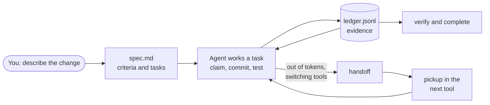

# What is SpecWeave?

SpecWeave is a small command-line tool and a set of skills that keep AI-assisted software work to engineering standards, and let you switch coding tools without losing your place.

You describe a change. SpecWeave keeps three things for it in your repository:

- **What done means**: a short `spec.md` with the problem, scope, acceptance criteria, approach and tasks.
- **What actually happened**: an append-only `ledger.jsonl` recording who claimed each task, which commit finished it and what test output proved it.
- **Where you stopped**: a handoff with the next step, open questions and your work in progress, pushed where a cloud session can see it.

Because all of it is plain files in git, it works with Claude Code (including Projects threads), Codex, Grok Build, Cursor, GitHub Copilot, Gemini CLI and OpenCode, and across two subscriptions of the same tool.

## The problem it solves

AI coding tools are good at writing code and poor at remembering why. Each one keeps its conversation in its own private store. When you hit a usage limit halfway through a feature, the goal, the decisions and your uncommitted edits are stuck in a session no other tool can read. Claude Code project memory stays with one account, so even a second Claude subscription starts cold.

Without a written definition of done, "it's finished" is whatever the agent says. SpecWeave makes the definition explicit before code is written, and closes the work only when the recorded evidence covers every acceptance criterion.

## What you do with it

| You want to | You say, or run |
|---|---|
| Plan a change | "Let's add a resumable checkout", or `specweave create-increment "Resumable checkout"` |
| Work through it | "Do the next task", or `specweave task next` and `specweave task claim T-01` |
| Prove a task is done | `specweave task done T-01 --run "npm test"` |
| Stop and continue elsewhere | "Hand off", or `specweave handoff` |
| Continue in another tool | "Pick up where I left off", or `specweave pickup` |
| Close with evidence | `specweave verify` then `specweave complete 0042` |

Every step is available as a skill in tools that support skills and as a plain command everywhere else. [How it works](/docs/overview/how-it-works) shows the files and the flow in more detail.

## What it is not

- **Not a replacement for your coding agent.** Your agent writes the code. SpecWeave keeps the record.
- **Not a tracker.** GitHub Issues, Jira and Azure DevOps stay where your team plans. SpecWeave can push progress to them when you ask, and never touches them on its own.
- **Not required for every change.** A one-line fix needs no increment. Use one when the work needs acceptance criteria, will span sessions, or may change hands.

## Next steps

- [Quick start](/docs/getting-started): install, initialize and run the loop once.
- [What changed in 3.0](/docs/guides/specweave-3): one-file increments, one instruction file, handoff and pickup.
- [Handoff and pickup](/docs/guides/cross-tool-handoff): moving work between tools and accounts.
